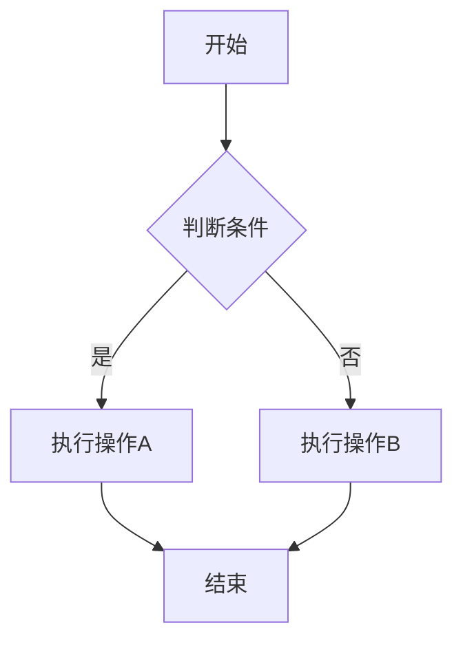
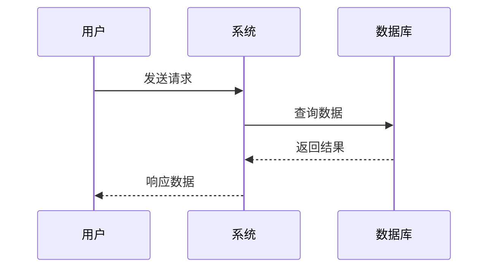

# 示例文档

这是一个示例 Markdown 文档，用于测试 auto-doc 技能的文档转换功能。

## 功能特性

- **Markdown 转 Word**: 支持完整的 Markdown 语法
- **Mermaid 图表**: 自动转换为 PNG 图片
- **自定义模板**: 支持使用 Word 模板
- **Word 转 Markdown**: 提取 Word 文档内容

## Mermaid 图表示例

### 流程图



### 时序图



## 文本格式

这是**加粗文本*，这是*斜体文本*，这是~~删除线~~。

## 列表

### 无序列表

- 项目一
- 项目二
  - 子项目 A
  - 子项目 B
- 项目三

### 有序列表

1. 第一步
2. 第二步
3. 第三步

## 代码块

```javascript
function hello() {
    console.log("Hello, World!");
}
```

## 表格

| 名称 | 类型 | 描述 |
|------|------|------|
| id | Long | 主键ID |
| name | String | 名称 |
| status | Integer | 状态 |

## 引用

> 这是一段引用文本。
>
> 可以是多行。

## 分隔线

---

## 转换测试

使用以下命令测试转换：

```bash
/auto-doc m2d input_doc/example-doc.md
```

转换后会在 `output_doc/` 目录生成 `example-doc.docx` 文件，Mermaid 图表会自动转换为 PNG 图片。
