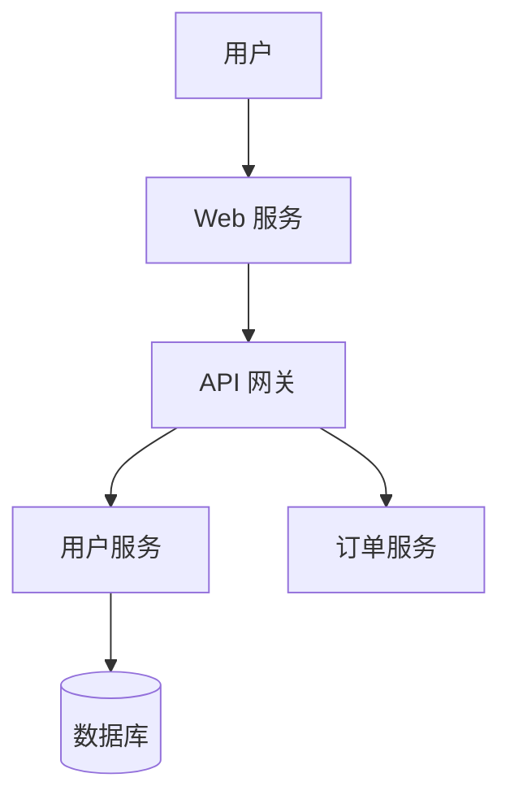
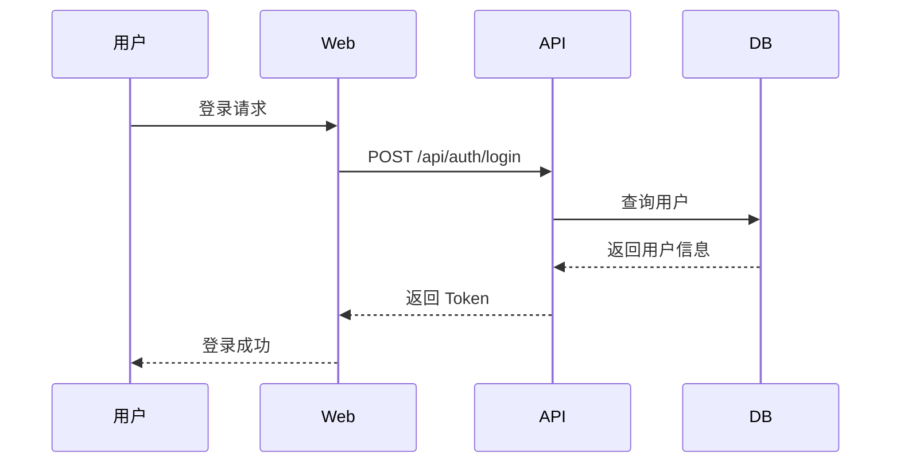

# 架构设计助手

执行 SDLC 阶段 3：系统架构设计，输出架构设计文档。

## 阶段目标

设计系统整体架构，确定技术选型，记录架构决策。

## 输入

- 需求规格说明书（阶段 1 产出）
- 产品设计文档（阶段 2 产出，ui-ux-pro-max）
- 项目宪法（guidance/CONSTITUTION.md）

## 输出

| 产出物 | 文件路径 | 说明 |
|--------|----------|------|
| 架构设计文档 | `docs/architecture/architecture.md` | 系统架构描述 |
| 架构决策记录 | `docs/architecture/adr/` | ADR 文档 |
| 技术选型报告 | `docs/architecture/technology-stack.md` | 技术栈说明 |
| 部署架构图 | `docs/architecture/deployment-architecture.md` | 部署方案 |

## 执行步骤

### 1. 需求分析

```markdown
- 阅读需求规格说明书
- 识别功能性需求
- 识别非功能性需求（性能、安全、可用性、扩展性）
- 确定约束条件
```

### 2. 架构设计

```markdown
- 选择架构风格（微服务/单体/事件驱动/CQRS）
- 划分系统模块/服务
- 定义模块间通信方式
- 设计数据流
```

### 3. 技术选型

```markdown
- 后端技术栈
- 前端技术栈
- 数据库选型
- 中间件选型
- 第三方服务
```

### 4. 架构决策记录

```markdown
- 记录每个重要决策
- 说明决策背景
- 列出备选方案
- 解释选择理由
```

## Mermaid 图表约定

架构设计阶段必须使用 Mermaid 绘制以下图表：

| 图表类型 | Mermaid 关键字 | 用途 | 示例场景 |
|----------|----------------|------|----------|
| 系统架构图 | `graph` | 展示系统组件关系 | 微服务架构图 |
| 部署架构图 | `graph` | 展示部署拓扑 | K8s 部署图 |
| 时序图 | `sequenceDiagram` | 展示组件交互 | API 调用流程 |
| 状态图 | `stateDiagram` | 展示状态流转 | 订单状态机 |
| ER 图 | `erDiagram` | 展示数据关系 | 数据模型概览 |

### 图表命名规范

- 文件命名：`diagrams/{name}-architecture.mmd`
- 图表标题：使用中文描述
- 节点命名：使用中文，简洁明了

### 图表示例

**系统架构图**


**时序图**


## 使用方法

### 开始架构设计

```
/architecture-design
```

### 基于现有需求

```
/architecture-design --from docs/requirements/
```

### 更新架构决策

```
/architecture-design --update-adr "选择 PostgreSQL 作为主数据库"
```

## 架构风格参考

| 风格 | 适用场景 |
|------|----------|
| 单体架构 | 小型项目、快速原型 |
| 微服务 | 大型系统、高扩展需求 |
| 事件驱动 | 异步处理、解耦系统 |
| CQRS | 读写分离、复杂查询 |
| 六边形架构 | 领域驱动、测试友好 |

## 触发的 Guards

| Guard | 触发条件 |
|-------|----------|
| Performance Agent | 涉及性能需求 |
| Infra Agent | 涉及部署架构 |

## 质量门禁

- [ ] 架构文档已评审
- [ ] 技术选型有记录
- [ ] ADR 已创建
- [ ] 性能需求可满足
- [ ] 安全需求已考虑

## 模板位置

```
templates/
├── architecture-template.md
```

## 下一步

架构设计完成后，执行：
```
/detailed-design
```
