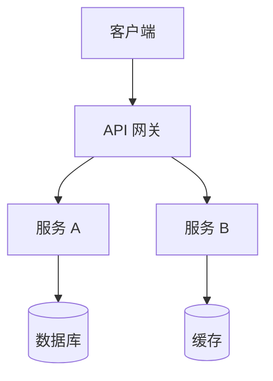
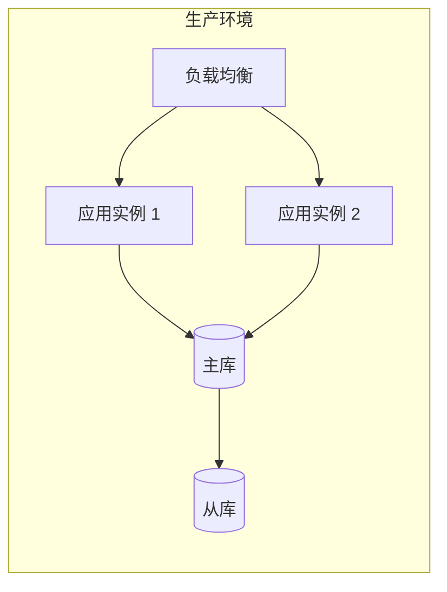

# 架构设计文档模板

## 1. 概述

### 1.1 项目背景
[描述项目背景和目标]

### 1.2 文档范围
[说明本文档覆盖的范围]

---

## 2. 架构目标

### 2.1 功能性目标
- [目标 1]
- [目标 2]

### 2.2 非功能性目标

| 指标 | 目标值 |
|------|--------|
| 响应时间 | < 200ms |
| 并发用户 | 1000+ |
| 可用性 | 99.9% |
| 数据一致性 | 强一致/最终一致 |

---

## 3. 系统架构

### 3.1 架构风格
[微服务 / 单体 / 事件驱动 / CQRS / 其他]

### 3.2 系统架构图

### 3.3 模块划分

| 模块 | 职责 | 依赖 |
|------|------|------|
| 用户模块 | 用户认证授权 | - |
| 订单模块 | 订单管理 | 用户模块 |
| 支付模块 | 支付处理 | 订单模块 |

---

## 4. 技术选型

### 4.1 技术栈

| 层级 | 技术选择 | 版本 | 选型理由 |
|------|----------|------|----------|
| 前端 | React | 18.x | 团队熟悉，生态丰富 |
| 后端 | Node.js | 20.x | 高性能，统一技术栈 |
| 数据库 | PostgreSQL | 15.x | 稳定可靠，功能完善 |
| 缓存 | Redis | 7.x | 高性能，支持多种数据结构 |

---

## 5. 部署架构

### 5.1 部署图

### 5.2 资源规划

| 服务 | CPU | 内存 | 实例数 |
|------|-----|------|--------|
| API 服务 | 2核 | 4GB | 2 |
| 数据库 | 4核 | 16GB | 1主1从 |
| 缓存 | 2核 | 8GB | 1 |

---

## 6. 安全设计

### 6.1 认证授权
- [认证方式: JWT / OAuth2 / Session]
- [授权模型: RBAC / ABAC]

### 6.2 数据安全
- [敏感数据加密]
- [传输加密: HTTPS]
- [存储加密: AES-256]

---

## 7. 扩展性设计

### 7.1 水平扩展
[如何支持水平扩展]

### 7.2 垂直扩展
[如何支持垂直扩展]

---

## 8. 审批记录

| 评审人 | 角色 | 日期 | 结果 |
|--------|------|------|------|
| | 架构师 | | |
| | 技术负责人 | | |
