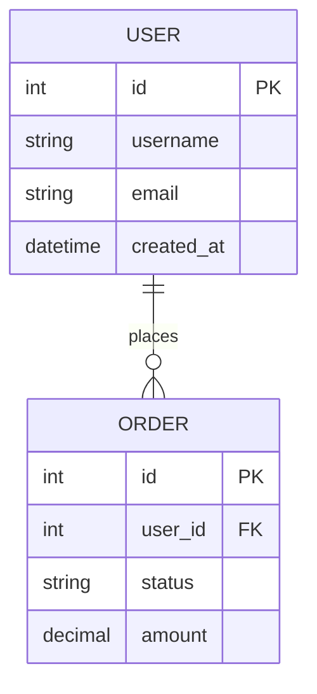
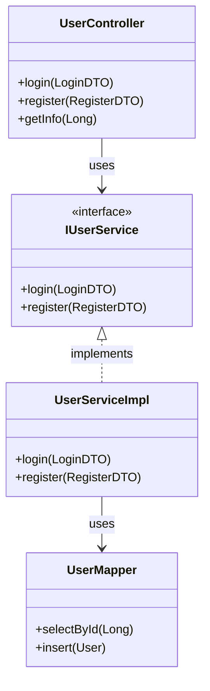

# 详细设计助手

执行 SDLC 阶段 4：系统详细设计，输出详细设计文档。

## 阶段目标

设计系统细节，包括 API 规范、数据模型、类设计等。

## 输入

- 架构设计文档（阶段 3 产出）
- 需求规格说明书（阶段 1 产出）

## 输出

| 产出物 | 文件路径 | 说明 |
|--------|----------|------|
| API 规范 | `docs/detailed-design/api-specs.md` | RESTful API 设计 |
| 数据模型 | `docs/detailed-design/data-models.md` | 实体关系设计 |
| 类设计 | `docs/detailed-design/class-design.md` | 类图和职责 |
| 数据库设计 | `docs/detailed-design/database-design.md` | 表结构设计 |

## 执行步骤

### 1. API 设计

```markdown
- 定义 API 端点
- 定义请求/响应格式
- 定义错误处理
- 定义认证授权
```

### 2. 数据模型设计

```markdown
- 识别实体和关系
- 设计 ER 图
- 定义字段类型和约束
- 设计索引策略
```

### 3. 类设计

```markdown
- 设计类结构
- 定义职责和接口
- 设计继承关系
- 应用设计模式
```

### 4. 数据库设计

```markdown
- 设计表结构
- 设计外键关系
- 设计索引
- 规划迁移策略
```

## Mermaid 图表约定

详细设计阶段必须使用 Mermaid 绘制以下图表：

| 图表类型 | Mermaid 关键字 | 用途 | 示例场景 |
|----------|----------------|------|----------|
| ER 图 | `erDiagram` | 数据库表关系 | 用户-订单关系 |
| 类图 | `classDiagram` | 类结构关系 | Service-Mapper 关系 |
| 时序图 | `sequenceDiagram` | API 调用时序 | 用户注册流程 |
| 对象图 | `objectDiagram` | 对象实例关系 | 订单对象结构 |
| 流程图 | `flowchart` | 业务流程 | 订单处理流程 |

### 图表命名规范

- 文件命名：`diagrams/{name}-design.mmd`
- ER 图表名：`{实体1}{关系}{实体2}`

### 图表示例

**ER 图**


**类图**


## 使用方法

### 开始详细设计

```
/detailed-design
```

### 只设计 API

```
/detailed-design --focus api
```

### 只设计数据模型

```
/detailed-design --focus data-model
```

### 基于架构文档

```
/detailed-design --from docs/architecture/
```

## API 设计规范

### RESTful 端点命名

```
GET    /api/v1/users          # 获取用户列表
GET    /api/v1/users/{id}     # 获取单个用户
POST   /api/v1/users          # 创建用户
PUT    /api/v1/users/{id}     # 更新用户
DELETE /api/v1/users/{id}     # 删除用户
```

### 响应格式

```json
{
  "code": 200,
  "message": "success",
  "data": { },
  "timestamp": "2026-03-16T10:00:00Z"
}
```

## 触发的 Guards

| Guard | 触发条件 |
|-------|----------|
| Security Agent | 涉及认证授权 |
| Performance Agent | 涉及数据查询 |

## 质量门禁

- [ ] API 规范已定义
- [ ] 数据模型已设计
- [ ] 类设计已完成
- [ ] 数据库设计已评审
- [ ] 索引策略已规划

## 模板位置

```
SDLC-Framework/04-detailed-design/templates/
├── api-spec-template.md
├── data-model-template.md
├── class-design-template.md
└── database-design-template.md
```

## 下一步

详细设计完成后，执行：
```
/flyway-migration create --table=xxx
```
或
```
/ruoyi-crud table_name
```
