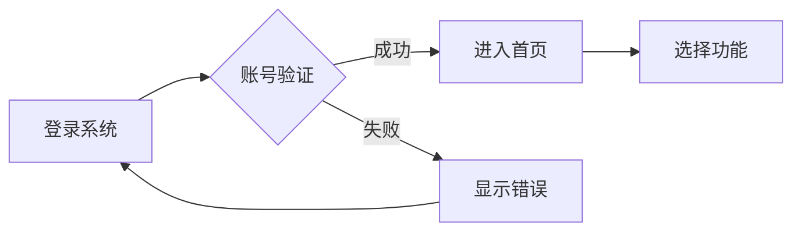

# 文档编写助手

执行 SDLC 阶段 12-13：文档编写，生成用户文档和运维文档。

## 阶段目标

生成完整的用户文档和运维文档。

## 文档类型

| 类型 | 阶段 | 产出物 | 文件路径 |
|------|------|--------|----------|
| 用户文档 | 12 | 用户手册 | `docs/user/user-manual.md` |
| 用户文档 | 12 | 快速开始 | `docs/user/quick-start.md` |
| 运维文档 | 13 | 运维手册 | `docs/deployment/operations-manual.md` |
| 运维文档 | 13 | 监控配置 | `docs/deployment/monitoring.md` |
| API 文档 | - | API 文档 | `docs/api/` |

## 执行步骤

### 1. 用户手册

```markdown
- 系统概述
- 功能说明
- 操作指南
- 常见问题
- 联系支持
```

### 2. 快速开始

```markdown
- 环境准备
- 安装步骤
- 基本配置
- 第一个操作
```

### 3. 运维手册

```markdown
- 系统架构
- 部署说明
- 配置管理
- 日志管理
- 备份恢复
- 故障排查
```

### 4. API 文档

```markdown
- 接口列表
- 请求/响应示例
- 错误码说明
- 认证方式
```

## 使用方法

### 生成用户手册

```
/documentation --type user-manual
```

### 生成运维手册

```
/documentation --type operations-manual
```

### 生成所有文档

```
/documentation --all
```

### 基于 API 生成文档

```
/documentation --from-api src/main/java/com/example/controller/
```

### 使用 API 文档 Skill

```
/api-doc UserController
```

## Mermaid 图表约定

文档编写阶段应使用 Mermaid 绘制说明性图表：

| 图表类型 | Mermaid 关键字 | 用途 | 放置位置 |
|----------|----------------|------|----------|
| 流程图 | `flowchart` | 操作步骤 | 用户手册 |
| 时序图 | `sequenceDiagram` | API 交互 | API 文档 |
| 甘特图 | `gantt` | 部署计划 | 运维手册 |
| 思维导图 | `mindmap` | 概念说明 | 系统概述 |
| 饼图 | `pie` | 数据分布 | 统计报告 |

### 文档中的图表规范

- 图表前必须有说明文字
- 图表后必须有示例说明
- 复杂图表需要分步骤展示
- 使用中文标注，提高可读性

### 图表示例

**用户手册中的操作流程**


**运维手册中的部署流程**

```mermaid
gantt
    title 系统部署时间线
    dateFormat  HH:mm
    section 准备阶段
    环境检查      :a1, 09:00, 30m
    依赖安装      :a2, after a1, 30m
    section 部署阶段
    应用部署      :b1, after a2, 20m
    数据库迁移    :b2, after b1, 10m
    section 验证阶段
    健康检查      :c1, after b2, 10m
    冒烟测试      :c2, after c1, 20m
```


## 文档模板

### 用户手册结构

```markdown
# 系统用户手册

## 1. 系统概述
   - 系统简介
   - 功能模块
   - 技术架构

## 2. 快速开始
   - 登录系统
   - 基本操作
   - 首页介绍

## 3. 功能说明
   - 模块 A
   - 模块 B
   - 模块 C

## 4. 操作指南
   - 操作 1
   - 操作 2

## 5. 常见问题
   - FAQ

## 6. 附录
   - 术语表
   - 联系方式
```

### 运维手册结构

```markdown
# 系统运维手册

## 1. 系统架构
   - 架构图
   - 组件说明

## 2. 部署说明
   - 环境要求
   - 部署步骤
   - 配置说明

## 3. 日常运维
   - 启动/停止
   - 日志查看
   - 监控检查

## 4. 备份恢复
   - 备份策略
   - 恢复步骤

## 5. 故障排查
   - 常见问题
   - 排查流程

## 6. 应急预案
   - 应急流程
   - 联系人
```

## 质量门禁

- [ ] 用户手册已完成
- [ ] 运维手册已完成
- [ ] API 文档已更新
- [ ] 文档已评审

## 相关 Skills

- `/api-doc` - API 文档生成
- `/mermaid-diagram` - 架构图绘制

## 下一步

文档完成后，执行：
```
/deployment
```
