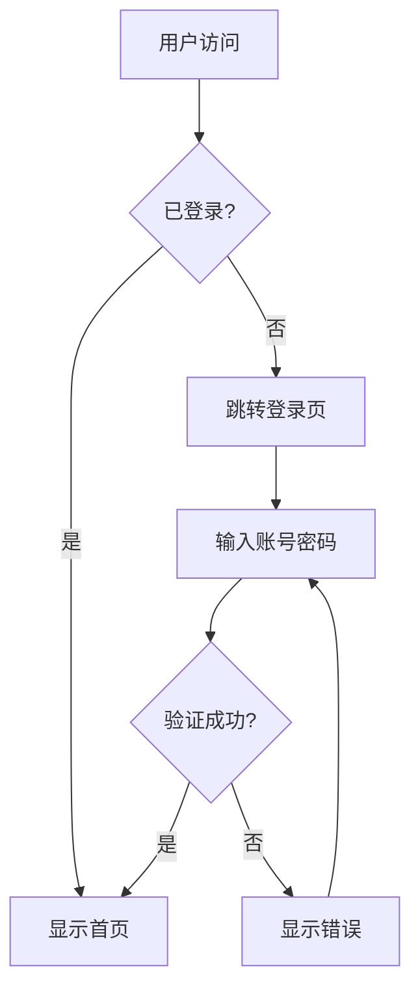
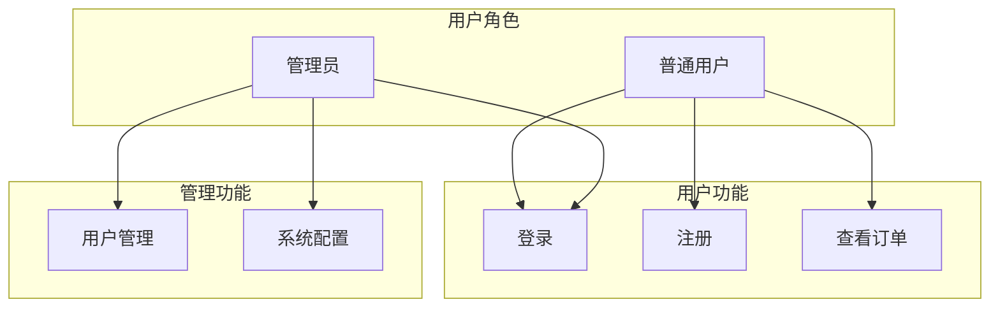
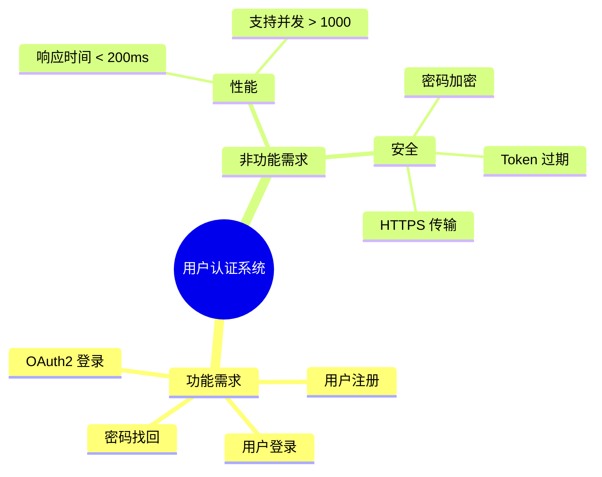

# 需求分析助手

执行 SDLC 阶段 1：需求分析，生成完整的需求文档。

## 阶段目标

收集和分析业务需求，输出标准化的需求规格说明书。

## 输入

- 用户描述的需求（口头或书面）
- 现有系统文档（如有）
- 相关参考材料

## 输出

| 产出物 | 文件路径 | 说明 |
|--------|----------|------|
| 需求规格说明书 | `docs/requirements/requirements-spec.md` | 完整需求描述 |
| 用户故事 | `docs/requirements/user-stories.md` | 用户故事列表 |
| 验收标准 | `docs/requirements/acceptance-criteria.md` | 验收条件 |
| 干系人分析 | `docs/requirements/stakeholders.md` | 干系人列表 |
| 业务流程图 | `docs/requirements/diagrams/*.mmd` | Mermaid 流程图 |

## 下一阶段

需求分析完成后，执行产品设计：
```
/ui-ux-pro-max --type prototype --style modern
```

## 执行步骤

### 1. 需求收集

```markdown
- 识别业务背景和目标
- 收集功能需求
- 收集非功能需求（性能、安全、可用性）
- 识别约束条件
```

### 2. 需求分析

```markdown
- 需求分类（功能/非功能）
- 需求优先级排序（MoSCoW 方法）
- 需求依赖关系分析
- 风险识别
```

### 3. 需求文档化

```markdown
- 使用模板生成需求规格说明书
- 编写用户故事
- 定义验收标准
- 绘制业务流程图
```

### 4. 需求评审

```markdown
- 检查需求完整性
- 验证需求可测试性
- 确认干系人认可
```

## Mermaid 图表约定

需求分析阶段必须使用 Mermaid 绘制业务图表：

| 图表类型 | Mermaid 关键字 | 用途 | 示例场景 |
|----------|----------------|------|----------|
| 流程图 | `flowchart` | 业务流程 | 用户注册流程 |
| 用例图 | `flowchart` | 用例关系 | 用户角色权限 |
| 思维导图 | `mindmap` | 需求结构 | 功能模块划分 |
| 状态图 | `stateDiagram` | 业务状态 | 订单生命周期 |
| 时序图 | `sequenceDiagram` | 业务交互 | 下单支付流程 |

### 图表命名规范

- 文件命名：`diagrams/{name}-requirement.mmd`
- 流程图命名：`{业务场景}-流程`
- 状态图命名：`{实体}-状态机`

### 图表示例

**业务流程图**


**用例图**


**需求思维导图**


## 下一阶段工作

需求分析完成后，使用 **ui-ux-pro-max** skill 进行产品设计：

```
/ui-ux-pro-max --type design --style modern --framework vue
```

产品设计将输出：
- 设计系统文档
- Vue 3 组件代码
- UI 规范说明

## 使用方法

### 从需求描述开始

```
/requirements-analysis 我们需要开发一个用户认证系统，支持 OAuth2 登录
```

### 从需求文件开始

```
/requirements-analysis --from docs/需求说明.txt
```

### 更新现有需求

```
/requirements-analysis --update docs/requirements/
```

## 质量门禁

- [ ] 需求规格说明书已完成
- [ ] 用户故事已定义
- [ ] 验收标准已明确
- [ ] 干系人已确认
- [ ] 无模糊或冲突的需求
- [ ] Mermaid 业务图表已完成

## 模板位置

```
templates/
├── requirements-template.md
├── user-stories-template.md
├── acceptance-criteria-template.md
└── stakeholders-template.md
```

## 下一步

需求分析完成后，执行产品设计：
```
/ui-ux-pro-max --type design --style modern
```

产品设计完成后，执行架构设计：
```
/sdlc-architecture-design
```
