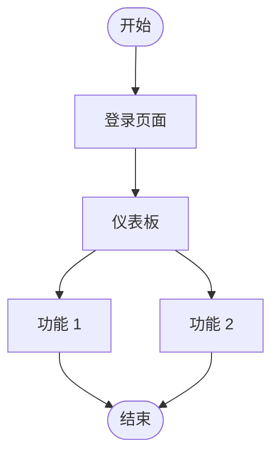
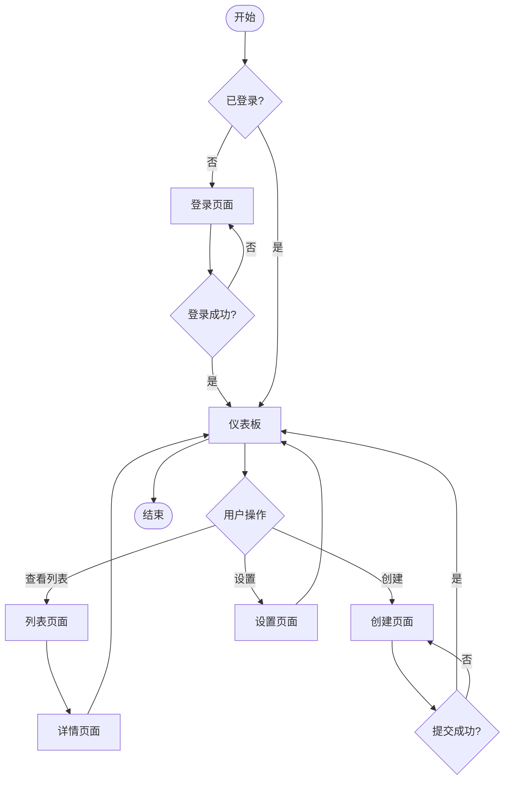

# Product Design Skill

设计产品: **$ARGUMENTS**

## 技能概述

本技能帮助你完成产品设计，包括线框图创建、用户流程设计和交互原型规格。创建的线框图使用 HTML 和 SVG 格式，可以在浏览器中直接查看和交互。

## 使用场景

- **新产品设计**: 从零开始设计产品界面
- **功能重构**: 重新设计现有功能的界面
- **用户体验优化**: 改进用户交互流程
- **原型演示**: 创建可交互的原型用于演示和测试

## 工作流程

### 步骤 1: 理解需求

**输入**:
- 需求规格说明书
- 用户故事
- 验收标准

**分析**:
1. 用户角色分析
2. 用户目标识别
3. 使用场景梳理
4. 约束条件确认

### 步骤 2: 设计信息架构

**活动**:
1. 定义页面层级结构
2. 设计导航体系
3. 规划内容组织
4. 确定页面流程

**输出**:
- 信息架构图
- 页面流程图

### 步骤 3: 创建线框图 (Wireframes)

**格式**: HTML + SVG

**工具**:
- 基础 HTML 结构
- SVG 图形元素
- CSS 基础样式
- 可点击的交互元素

**包含元素**:
- 页面布局
- 组件位置
- 导航结构
- 交互元素

**输出位置**: `docs/design/wireframes/`

### 步骤 4: 设计用户流程

**使用 Mermaid flowchart**:


**输出位置**: `docs/design/user-flow.md`

### 步骤 5: 创建交互原型规格

**包含内容**:
1. 页面跳转逻辑
2. 交互状态定义
3. 动画效果说明
4. 错误处理流程

**输出位置**: `docs/design/prototype-spec.md`

### 步骤 6: 设计规范

**包含内容**:
1. 颜色规范
2. 字体规范
3. 间距规范
4. 组件规范

**输出位置**: `docs/design/design-system.md`

## 输出文档

### 1. 线框图 (Wireframes)

**位置**: `docs/design/wireframes/`

**文件结构**:
```
wireframes/
├── index.html           # 线框图导航页
├── login.html           # 登录页面线框图
├── dashboard.html       # 仪表板线框图
├── user-list.html       # 用户列表线框图
└── user-detail.html     # 用户详情线框图
```

**线框图模板**: 使用 `templates/wireframe-template.html`

### 2. 用户流程图 (User Flow)

**位置**: `docs/design/user-flow.md`

**使用模板**: `templates/ui-flow-template.md`

### 3. 原型规格 (Prototype Specification)

**位置**: `docs/design/prototype-spec.md`

**使用模板**: `templates/prototype-spec-template.md`

### 4. 设计系统 (Design System)

**位置**: `docs/design/design-system.md`

**使用模板**: `templates/design-system-template.md`

## 线框图创建指南

### HTML 线框图结构

```html
<!DOCTYPE html>
<html lang="zh-CN">
<head>
    <meta charset="UTF-8">
    <meta name="viewport" content="width=device-width, initial-scale=1.0">
    <title>[页面名称] - 线框图</title>
    <style>
        /* 基础样式 */
        * {
            margin: 0;
            padding: 0;
            box-sizing: border-box;
        }

        body {
            font-family: Arial, sans-serif;
            background: #f5f5f5;
            padding: 20px;
        }

        .wireframe {
            max-width: 1200px;
            margin: 0 auto;
            background: white;
            border: 2px dashed #ccc;
            padding: 20px;
        }

        /* 组件样式 */
        .header {
            border: 2px solid #333;
            padding: 15px;
            margin-bottom: 20px;
            display: flex;
            justify-content: space-between;
            align-items: center;
        }

        .nav {
            border: 2px solid #666;
            padding: 10px;
            margin-bottom: 20px;
        }

        .content {
            border: 2px solid #999;
            padding: 20px;
            min-height: 400px;
        }

        .footer {
            border: 2px solid #666;
            padding: 10px;
            margin-top: 20px;
            text-align: center;
        }

        /* 交互元素 */
        .button {
            border: 2px solid #333;
            padding: 8px 16px;
            display: inline-block;
            background: #e0e0e0;
            cursor: pointer;
        }

        .input {
            border: 2px solid #666;
            padding: 8px;
            width: 200px;
        }

        .card {
            border: 2px solid #666;
            padding: 15px;
            margin: 10px 0;
        }
    </style>
</head>
<body>
    <div class="wireframe">
        <div class="header">
            <h1>[页面标题]</h1>
            <div class="user-info">用户信息 | 退出</div>
        </div>

        <nav class="nav">
            <a href="#" class="button">首页</a>
            <a href="#" class="button">功能1</a>
            <a href="#" class="button">功能2</a>
            <a href="#" class="button">设置</a>
        </nav>

        <main class="content">
            <h2>[主要内容区域]</h2>
            <div class="card">
                <h3>[卡片标题]</h3>
                <p>[卡片内容]</p>
                <button class="button">操作</button>
            </div>
        </main>

        <footer class="footer">
            <p>页脚信息</p>
        </footer>
    </div>
</body>
</html>
```

### SVG 线框图元素

对于复杂的图形元素，使用 SVG：

```html
<svg width="400" height="300" xmlns="http://www.w3.org/2000/svg">
    <!-- 容器边框 -->
    <rect x="10" y="10" width="380" height="280"
          fill="none" stroke="#333" stroke-width="2" stroke-dasharray="5,5"/>

    <!-- 标题 -->
    <rect x="30" y="30" width="200" height="30"
          fill="#e0e0e0" stroke="#333" stroke-width="2"/>
    <text x="130" y="50" text-anchor="middle" font-family="Arial" font-size="14">标题</text>

    <!-- 按钮 -->
    <rect x="30" y="80" width="80" height="30"
          fill="#f0f0f0" stroke="#333" stroke-width="2"/>
    <text x="70" y="100" text-anchor="middle" font-family="Arial" font-size="12">按钮</text>

    <!-- 输入框 -->
    <rect x="120" y="80" width="150" height="30"
          fill="white" stroke="#666" stroke-width="2"/>
    <text x="130" y="100" font-family="Arial" font-size="12" fill="#999">输入框</text>
</svg>
```

## 用户流程设计

使用 Mermaid 创建用户流程图：



## 交互原型规格

### 页面跳转规格

```markdown
## 页面: 登录页面

### 入口
- URL: /login
- 前置页面: 任何需要认证的页面

### 出口
- 登录成功 → 跳转到仪表板 (/dashboard)
- 取消 → 返回首页 (/)
- 忘记密码 → 跳转到密码重置页面 (/reset-password)

### 交互元素
- 用户名输入框
- 密码输入框
- 登录按钮
- 取消按钮
- 忘记密码链接
```

### 状态定义

```markdown
## 状态: 表单提交

### 初始状态
- 提交按钮: 可点击
- 表单字段: 可编辑

### 提交中状态
- 提交按钮: 禁用，显示"提交中..."
- 表单字段: 禁用
- 加载指示器: 显示

### 成功状态
- 提交按钮: 显示"成功 ✓"
- 表单字段: 禁用
- 成功消息: 显示
- 2秒后自动跳转

### 错误状态
- 提交按钮: 恢复可点击
- 表单字段: 恢复可编辑
- 错误消息: 显示在顶部
- 错误字段: 高亮显示
```

## 设计系统模板

### 颜色规范

```markdown
## 颜色规范

### 主色调
- Primary Blue: #1890ff
  - Light: #40a9ff
  - Dark: #096dd9

### 辅助色
- Success: #52c41a
- Warning: #faad14
- Error: #f5222d
- Info: #1890ff

### 中性色
- Text Primary: #262626
- Text Secondary: #595959
- Border: #d9d9d9
- Background: #f0f2f5
```

### 字体规范

```markdown
## 字体规范

### 字体家族
- 中文字体: -apple-system, "PingFang SC", "Microsoft YaHei"
- 英文字体: -apple-system, BlinkMacSystemFont, "Segoe UI"

### 字号
- H1: 32px / 48px (标题/大标题)
- H2: 24px / 36px
- H3: 18px / 24px
- Body: 14px / 16px
- Small: 12px

### 字重
- Regular: 400
- Medium: 500
- Bold: 700
```

## 质量检查

在完成产品设计后，确保：

- [ ] 所有主要页面的线框图已创建
- [ ] 用户流程图清晰完整
- [ ] 交互原型规格详细
- [ ] 设计系统规范一致
- [ ] 线框图可在浏览器中查看
- [ ] 用户流程符合用户故事
- [ ] 设计符合用户体验最佳实践
- [ ] 与需求规格保持一致

## 下一步

产品设计完成后，进入下一阶段：

```bash
/architecture-design
```

## 示例

**输入**:
```bash
/product-design "用户管理功能界面"
```

**输出**:
1. `docs/design/wireframes/` - HTML 线框图
2. `docs/design/user-flow.md` - 用户流程图
3. `docs/design/prototype-spec.md` - 原型规格
4. `docs/design/design-system.md` - 设计系统
