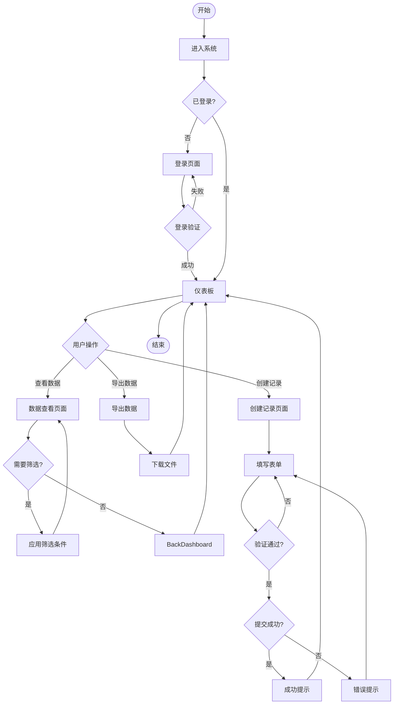
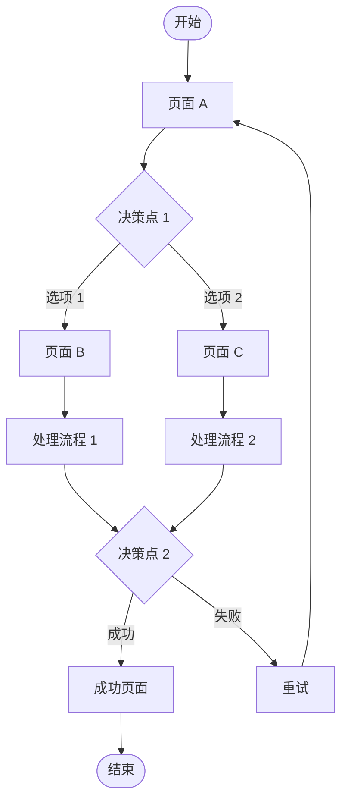
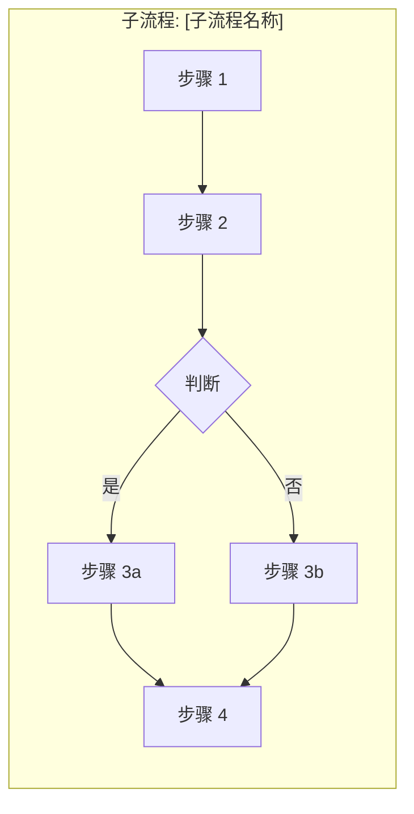
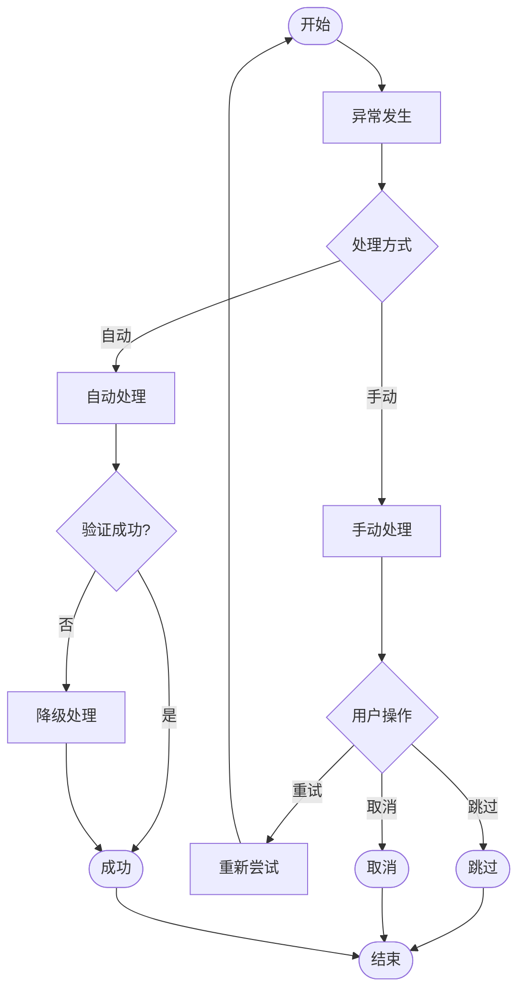

# 用户流程图 (User Flow)

> **项目**: [项目名称]
> **版本**: 1.0
> **最后更新**: [日期]

---

## 流程概览

本文档描述产品的主要用户流程，包括用户从进入系统到完成目标的完整路径。

---

## 用户角色

| 角色 | 描述 | 主要目标 |
|------|------|----------|
| 管理员 | 系统管理员 | 管理用户、配置系统 |
| 操作员 | 业务操作人员 | 处理日常业务 |
| 普通用户 | 终端用户 | 使用系统功能 |

---

## 用户流程图

### 主要流程 1: [流程名称]

**流程说明**:
1. 用户进入系统，检查登录状态
2. 未登录则跳转到登录页面
3. 登录成功后进入仪表板
4. 根据用户操作导航到不同功能页面
5. 完成操作后返回仪表板或退出

---

### 主要流程 2: [流程名称]

---

### 子流程: [子流程名称]

---

## 页面流程详情

### 页面: [页面名称]

**入口**:
- 来源: [从哪个页面进入]
- 条件: [进入条件]

**出口**:
- 动作 1 → [目标页面]
- 动作 2 → [目标页面]
- 返回 → [返回页面]

**关键交互**:
1. [交互 1]
2. [交互 2]

**页面元素**:
- [元素 1]: [说明]
- [元素 2]: [说明]

---

## 异常流程

### 异常 1: [异常名称]

**触发条件**: [什么情况触发]

**处理流程**:

---

## 用户流程最佳实践

### 设计原则

1. **清晰性**: 流程应该清晰、直观
2. **简洁性**: 减少不必要的步骤
3. **一致性**: 相似操作使用相似流程
4. **反馈性**: 每个操作都有明确反馈
5. **容错性**: 允许用户撤销和修正

### 流程优化建议

- **减少点击次数**: 合并相关步骤
- **提供快捷方式**: 为高频用户提供快速路径
- **智能预填充**: 根据上下文预填信息
- **错误预防**: 在错误发生前进行提示
- **渐进式引导**: 新用户显示引导提示

---

## 流程验证

### 验证清单

- [ ] 流程覆盖所有用户场景
- [ ] 每个决策点都有明确的分支
- [ ] 异常流程都有处理方案
- [ ] 流程符合用户习惯
- [ ] 流程支持用户目标达成

### 测试用例

| 用例 ID | 场景描述 | 步骤 | 预期结果 |
|---------|----------|------|----------|
| UF-001 | 正常登录 | 1. 打开登录页 2. 输入用户名密码 3. 点击登录 | 跳转到仪表板 |
| UF-002 | 登录失败 | 1. 打开登录页 2. 输入错误密码 3. 点击登录 | 显示错误提示 |

---

## 相关文档

- 线框图: `docs/design/wireframes/`
- 原型规格: `docs/design/prototype-spec.md`
- 需求规格: `docs/requirements/requirements-spec.md`
