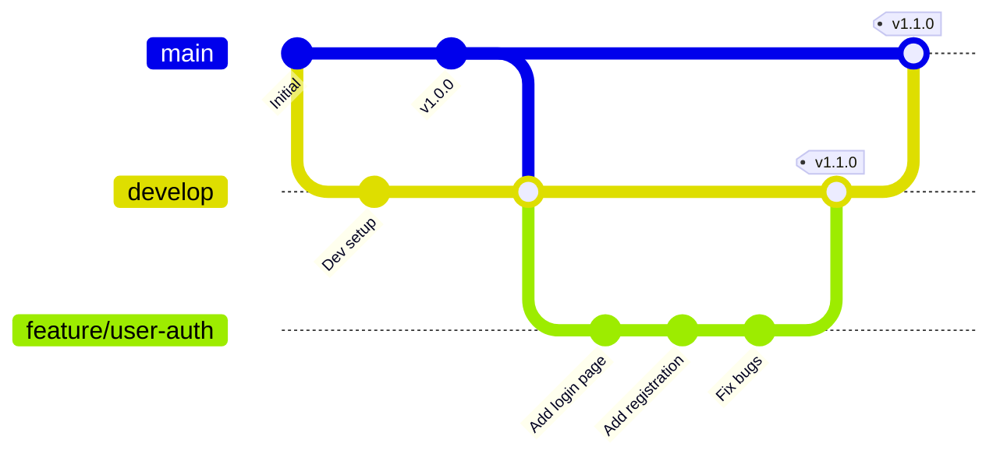

# Git 工作流程规范 (Git Workflow)

> **项目**: [项目名称]
> **版本**: 1.0
> **最后更新**: [日期]

---

## 概述

本文档定义项目的 Git 工作流程规范，确保代码质量和团队协作效率。

**核心原则**:
- **分支隔离**: 所有功能开发在独立分支进行
- **PR 合并**: 代码只能通过 Pull Request 合并到 main
- **代码审查**: 每个 PR 必须经过代码审查
- **禁止直接提交**: main 分支禁止直接提交代码

---

## 分支策略

### 主要分支

#### main 分支
- **用途**: 生产环境代码，始终保持稳定可发布状态
- **保护**: 启用分支保护，禁止直接推送
- **要求**:
  - 只能通过 PR 合并
  - PR 必须经过审查批准
  - 必须通过 CI 检查
  - 必须更新文档（如需要）

#### develop 分支（可选）
- **用途**: 开发环境代码，集成最新功能
- **来源**: 从 main 分支创建
- **合并**: 功能分支合并到 develop
- **发布**: develop 合并到 main 时创建 release tag

### 功能分支

#### 命名规范

```
feature/[功能名称]-[编号]
```

**示例**:
```
feature/user-authentication-001
feature/order-management-002
feature/payment-integration-003
```

#### 创建时机
- 开始新功能开发时
- 从 main 分支拉取最新代码

#### 工作流程
1. 从 main 拉取最新代码
2. 创建功能分支
3. 在功能分支上开发
4. 提交代码到功能分支
5. 创建 PR 到 main
6. 代码审查通过后合并
7. 删除功能分支（可选）

#### 生命周期
- 短期分支，开发完成后即删除
- 合并到 main 后可以删除

### 修复分支

#### 命名规范

```
fix/[问题描述]-[编号]
bugfix/[问题描述]-[编号]
hotfix/[紧急修复]-[编号]
```

**示例**:
```
fix/login-error-001
bugfix/payment-timeout-002
hotfix/security-patch-003
```

#### 使用场景
- **fix**: 修复普通 Bug
- **bugfix**: 修复较复杂的 Bug
- **hotfix**: 紧急生产问题修复

#### 工作流程
1. 从 main 拉取最新代码
2. 创建修复分支
3. 修复 Bug
4. 提交代码
5. 创建 PR 到 main
6. 加急审查
7. 合并后立即部署

### 发布分支

#### 命名规范

```
release/[版本号]
```

**示例**:
```
release/v1.0.0
release/v1.1.0
release/v2.0.0
```

#### 使用场景
- 准备发布新版本
- 进行发布前的测试
- 生成版本号和发布说明

#### 工作流程
1. 从 develop 创建发布分支（如果有 develop）
2. 在发布分支上进行最后的调整
3. 创建版本号 Tag
4. 合并到 main
5. 合并回 develop（如果有）

---

## 分支保护规则

### main 分支保护

**必须启用的保护规则**:

1. **禁止直接推送**
   - ❌ 不允许任何用户直接推送到 main
   - ✅ 只能通过 PR 合并

2. **PR 要求**
   - ✅ 至少 1 个审查批准
   - ✅ 所有 CI 检查通过
   - ✅ 代码审查覆盖率达到要求

3. **审查要求**
   - ✅ 至少 1 位审查者批准
   - ✅ 代码所有者批准（如果设置了）

4. **更新策略**
   - ✅ 允许合并提交（Squash and merge 或 Merge commit）
   - ❌ 禁止 rebase merge
   - ❌ 禁止普通提交

### GitHub 分支保护设置

**路径**: Settings → Branches → Add rule

**配置示例**:
```
Branch name pattern: main

☑ Require pull request reviews
  - Required approvals: 1
  - Dismiss stale reviews: 取消勾选

☑ Require status checks to pass before merging
  - Required checks:
    ✓ ci/test
    ✓ ci/lint
    ✓ ci/build

☑ Require branches to be up to date before merging

☑ Require conversation resolution before merging

☑ Limit who can push to matching branches
  - 选定特定人员或团队（通常只有维护者）
```

---

## 工作流程

### 功能开发工作流



### 步骤详解

#### 1. 开始新功能

```bash
# 1. 确保本地 main 是最新的
git checkout main
git pull origin main

# 2. 从 main 创建功能分支
git checkout -b feature/user-authentication-001

# 3. 查看当前分支
git branch
```

#### 2. 开发过程中

```bash
# 1. 查看修改状态
git status

# 2. 添加修改的文件
git add .
# 或添加特定文件
git add src/main/java/UserController.java

# 3. 提交代码
git commit -m "feat(user): 添加用户登录功能

- 实现用户名密码登录
- 添加 JWT Token 认证
- 添加登录验证逻辑

Closes #001"

# 4. 推送到远程仓库
git push -u origin feature/user-authentication-001
```

#### 3. 创建 Pull Request

**方式 1: 通过 GitHub 网页**

1. 访问 GitHub 仓库
2. 点击 "Compare & pull request"
3. 选择功能分支到 main
4. 填写 PR 信息
5. 提交 PR

**方式 2: 通过 GitHub CLI**

```bash
# 安装 GitHub CLI
# macOS: brew install gh
# Linux: https://github.com/cli/cli

# 创建 PR
gh pr create \
  --title "feat: 添加用户认证功能" \
  --body "请查看描述" \
  --base main \
  --head feature/user-authentication-001
```

#### 4. 代码审查

**审查者检查项**:
- [ ] 代码符合规范
- [ ] 功能正确实现
- [ ] 无明显 Bug
- [ ] 性能无明显问题
- [ ] 测试覆盖充分
- [ ] 文档已更新
- [ ] 无安全漏洞

**审查流程**:
1. 审查者在 GitHub 上查看代码
2. 添加评论和建议
3. 开发者根据反馈修改代码
4. 审查者批准 PR

#### 5. 合并 PR

**合并方式**: Squash and merge（推荐）

**原因**:
- 保持 main 分支历史清晰
- 将多个提交压缩为一个
- 便于回滚

**步骤**:
1. 确保 CI 检查全部通过
2. 确保有审查批准
3. 点击 "Merge pull request"
4. 使用 "Squash and merge" 方式

#### 6. 清理分支

```bash
# 切换到 main 分支
git checkout main

# 拉取最新代码
git pull origin main

# 删除本地功能分支
git branch -d feature/user-authentication-001

# 删除远程功能分支
git push origin --delete feature/user-authentication-001
```

---

## 提交规范

### Commit Message 格式

遵循 [Conventional Commits](https://www.conventionalcommits.org/) 规范：

```
<类型>[可选的作用域]: <描述>

[可选的正文]

[可选的脚注]
```

### 类型 (Type)

| 类型 | 描述 | 示例 |
|------|------|------|
| `feat` | 新功能 | `feat(auth): 添加用户登录功能` |
| `fix` | Bug 修复 | `fix(payment): 修复支付超时问题` |
| `docs` | 文档更新 | `docs(readme): 更新安装说明` |
| `style` | 代码格式 | `style(user): 格式化代码` |
| `refactor` | 重构 | `refactor(service): 重构订单服务` |
| `perf` | 性能优化 | `perf(query): 优化查询性能` |
| `test` | 测试 | `test(user): 添加用户测试` |
| `chore` | 构建/工具 | `chore: 更新依赖版本` |
| `revert` | 回滚 | `revert: 撤销 feat(xxx)` |

### 作用域 (Scope)

作用域可以是模块名、功能名等：

```
feat(auth): 添加用户登录功能
fix(database): 修复查询 Bug
docs(api): 更新 API 文档
```

### 描述 (Description)

- 使用现在时态："添加"而不是"添加了"
- 首字母小写
- 简洁明了，说明做了什么

**示例**:
```
✅ 好的提交:
feat(user): 添加用户注册功能
fix(auth): 修复 Token 过期问题
docs(api): 更新认证接口文档

❌ 不好的提交:
update
fix bug
add new feature
```

### 详细模板

```bash
feat(auth): 添加用户双因素认证功能

- 实现 TOTP 验证码生成
- 添加二维码绑定功能
- 支持 Recovery Code
- 更新登录 UI

Closes #123
Co-Authored-By: 张三 <zhangsan@example.com>
```

---

## Pull Request 模板

### PR 标题

```
<类型>: <简短描述>

关联 Issue: #<编号>
```

### PR 描述模板

```markdown
## 变更说明
<!-- 描述这个 PR 做了什么 -->

## 变更类型
- [ ] 新功能
- [ ] Bug 修复
- [ ] 性能优化
- [ ] 重构
- [ ] 文档更新
- [ ] 测试

## 测试情况
- [ ] 单元测试通过
- [ ] 集成测试通过
- [ ] 手动测试通过
- [ ] 测试覆盖率 >= 80%

## 检查清单
- [ ] 代码符合团队规范
- [ ] 已添加必要的注释
- [ ] 已更新相关文档
- [ ] 已更新 API 文档（如需要）
- [ ] 无明显的性能问题
- [ ] 无安全漏洞

## 截图/演示
<!-- 如果是 UI 变更，添加截图或 GIF -->

## 相关 Issue
Closes #<issue编号>
Relates to #<issue编号>

## 其他说明
<!-- 其他需要说明的内容 -->
```

---

## 代码审查规范

### 审查者职责

1. **代码质量**
   - 代码符合团队规范
   - 命名清晰合理
   - 逻辑正确无误
   - 无明显 Bug

2. **架构设计**
   - 设计合理
   - 遵循 SOLID 原则
   - 没有明显的技术债

3. **性能和安全**
   - 无明显性能问题
   - 无安全漏洞
   - 输入验证完整

4. **测试**
   - 测试覆盖充分
   - 测试用例合理
   - 边界条件考虑

5. **文档**
   - 代码注释充分
   - API 文档更新
   - README 更新（如需要）

### 开发者职责

1. **响应反馈**
   - 及时响应审查评论
   - 解释设计决策
   - 接受或拒绝建议

2. **修改代码**
   - 根据反馈修改
   - 确保修改后测试通过

3. **保持更新**
   - 及时同步 main 分支的变更
   - 解决冲突

### 审查评论规范

#### 评论类型

**问题 (Must fix)**: 必须修改才能合并
```markdown
**问题**: 这里的空指针检查缺失，可能导致崩溃
建议：添加 null check
```

**建议 (Should fix)**: 建议修改，但不强制
```markdown
**建议**: 建议使用 Optional 包装可能为 null 的值
```

**好评 (Praise)**: 肯定好的实践
```markdown
**好评**: 这里的错误处理很完善，值得借鉴
```

**疑问 (Question)**: 提出疑问
```markdown
**疑问**: 为什么使用 HashMap 而不是 TreeMap？
```

---

## 常见问题

### Q: 如何处理 PR 中的冲突？

**A**:
```bash
# 1. 切换到功能分支
git checkout feature/user-authentication-001

# 2. 拉取 main 最新代码
git fetch origin
git rebase origin/main

# 3. 解决冲突
# 编辑冲突文件，解决 <<<<<<< ======= >>>>>>> 标记的冲突

# 4. 添加修改
git add .

# 5. 继续变基
git rebase --continue

# 6. 强制推送（因为 rebase 重写了历史）
git push --force-with-lease
```

### Q: 如何修改已提交的代码？

**A**:
```bash
# 方式 1: 修改最后一条提交
git commit --amend

# 方式 2: 修改多条提交
git rebase -i HEAD~3  # 交互式变基最近 3 次提交

# 方式 3: 完全撤销最近的提交
git reset HEAD~1  # 撤销提交但保留修改
git reset --hard HEAD~1  # 撤销提交和修改
```

### Q: 如何查看提交历史？

**A**:
```bash
# 查看提交历史
git log

# 查看简洁历史
git log --oneline

# 查看分支图
git log --graph --oneline --all

# 查看特定文件的历史
git log -- filename

# 查看提交详情
git show <commit-hash>
```

---

## 辅助脚本

### 功能开发脚本

创建 `scripts/start-feature.sh`:

```bash
#!/bin/bash

if [ -z "$1" ]; then
    echo "用法: ./start-feature.sh <feature-name>"
    exit 1
fi

FEATURE_NAME=$1
BRANCH_NAME="feature/${FEATURE_NAME}"

# 确保在 main 分支
git checkout main

# 拉取最新代码
git pull origin main

# 创建功能分支
git checkout -b "$BRANCH_NAME"

echo "✓ 功能分支 $BRANCH_NAME 已创建"
echo "当前分支: $(git branch --show-current)"
```

### 完成功能脚本

创建 `scripts/finish-feature.sh`:

```bash
#!/bin/bash

CURRENT_BRANCH=$(git branch --show-current)

if [[ ! $CURRENT_BRANCH =~ ^feature/ ]]; then
    echo "错误: 当前不在功能分支上"
    echo "当前分支: $CURRENT_BRANCH"
    exit 1
fi

# 推送到远程
git push -u origin "$CURRENT_BRANCH"

# 创建 PR
echo "正在创建 Pull Request..."
gh pr create \
  --title "feat: $(echo $CURRENT_BRANCH | sed 's/feature\///' | sed 's/-/ /g')" \
  --base main \
  --head "$CURRENT_BRANCH"

echo "✓ Pull Request 已创建"
```

### 更新 main 分支脚本

创建 `scripts/update-main.sh`:

```bash
#!/bin/bash

# 切换到 main 分支
git checkout main

# 拉取最新代码
git pull origin main

echo "✓ main 分支已更新到最新"
```

---

## 最佳实践

### 分支管理

1. **频繁提交**: 小步快跑，频繁提交代码
2. **原子提交**: 每次提交只做一件事
3. **清晰描述**: 提交信息清晰描述变更内容
4. **及时同步**: 定期从 main 拉取最新代码
5. **保持简洁**: 不要在功能分支上停留太久

### 代码质量

1. **自审**: 提交前自己先审查代码
2. **测试**: 确保测试通过
3. **格式化**: 使用统一的代码格式
4. **Lint**: 确保通过 Lint 检查
5. **文档**: 及时更新文档

### 团队协作

1. **小 PR**: 保持 PR 小而聚焦
2. **及时响应**: 及时响应审查评论
3. **沟通**: 遇到问题及时沟通
4. **尊重**: 尊重审查者的意见
5. **学习**: 从审查中学习

---

## 相关文档

- [Git 分支保护设置](https://docs.github.com/en/repositories/configuring-branches-and-merges-in-your-repository/defining-the-merge-behavior-of-your-repository/about-protected-branches)
- [Conventional Commits](https://www.conventionalcommits.org/)
- [GitHub Flow](https://guides.github.com/introduction/flow/)
- [代码审查最佳实践](https://github.com/features/en/code-review/)
