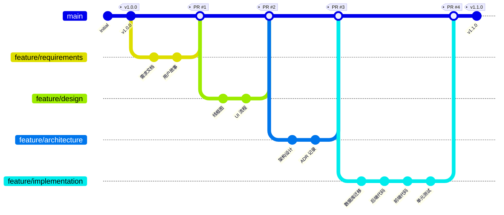

# Full SDLC Workflow

> **完整软件开发生命周期工作流**

本文档描述如何使用 SDLC Framework 从头到尾完成一个软件项目。

---

## 工作流概览

```
需求分析 → 产品设计 → 架构设计 → 详细设计 → 数据库迁移
    ↓
代码开发 → 单元测试 → 集成测试 → 测试计划 → 测试用例
    ↓
系统验收 → 用户手册 → 运维手册 → 部署指南 → 升级指南
```

**总阶段数**: 15
**预计时间**: 根据项目规模，通常 2-6 个月
**并行执行**: 部分阶段可并行（见具体说明）

---

## 阶段详解

### 阶段 1: 需求分析 (Requirements Analysis)

**Skill**: `/requirements-analysis`
**Subagent**: Product Manager
**输入**: 业务目标描述
**输出**:
- `docs/requirements/requirements-spec.md`
- `docs/requirements/user-stories.md`
- `docs/requirements/acceptance-criteria.md`
- `docs/requirements/stakeholders.md`

**活动**:
1. 收集和分析业务需求
2. 识别干系人和用户角色
3. 编写用户故事和验收标准
4. 定义功能和非功能需求
5. 获取干系人批准

**质量门禁**:
- [ ] 干系人批准
- [ ] 需求完整性检查通过
- [ ] 用户故事符合 INVEST 原则

**预计时间**: 1-2 周

**命令示例**:
```bash
/requirements-analysis "创建用户认证系统，支持邮箱和手机号登录"
```

---

### 阶段 2: 产品设计 (Product Design)

**Skill**: `/product-design`
**Subagent**: Product Manager + Frontend Developer
**输入**: 需求规格说明书
**输出**:
- `docs/design/wireframes.md`
- `docs/design/ui-flow.md`
- `docs/design/prototype-spec.md`

**活动**:
1. 创建线框图
2. 设计用户流程
3. 定义产品原型
4. 设计规范说明

**质量门禁**:
- [ ] 设计审查通过
- [ ] 用户体验评审通过

**预计时间**: 1-2 周

**命令示例**:
```bash
/product-design
```

---

### 阶段 3: 系统架构设计 (Architecture Design)

**Skill**: `/architecture-design`
**Subagent**: Architect
**输入**: 需求规格说明书、产品设计
**输出**:
- `docs/architecture/architecture.md`
- `docs/architecture/adr-records.md`
- `docs/architecture/component-diagram.md`
- `docs/architecture/deployment-architecture.md`

**活动**:
1. 设计系统架构
2. 选择技术栈
3. 创建架构决策记录 (ADR)
4. 设计部署架构
5. 评估性能和可扩展性

**质量门禁**:
- [ ] 架构审查通过
- [ ] 安全审查通过
- [ ] 主要决策已记录

**预计时间**: 1-2 周

**命令示例**:
```bash
/architecture-design
```

---

### 阶段 4: 系统详细设计 (Detailed Design)

**Skill**: `/detailed-design`
**Subagent**: Architect + Backend Developer
**输入**: 架构设计文档
**输出**:
- `docs/detailed-design/api-specs.md`
- `docs/detailed-design/data-models.md`
- `docs/detailed-design/class-diagram.md`
- `docs/detailed-design/sequence-diagram.md`

**活动**:
1. 设计 REST API
2. 设计数据模型
3. 创建类图
4. 设计交互序列

**质量门禁**:
- [ ] 设计完整性检查
- [ ] API 规范审查通过

**预计时间**: 1-2 周

**命令示例**:
```bash
/detailed-design
```

---

### 阶段 5: 数据库迁移脚本 (Database Migration)

**Skill**: `/flyway-migration`
**Subagent**: DB Administrator
**输入**: 数据模型设计
**输出**:
- `database-migrations/migrations/VX__description.sql`
- `database-migrations/rollback/VX__rollback.sql`

**活动**:
1. 创建 Flyway 迁移脚本
2. 创建回滚脚本
3. 验证 SQL 语法
4. 测试迁移脚本

**质量门禁**:
- [ ] 迁移脚本已测试
- [ ] 回滚脚本存在

**预计时间**: 3-5 天

**命令示例**:
```bash
/flyway-migration create --table=sys_user --type=create_table
```

---

### 阶段 6: 前后端代码开发 (Code Development)

**Skills**: `/ruoyi-crud`, `/code-development`
**Subagent**: Backend Developer + Frontend Developer
**输入**: 详细设计文档
**输出**:
- `src/main/java/**/*.java`
- `src/main/resources/**/*.xml`
- `src/frontend/**/*`

**活动**:
1. 生成 CRUD 代码
2. 实现业务逻辑
3. 实现 API 接口
4. 实现前端组件
5. 代码审查

**质量门禁**:
- [ ] 代码审查通过（无严重问题）
- [ ] 单元测试已编写
- [ ] 安全扫描通过

**预计时间**: 2-4 周

**命令示例**:
```bash
/ruoyi-crud sys_user
/code-development
```

---

### 阶段 7: 单元测试 (Unit Testing)

**Skill**: `/test-gen`
**Subagent**: Backend Developer + QA Engineer
**输入**: 源代码
**输出**:
- `src/test/java/**/*Test.java`
- `docs/testing/unit-test-report.md`

**活动**:
1. 生成单元测试
2. 编写 Mock 对象
3. 准备测试数据
4. 运行测试
5. 生成覆盖率报告

**质量门禁**:
- [ ] 覆盖率 >= 80%
- [ ] 所有测试通过

**预计时间**: 1-2 周

**命令示例**:
```bash
/test-gen UserService
```

---

### 阶段 8: 集成测试 (Integration Testing)

**Skill**: `/integration-test`
**Subagent**: QA Engineer
**输入**: API 规范、源代码
**输出**:
- `src/test-integration/java/**/*Test.java`
- `docs/testing/integration-test-report.md`

**活动**:
1. 设计集成测试
2. 实现 API 测试
3. 测试数据库集成
4. 运行测试

**质量门禁**:
- [ ] 所有测试通过
- [ ] API 契约验证通过

**预计时间**: 1-2 周

**命令示例**:
```bash
/integration-test
```

**注意**: 此阶段可与阶段 7 并行执行

---

### 阶段 9: 系统测试方案 (System Testing Plan)

**Skill**: `/test-planning`
**Subagent**: QA Engineer
**输入**: 需求、架构设计
**输出**:
- `docs/testing/test-plan.md`
- `docs/testing/test-strategy.md`
- `docs/testing/test-environment.md`

**活动**:
1. 制定测试策略
2. 定义测试范围
3. 规划测试环境
4. 制定测试进度

**质量门禁**:
- [ ] 测试计划已批准

**预计时间**: 3-5 天

**命令示例**:
```bash
/test-planning
```

---

### 阶段 10: 测试用例编写 (Test Case Writing)

**Skill**: `/test-case-writing`
**Subagent**: QA Engineer
**输入**: 测试计划、需求
**输出**:
- `docs/testing/test-cases.md`
- `docs/testing/test-data.md`

**活动**:
1. 编写测试用例
2. 准备测试数据
3. 定义测试场景
4. 组织测试套件

**质量门禁**:
- [ ] 测试用例覆盖所有需求

**预计时间**: 1 周

**命令示例**:
```bash
/test-case-writing
```

---

### 阶段 11: 系统验收 (System Acceptance)

**Skill**: `/acceptance-testing`
**Subagent**: QA Engineer + Product Manager
**输入**: 测试结果、需求
**输出**:
- `docs/acceptance/acceptance-report.md`
- `docs/acceptance/sign-off.md`

**活动**:
1. 执行验收测试
2. 验证验收标准
3. 生成验收报告
4. 获取干系人签署

**质量门禁**:
- [ ] 所有验收标准满足
- [ ] 干系人签署批准

**预计时间**: 1 周

**命令示例**:
```bash
/acceptance-testing
```

---

### 阶段 12: 系统用户手册 (User Manual)

**Skill**: `/user-manual-gen`
**Subagent**: Technical Writer
**输入**: 产品设计、实现
**输出**:
- `docs/user/user-manual.md`
- `docs/user/quick-start.md`
- `docs/user/faq.md`

**活动**:
1. 编写用户手册
2. 创建快速开始指南
3. 编写 FAQ
4. 审查和修订

**质量门禁**:
- [ ] 文档审查通过

**预计时间**: 1 周

**命令示例**:
```bash
/user-manual-gen
```

**注意**: 此阶段可与阶段 13 并行执行

---

### 阶段 13: 系统运维手册 (Operations Manual)

**Skill**: `/ops-manual-gen`
**Subagent**: Technical Writer + DevOps Engineer
**输入**: 架构、部署配置
**输出**:
- `docs/operations/ops-manual.md`
- `docs/operations/monitoring.md`
- `docs/operations/troubleshooting.md`

**活动**:
1. 编写运维手册
2. 创建监控指南
3. 编写故障排查指南
4. 定义备份和恢复流程

**质量门禁**:
- [ ] 运维手册完整

**预计时间**: 1 周

**命令示例**:
```bash
/ops-manual-gen
```

**注意**: 此阶段可与阶段 12 并行执行

---

### 阶段 14: 系统部署说明 (Deployment Instructions)

**Skill**: `/deployment-guide`
**Subagent**: DevOps Engineer
**输入**: 架构、运维手册
**输出**:
- `docs/deployment/deployment-guide.md`
- `docs/deployment/rollback-plan.md`
- `docs/deployment/environment-config.md`

**活动**:
1. 编写部署指南
2. 创建回滚计划
3. 定义环境配置
4. 创建部署检查清单

**质量门禁**:
- [ ] 部署计划已批准
- [ ] 回滚计划已测试

**预计时间**: 3-5 天

**命令示例**:
```bash
/deployment-guide
```

---

### 阶段 15: 系统增量升级说明 (Incremental Upgrade)

**Skill**: `/upgrade-guide`
**Subagent**: Technical Writer + DevOps Engineer
**输入**: 迁移脚本、部署指南
**输出**:
- `docs/upgrade/upgrade-guide.md`
- `docs/upgrade/migration-checklist.md`
- `docs/upgrade/compatibility-matrix.md`

**活动**:
1. 编写升级指南
2. 创建迁移检查清单
3. 定义兼容性矩阵
4. 测试升级流程

**质量门禁**:
- [ ] 升级路径已测试

**预计时间**: 3-5 天

**命令示例**:
```bash
/upgrade-guide
```

---

## Git 工作流集成

SDLC Framework 完全集成了 Git 工作流程，确保所有开发活动都遵循版本控制最佳实践。

### 分支策略

完整的 Git 工作流程详见: [Git 工作流程规范](../guides/git-workflow.md)

**核心原则**:
- ✅ **分支隔离**: 所有功能开发在独立分支进行
- ✅ **PR 合并**: 代码只能通过 Pull Request 合并到 main
- ✅ **代码审查**: 每个 PR 必须经过代码审查
- ✅ **禁止直接提交**: main 分支禁止直接提交代码

### 工作流与 Git 集成



### 阶段与分支映射

每个 SDLC 阶段对应一个或多个 Git 分支和 PR：

| SDLC 阶段 | Git 分支 | PR 示例 |
|-----------|----------|---------|
| 阶段 1: 需求分析 | `feature/requirements-user-auth` | #1 - 需求文档 |
| 阶段 2: 产品设计 | `feature/design-user-auth` | #2 - 设计文档 |
| 阶段 3: 架构设计 | `feature/architecture-user-auth` | #3 - 架构文档 |
| 阶段 4: 详细设计 | `feature/detailed-design-user-auth` | #4 - API 规范 |
| 阶段 5: 数据库迁移 | `feature/db-migration-user-auth` | #5 - 迁移脚本 |
| 阶段 6: 代码开发 | `feature/user-auth-implementation` | #6 - 功能实现 |
| 阶段 7-8: 测试 | `feature/test-user-auth` | #7 - 测试代码 |
| 阶段 9-11: 验收 | `feature/acceptance-user-auth` | #8 - 验收文档 |
| 阶段 12-15: 文档 | `feature/docs-user-auth` | #9 - 用户和运维文档 |

### 典型工作流

#### 开始新项目/功能

```bash
# 1. 更新 main 分支
./SDLC-Framework/scripts/update-main.sh

# 2. 创建功能分支
./SDLC-Framework/scripts/start-feature.sh user-auth-system

# 3. 执行需求分析
/requirements-analysis "创建用户认证系统"

# 4. 提交需求文档
git add docs/requirements/
git commit -m "docs(requirements): 添加用户认证系统需求文档"

# 5. 推送并创建 PR
./SDLC-Framework/scripts/finish-feature.sh
```

#### 实现阶段

```bash
# 1. 创建实现分支
./SDLC-Framework/scripts/start-feature.sh user-auth-implementation

# 2. 执行架构和详细设计
/architecture-design
/detailed-design

# 3. 生成代码
/flyway-migration create --table=sys_user --type=create_table
/ruoyi-crud sys_user

# 4. 编写测试
/test-gen UserService

# 5. 代码审查
/code-review

# 6. 提交所有变更
git add .
git commit -m "feat(auth): 实现用户认证功能

- 创建数据库迁移脚本
- 生成 CRUD 代码
- 实现业务逻辑
- 编写单元测试

Closes #6"

# 7. 推送并创建 PR
git push -u origin feature/user-auth-implementation
gh pr create --title "feat: 实现用户认证功能" --body "请查看 PR 模板"
```

#### 完成功能

```bash
# 1. 确保 PR 通过所有 CI 检查
# 2. 获得代码审查批准
# 3. 合并 PR（Squash and merge）
# 4. 更新本地 main
./SDLC-Framework/scripts/update-main.sh

# 5. 删除功能分支
git branch -d feature/user-auth-implementation

# 6. 创建版本标签
git tag -a v1.1.0 -m "Release v1.1.0: 用户认证系统"
git push origin v1.1.0
```

### Git 辅助脚本

Framework 提供了三个辅助脚本简化 Git 操作：

| 脚本 | 功能 | 用法 |
|------|------|------|
| `start-feature.sh` | 创建功能分支 | `./scripts/start-feature.sh <name>` |
| `finish-feature.sh` | 完成 PR | `./scripts/finish-feature.sh` |
| `update-main.sh` | 更新 main | `./scripts/update-main.sh` |

详见: [辅助脚本文档](../scripts/README.md)

### 分支保护规则

**main 分支**必须启用以下保护规则：

```
✅ 禁止直接推送
✅ 要求 PR 审查（至少 1 人批准）
✅ 要求 CI 检查通过
✅ 要求分支最新（合并前同步）
✅ 要求解决所有审查评论
```

详见: [Git 工作流程规范](../guides/git-workflow.md#分支保护规则)

### 提交规范

遵循 [Conventional Commits](https://www.conventionalcommits.org/)：

```bash
# 功能开发
git commit -m "feat(auth): 添加用户登录功能"

# Bug 修复
git commit -m "fix(payment): 修复支付超时问题"

# 文档更新
git commit -m "docs(readme): 更新安装说明"

# 重构
git commit -m "refactor(service): 重构订单服务"

# 测试
git commit -m "test(user): 添加用户测试用例"
```

### PR 模板

项目提供了标准的 PR 模板 (`.github/pull_request_template.md`)，包含：
- 变更说明
- 变更类型
- 测试情况
- 检查清单
- 代码审查重点
- 截图/演示
- 部署说明
- 回滚计划

创建 PR 时会自动加载模板。

---

## 自动化命令

### 执行完整工作流

```bash
# 从头开始执行完整 SDLC
/sdlc-full "项目描述"

# 示例
/sdlc-full "创建一个电商订单管理系统"
```

### 从特定阶段恢复

```bash
# 从架构设计阶段恢复
/sdlc-resume --from-stage=architecture-design

# 从代码开发阶段恢复
/sdlc-resume --from-stage=code-development
```

### 执行特定阶段

```bash
# 执行单个阶段
/sdlc-stage --stage=requirements-analysis

# 执行多个阶段
/sdlc-stages --stages=requirements-analysis,architecture-design
```

### 跳过阶段（不推荐）

```bash
# 跳过某些阶段
/sdlc-full --skip=product-design "项目描述"
```

---

## 质量门禁

每个阶段都有质量门禁，必须通过才能进入下一阶段：

### 自动检查

- 代码覆盖率 >= 80%
- 所有测试通过
- 无严重安全问题
- SQL 语法有效

### 手动检查

- 干系人批准
- 代码审查通过
- 设计审查通过
- 测试环境就绪

---

## 并行执行

以下阶段可以并行执行以节省时间：

**测试组**:
- 阶段 7: 单元测试
- 阶段 8: 集成测试

**文档组**:
- 阶段 12: 用户手册
- 阶段 13: 运维手册

---

## 时间估算

根据项目规模，总时间估算：

| 项目规模 | 阶段时间 | 总时间 |
|----------|----------|--------|
| 小型     | 1-2 周/阶段 | 3-4 个月 |
| 中型     | 2-3 周/阶段 | 4-6 个月 |
| 大型     | 3-4 周/阶段 | 6-9 个月 |

---

## 回滚策略

如果某阶段失败，可以回滚到上一阶段：

```bash
# 回滚到上一阶段
/sdlc-rollback

# 回滚到指定阶段
/sdlc-rollback --to-stage=architecture-design
```

---

## 最佳实践

1. **按顺序执行**: 除非明确说明可以并行，否则按顺序执行
2. **质量优先**: 不通过质量门禁不要进入下一阶段
3. **文档同步**: 保持文档与代码同步更新
4. **定期审查**: 每个阶段完成后进行审查
5. **版本控制**: 所有文档和代码都应该版本控制
6. **沟通协作**: 保持与干系人的定期沟通

---

## 相关文档

- [敏捷 Sprint 工作流](./agile-sprint-workflow.md)
- [Bug 修复工作流](./bug-fix-workflow.md)
- [快速开始指南](../guides/getting-started.md)
