# Mermaid Diagram Generation Skill

生成 Mermaid 图表: **$ARGUMENTS**

## 技能概述

本技能帮助你快速生成各种类型的 Mermaid 图表，用于系统架构设计、流程分析、数据建模等场景。

## 支持的图表类型

### 1. 系统架构图 (System Architecture)

**使用场景**: 展示系统整体架构、组件关系

```bash
/mermaid-diagram --type=architecture --title="电商系统架构"
```

**生成示例**:
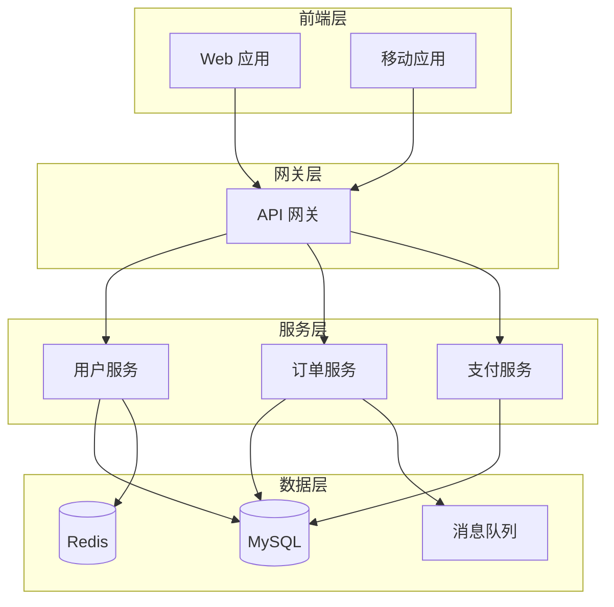

### 2. 流程图 (Flowchart)

**使用场景**: 业务流程、用户流程、审批流程

```bash
/mermaid-diagram --type=flowchart --title="订单处理流程"
```

**生成示例**:
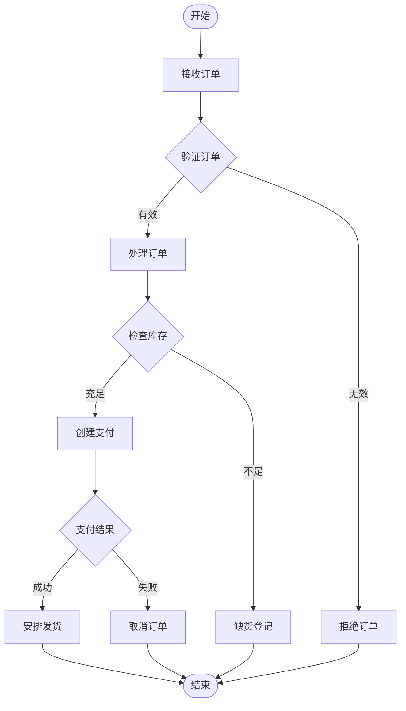

### 3. 时序图 (Sequence Diagram)

**使用场景**: API 交互、组件通信、业务流程时序

```bash
/mermaid-diagram --type=sequence --title="用户登录时序"
```

**生成示例**:
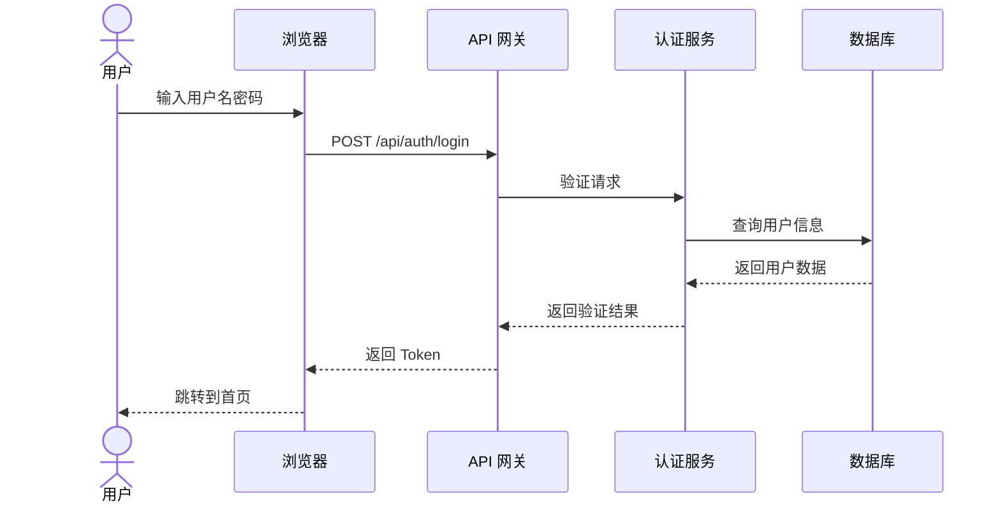

### 4. 状态图 (State Diagram)

**使用场景**: 订单状态、审批流程、对象生命周期

```bash
/mermaid-diagram --type=state --title="订单状态流转"
```

**生成示例**:
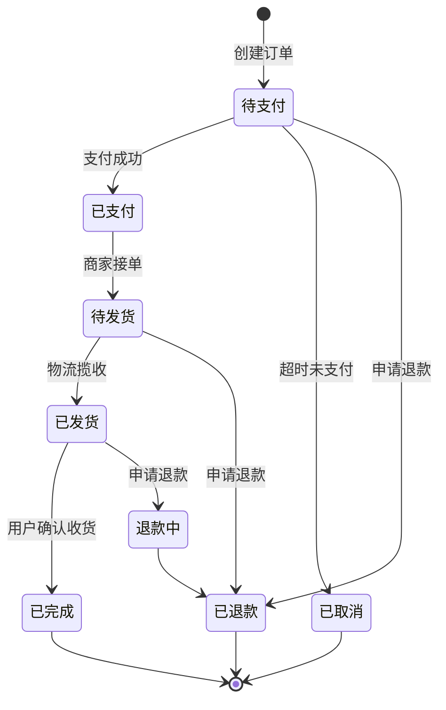

### 5. ER 图 (Entity Relationship)

**使用场景**: 数据模型设计、数据库关系

```bash
/mermaid-diagram --type=er --title="用户订单数据模型"
```

**生成示例**:
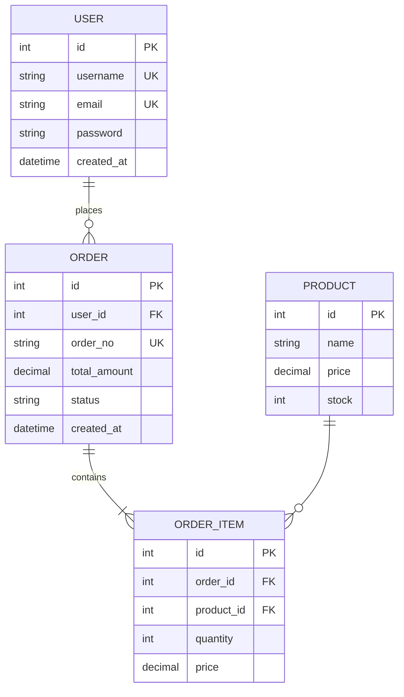

### 6. 类图 (Class Diagram)

**使用场景**: 代码结构设计、类关系展示

```bash
/mermaid-diagram --type=class --title="用户管理类结构"
```

**生成示例**:
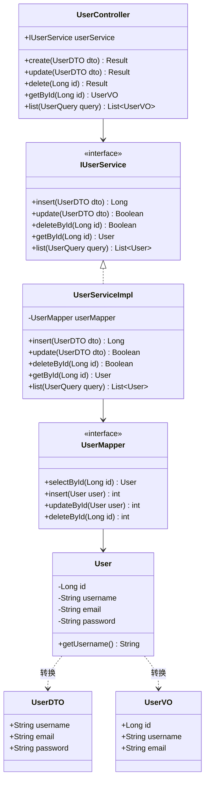

### 7. 甘特图 (Gantt Chart)

**使用场景**: 项目计划、任务排期

```bash
/mermaid-diagram --type=gantt --title="开发计划"
```

**生成示例**:
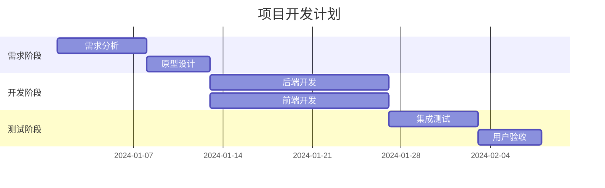

### 8. 饼图 (Pie Chart)

**使用场景**: 数据分布、占比展示

```bash
/mermaid-diagram --type=pie --title="用户分布"
```

**生成示例**:
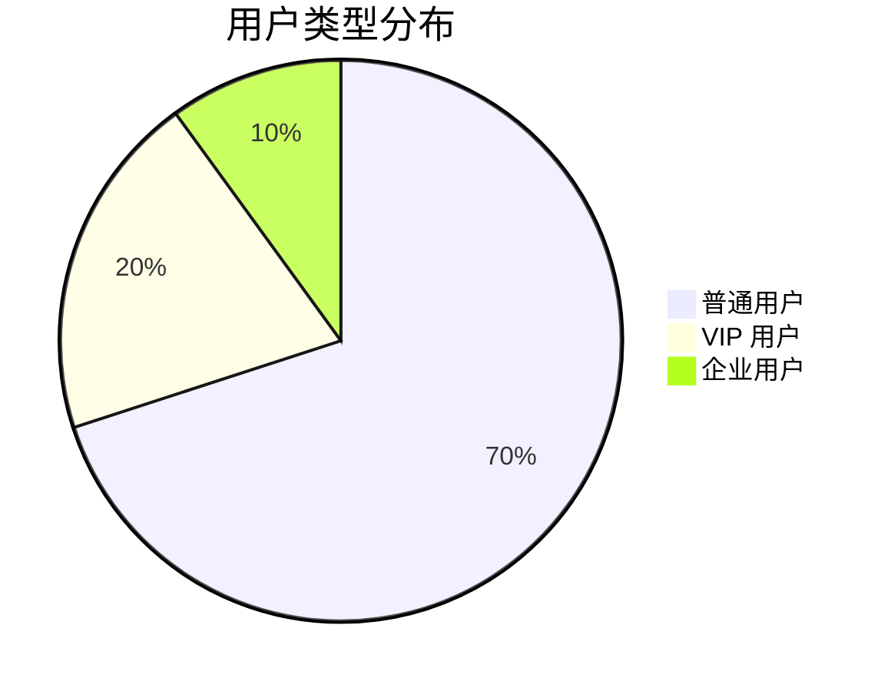

## 图表配置

### 样式配置

Mermaid 支持通过配置类自定义样式：

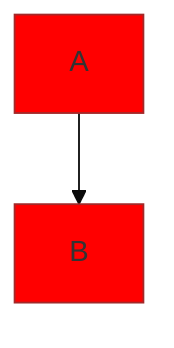

### 主题选择

- **default**: 默认主题
- **forest**: 森林主题
- **dark**: 暗色主题
- **neutral**: 中性主题

### 方向设置

- **TB**: 从上到下 (top to bottom)
- **BT**: 从下到上 (bottom to top)
- **LR**: 从左到右 (left to right)
- **RL**: 从右到左 (right to left)

## 图表元素

### 节点样式

```mermaid
graph LR
    A[矩形节点]
    B(圆角矩形)
    C[(圆柱体/数据库)]
    D((圆形))
    E{菱形/判断}
    F[/平行四边形/输入输出]
```

### 连接线样式

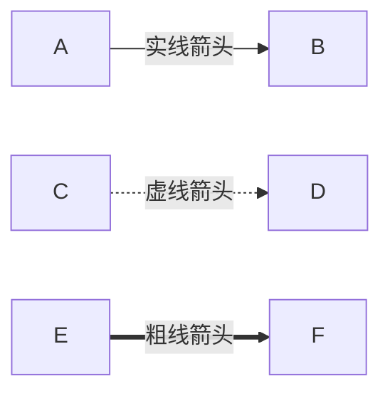

### 子图

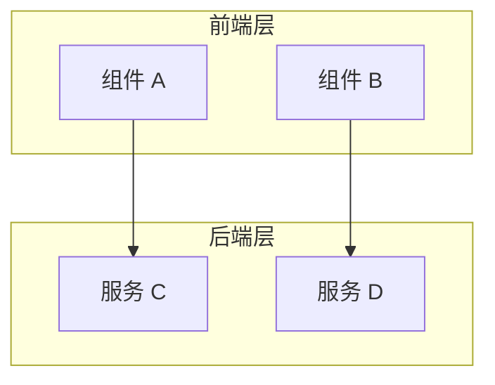

## 图表导出

### PNG 图片

使用 Mermaid CLI 工具导出：

```bash
# 安装 Mermaid CLI
npm install -g @mermaid-js/mermaid-cli

# 导出为 PNG
mmdc -i input.mmd -o output.png
```

### SVG 图片

```bash
# 导出为 SVG
mmdc -i input.mmd -o output.svg
```

## 最佳实践

1. **简洁明了**: 避免过度复杂，突出重点
2. **层次清晰**: 使用子图组织复杂结构
3. **方向一致**: 统一使用 TB 或 LR
4. **颜色标注**: 使用样式区分不同类型
5. **标签清晰**: 节点和边的标签要简洁明确
6. **适度详细**: 图表不要包含过多细节

## 常见问题

### Q: 图表不显示？

A: 检查：
1. Mermaid 语法是否正确
2. 是否有未闭合的括号或引号
3. 特殊字符是否需要转义

### Q: 图表太大？

A: 解决方案：
1. 拆分成多个小图
2. 使用子图组织
3. 简化节点和连接

### Q: 图表重叠？

A: 解决方案：
1. 调整图表方向
2. 使用子图分隔
3. 增加图表尺寸

## 相关文档

- [Mermaid 官方文档](https://mermaid.js.org/)
- 架构设计: `docs/architecture/architecture.md`
- 产品设计: `docs/design/wireframes/`
