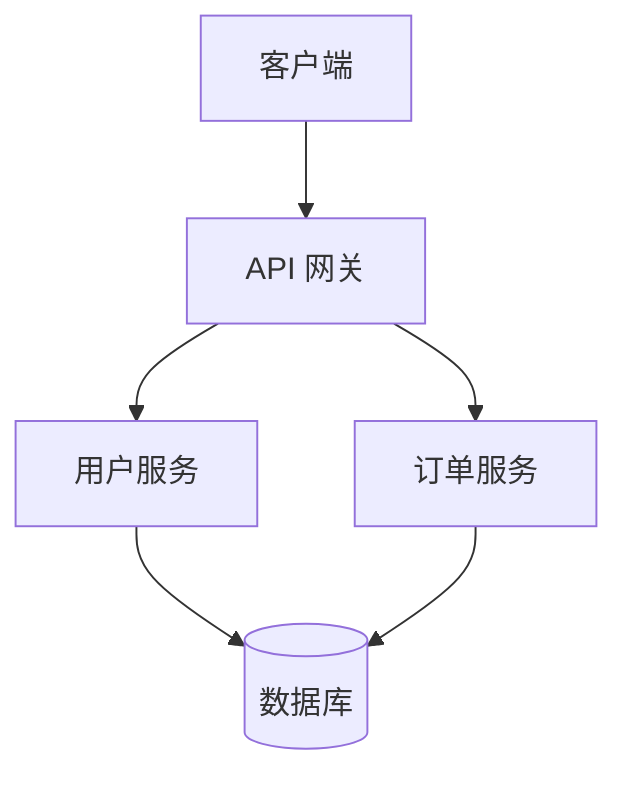
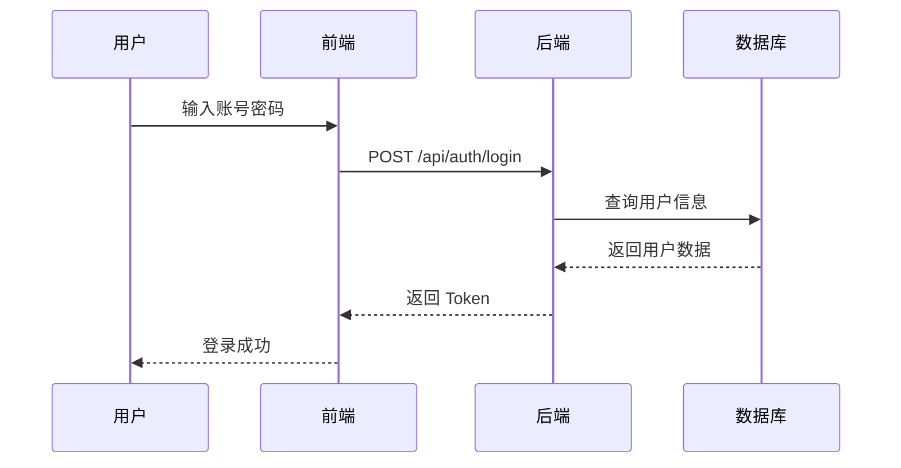

# sdlc-mermaid-diagram 使用指南

生成各种类型的 Mermaid 图表，包括系统架构图、流程图、时序图、状态图、ER 图和类图。

## 🚀 快速开始

```bash
# 生成架构图
/sdlc-mermaid-diagram "生成用户认证系统的架构图"

# 生成流程图
/sdlc-mermaid-diagram "创建订单处理流程图"

# 生成时序图
/sdlc-mermaid-diagram "用户登录的时序图"
```

## 📋 支持的图表类型

| 类型 | 说明 | 使用场景 |
|------|------|---------|
| **系统架构图** | 展示系统组件和部署架构 | 架构设计、技术评审 |
| **流程图** | 业务流程和算法逻辑 | 需求分析、流程设计 |
| **时序图** | 组件间的交互序列 | 接口设计、消息流转 |
| **状态图** | 系统状态转换 | 逻辑设计、状态机 |
| **ER 图** | 数据库关系模型 | 数据库设计 |
| **类图** | 类结构和关系 | 详细设计、代码审查 |

## 🎯 使用示例

### 示例 1：系统架构图

```bash
/sdlc-mermaid-diagram "生成微服务架构图，包含 API Gateway、用户服务、订单服务和数据库"
```

**生成内容**：


### 示例 2：时序图

```bash
/sdlc-mermaid-diagram "用户登录时序图，包含前端、后端和数据库的交互"
```

**生成内容**：


### 示例 3：状态图

```bash
/sdlc-mermaid-diagram "订单状态机，包含待支付、已支付、已发货、已完成等状态"
```

### 示例 4：ER 图

```bash
/sdlc-mermaid-diagram "用户表、订单表、商品表的 ER 图"
```

## 📝 高级用法

### 输出格式

图表可输出为：
- **Markdown**: 直接嵌入文档
- **PNG 图片**: 适合演示文稿
- **SVG**: 矢量图，适合 Web

### 自定义样式

可以指定图表的：
- 方向（TB/RL/BT/LR）
- 样式主题（default/forest/dark/neutral）
- 节点形状和颜色

## 🔧 配置选项

在生成图表时可以指定：
- **图表类型**: 通过描述关键词自动识别
- **详细程度**: 简要版 vs 完整版
- **输出格式**: Markdown vs 图片

## 🐛 常见问题

### Q: 如何指定图表类型？
**A**: 在描述中明确说明，如"生成时序图"、"创建流程图"

### Q: 图表太复杂看不清？
**A**: 可以要求简化或分模块生成多个图表

### Q: 如何导出为图片？
**A**: Skill 会自动生成 Markdown 格式，可使用 Mermaid CLI 或在线工具转图片

## 📚 完整参考

详细配置和高级用法请参考：
[SKILL.md](../../.claude/skills/sdlc-mermaid-diagram/SKILL.md)

## 🔗 相关 Skills

- [sdlc-architecture-design](../skills/index.md#sdlc-architecture-design) - 系统架构设计
- [sdlc-detailed-design](../skills/index.md#sdlc-detailed-design) - 详细设计阶段
