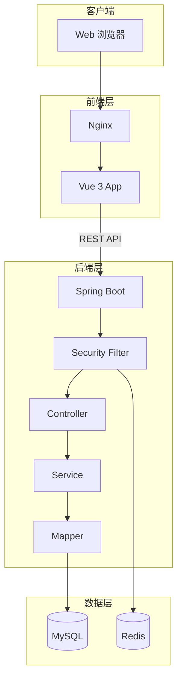
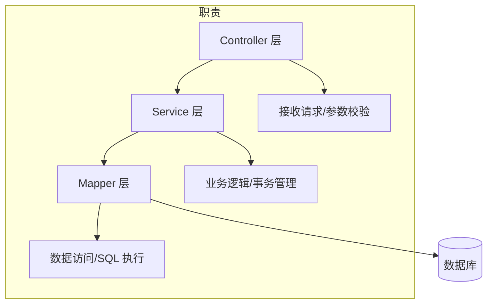
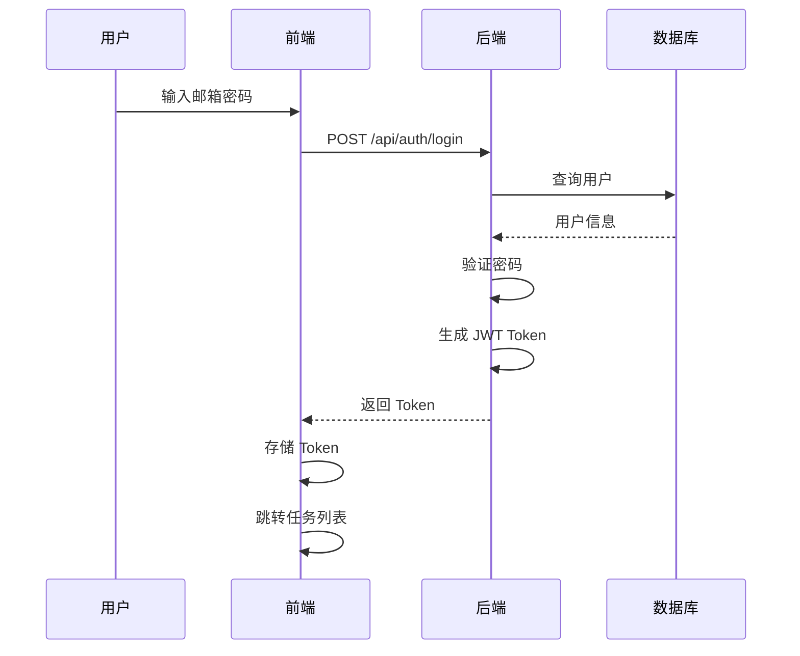
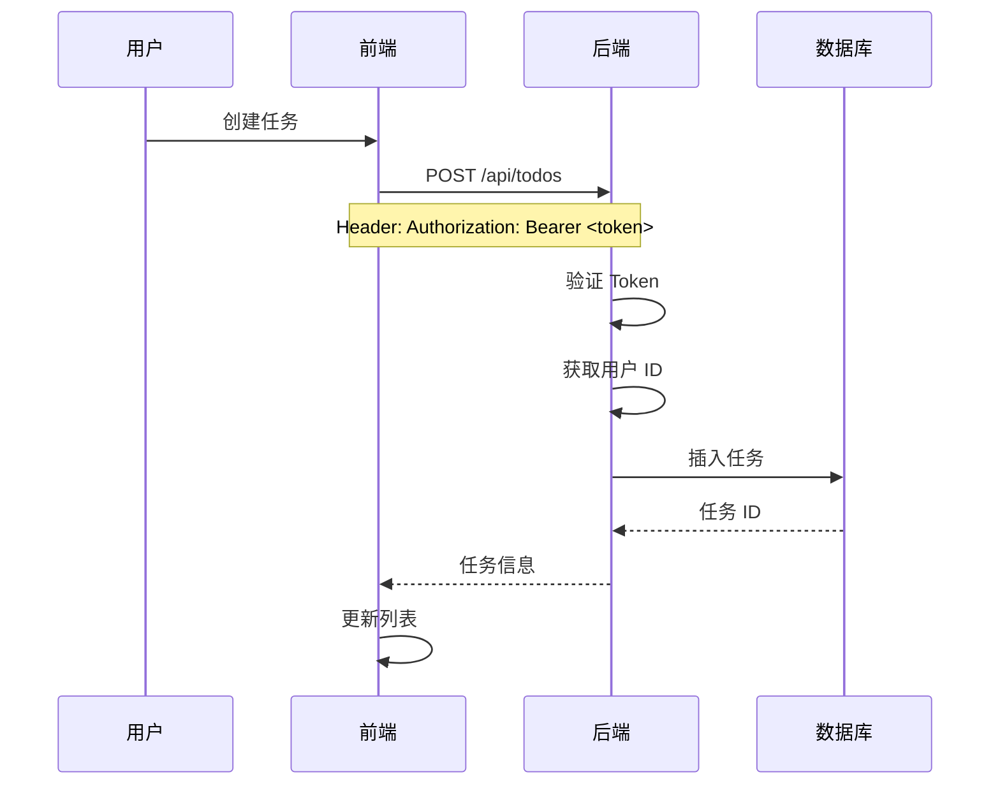

# 系统架构设计: TodoList 待办事项管理

> **文档信息**
> - 版本: 1.0
> - 创建日期: 2026-03-16
> - 作者: Claude Code (Architect Role)
> - 状态: 已完成

---

## 1. 架构概览

### 1.1 系统架构风格
**前后端分离架构** + **RESTful API**

```
┌─────────────┐     HTTP/HTTPS     ┌─────────────┐
│   前端       │ ◄───────────────► │   后端       │
│   Vue 3     │     REST API       │ Spring Boot │
│   Nginx     │                    │   Tomcat    │
└─────────────┘                    └─────────────┘
                                        │
                                   ┌────┴────┐
                                   │         │
                              ┌────┴──┐ ┌────┴───┐
                              │ MySQL │ │ Redis  │
                              │  8.0  │ │  7.x   │
                              └───────┘ └────────┘
```

### 1.2 架构特点
- 前后端独立部署
- RESTful API 通信
- JWT 无状态认证
- 数据库读写分离（可选扩展）

---

## 2. 技术选型

### 2.1 后端技术栈

| 技术 | 版本 | 用途 | 选型理由 |
|------|------|------|----------|
| Java | 17 | 运行环境 | LTS 版本，性能优化 |
| Spring Boot | 3.2.x | 框架 | 生态完善，快速开发 |
| MyBatis-Plus | 3.5.x | ORM | 简化 CRUD 操作 |
| MySQL | 8.0 | 数据库 | 成熟稳定，关系型数据 |
| Redis | 7.x | 缓存 | Token 存储，热点数据 |
| JWT | - | 认证 | 无状态，可扩展 |
| Knife4j | 4.x | API 文档 | Swagger 增强 |

### 2.2 前端技术栈

| 技术 | 版本 | 用途 | 选型理由 |
|------|------|------|----------|
| Vue | 3.4.x | 框架 | 响应式，组件化 |
| Vite | 5.x | 构建工具 | 快速热更新 |
| Element Plus | 2.x | UI 组件 | 企业级组件库 |
| Pinia | 2.x | 状态管理 | Vue 3 官方推荐 |
| Axios | 1.x | HTTP 客户端 | 拦截器支持 |

---

## 3. 系统架构图

### 3.1 整体架构



### 3.2 后端分层架构



---

## 4. 模块设计

### 4.1 后端模块

```
todolist-backend/
├── controller/          # 控制器层
│   ├── AuthController   # 认证接口
│   └── TodoController   # 任务接口
├── service/             # 服务层
│   ├── AuthService      # 认证服务
│   └── TodoService      # 任务服务
├── mapper/              # 数据访问层
│   ├── UserMapper       # 用户数据
│   └── TodoMapper       # 任务数据
├── entity/              # 实体类
│   ├── User             # 用户实体
│   └── Todo             # 任务实体
├── dto/                 # 数据传输对象
│   ├── LoginDTO         # 登录请求
│   └── TodoDTO          # 任务请求
├── vo/                  # 视图对象
│   ├── LoginVO          # 登录响应
│   └── TodoVO           # 任务响应
├── config/              # 配置类
│   ├── SecurityConfig   # 安全配置
│   └── MybatisPlusConfig# MyBatis 配置
├── security/            # 安全模块
│   ├── JwtUtils         # JWT 工具
│   └── JwtFilter        # JWT 过滤器
└── common/              # 通用模块
    ├── R                # 统一响应
    └── BusinessException# 业务异常
```

### 4.2 前端模块

```
todolist-frontend/
├── views/               # 页面
│   ├── Login.vue        # 登录页
│   ├── Register.vue     # 注册页
│   └── TodoList.vue     # 任务列表
├── components/          # 组件
│   ├── Layout.vue       # 布局组件
│   ├── TodoItem.vue     # 任务项
│   └── TodoForm.vue     # 任务表单
├── stores/              # 状态管理
│   ├── user.js          # 用户状态
│   └── todo.js          # 任务状态
├── api/                 # API 请求
│   ├── auth.js          # 认证 API
│   └── todo.js          # 任务 API
├── router/              # 路由
│   └── index.js         # 路由配置
└── utils/               # 工具
    └── request.js       # Axios 封装
```

---

## 5. 数据流设计

### 5.1 登录流程



### 5.2 任务操作流程



---

## 6. 部署架构

### 6.1 开发环境

```
┌─────────────────────────────────────────┐
│            开发机器                      │
│  ┌─────────────┐  ┌─────────────────┐   │
│  │ 前端 :5173  │  │ 后端 :8080      │   │
│  │   Vite      │  │  Spring Boot    │   │
│  └─────────────┘  └─────────────────┘   │
│                          │              │
│                    ┌─────┴─────┐        │
│                    │ MySQL     │        │
│                    │ :3306     │        │
│                    └───────────┘        │
└─────────────────────────────────────────┘
```

### 6.2 生产环境

```
┌─────────────────────────────────────────────────────┐
│                    负载均衡器                        │
└───────────────────────┬─────────────────────────────┘
                        │
        ┌───────────────┼──────────���────┐
        │               │               │
   ┌────┴────┐     ┌────┴────┐     ┌────┴────┐
   │  Nginx  │     │  Nginx  │     │  Nginx  │
   │  静态资源│     │  静态资源│     │  静态资源│
   └────┬────┘     └────┬────┘     └────┬────┘
        │               │               │
        └───────────────┼───────────────┘
                        │
        ┌───────────────┼───────────────┐
        │               │               │
   ┌────┴────┐     ┌────┴────┐     ┌────┴────┐
   │ Spring  │     │ Spring  │     │ Spring  │
   │ Boot    │     │ Boot    │     │ Boot    │
   │ :8080   │     │ :8080   │     │ :8080   │
   └────┬────┘     └────┬────┘     └────┬────┘
        │               │               │
        └───────────────┼───────────────┘
                        │
              ┌─────────┴─────────┐
              │                   │
         ┌────┴────┐         ┌────┴────┐
         │  MySQL  │         │  Redis  │
         │ 主从复制 │         │  集群   │
         └─────────┘         └─────────┘
```

---

## 7. 安全设计

### 7.1 认证机制
- JWT Token 认证
- Token 存储在 localStorage
- 请求头携带: `Authorization: Bearer <token>`

### 7.2 授权机制
- 基于用户 ID 的数据隔离
- 每个请求验证 Token 并提取用户 ID
- 只能操作自己的数据

### 7.3 安全配置
- CORS 跨域配置
- SQL 注入防护（MyBatis-Plus 参数化）
- XSS 防护（前端转义）

---

## 8. 架构决策记录 (ADR)

### ADR-001: 选择 JWT 认证

**状态**: 已接受

**背景**: 需要选择用户认证方案

**决策**: 使用 JWT Token 认证

**理由**:
- 无状态，服务器不存储会话
- 易于扩展，支持分布式部署
- 前后端分离友好

---

### ADR-002: 选择 MyBatis-Plus

**状态**: 已接受

**背景**: 需要选择 ORM 框架

**决策**: 使用 MyBatis-Plus

**理由**:
- 简化 CRUD 操作
- 支持代码生成
- 灵活的 SQL 控制

---

## 9. 质量门禁检查

### 阶段 3 质量门禁
- [x] 架构设计文档已完成
- [x] 技术选型已确定
- [x] 模块划分已明确
- [x] 数据流已设计
- [x] 部署架构已规划
- [x] ADR 已记录

---

## 下一步

架构设计完成后，执行：
```
/detailed-design
```
