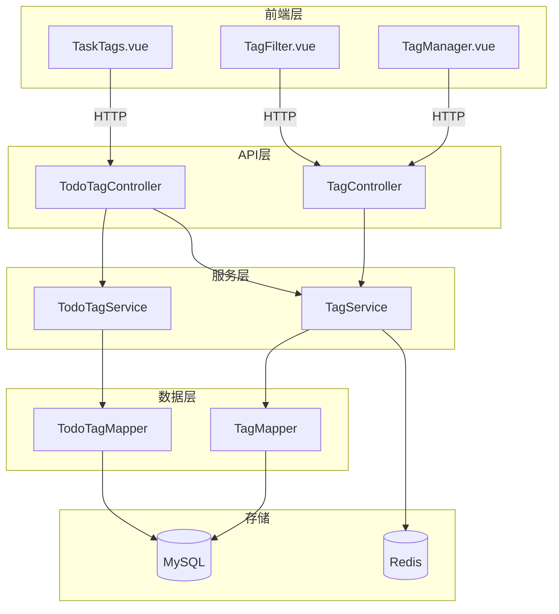
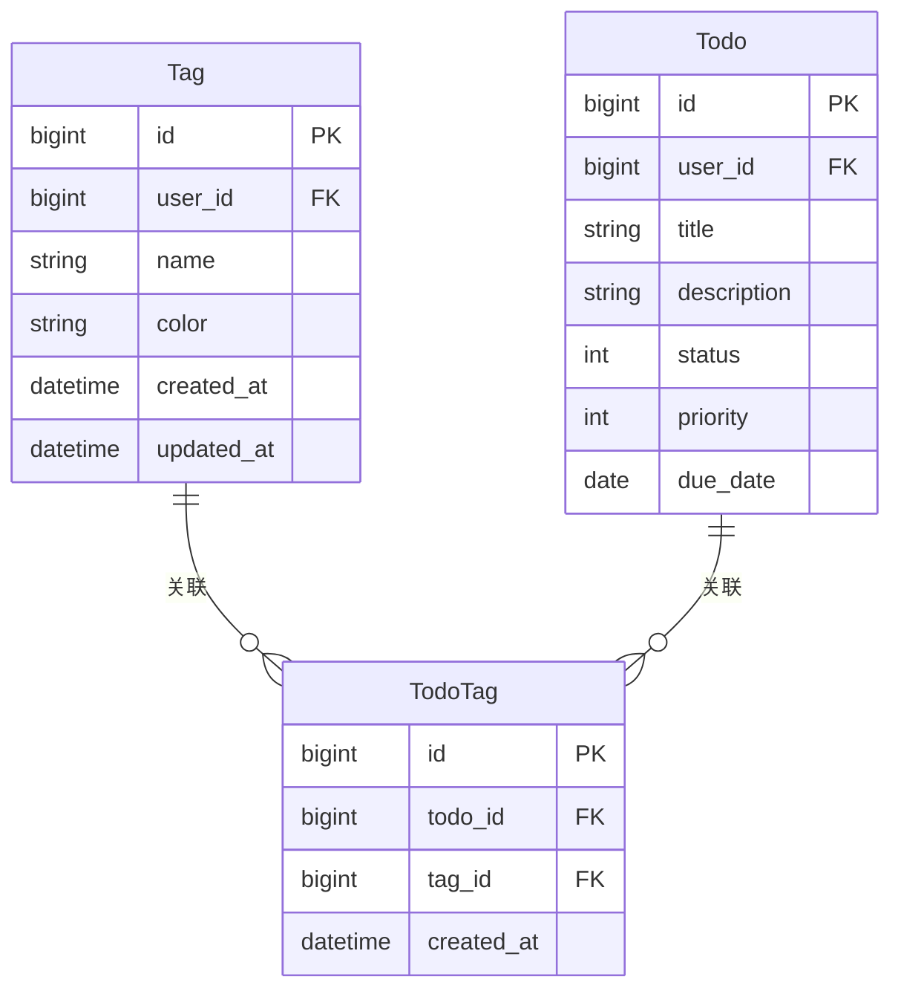
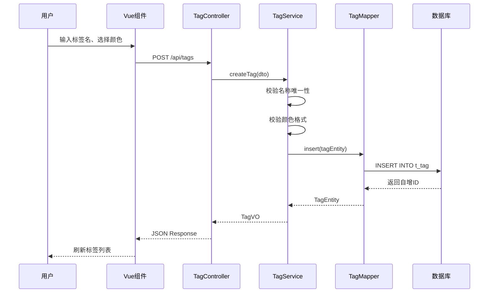
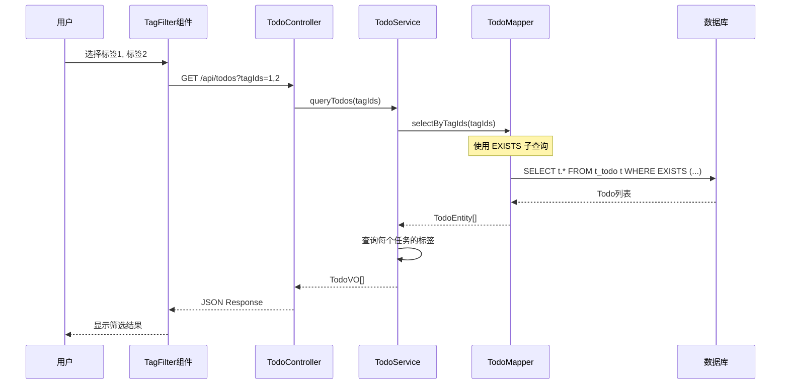

# 任务标签功能 - 架构设计

| 文档版本 | 1.0 |
|----------|-----|
| 创建日期 | 2026-03-16 |
| 功能模块 | 任务标签 |

---

## 1. 架构概述

### 1.1 功能定位

任务标签功能是 TodoList 项目的**新增核心功能模块**，在现有单体分层架构基础上添加标签管理能力。

### 1.2 架构视图



---

## 2. 数据库设计

### 2.1 标签表 (t_tag)

```sql
CREATE TABLE t_tag (
    id BIGINT AUTO_INCREMENT PRIMARY KEY COMMENT '主键ID',
    user_id BIGINT NOT NULL COMMENT '用户ID',
    name VARCHAR(20) NOT NULL COMMENT '标签名称',
    color VARCHAR(7) DEFAULT '#999999' COMMENT '标签颜色HEX',
    created_at DATETIME DEFAULT CURRENT_TIMESTAMP COMMENT '创建时间',
    updated_at DATETIME DEFAULT CURRENT_TIMESTAMP ON UPDATE CURRENT_TIMESTAMP COMMENT '更新时间',

    UNIQUE KEY uk_user_name (user_id, name) COMMENT '用户下标签名唯一',
    KEY idx_user_id (user_id) COMMENT '查询用户标签'
) ENGINE=InnoDB DEFAULT CHARSET=utf8mb4 COMMENT='任务标签表';
```

### 2.2 任务标签关联表 (t_todo_tag)

```sql
CREATE TABLE t_todo_tag (
    id BIGINT AUTO_INCREMENT PRIMARY KEY COMMENT '主键ID',
    todo_id BIGINT NOT NULL COMMENT '任务ID',
    tag_id BIGINT NOT NULL COMMENT '标签ID',
    created_at DATETIME DEFAULT CURRENT_TIMESTAMP COMMENT '创建时间',

    UNIQUE KEY uk_todo_tag (todo_id, tag_id) COMMENT '防止重复关联',
    KEY idx_tag_id (tag_id) COMMENT '按标签查询任务',
    KEY idx_todo_id (todo_id) COMMENT '查询任务标签'
) ENGINE=InnoDB DEFAULT CHARSET=utf8mb4 COMMENT='任务标签关联表';
```

### 2.3 ER 图



---

## 3. API 接口设计

### 3.1 标签管理接口

| 方法 | 路径 | 描述 |
|------|------|------|
| POST | /api/tags | 创建标签 |
| PUT | /api/tags/{id} | 更新标签 |
| DELETE | /api/tags/{id} | 删除标签 |
| GET | /api/tags | 分页查询标签 |
| GET | /api/tags/{id} | 查询标签详情 |

#### 创建标签

```http
POST /api/tags
Authorization: Bearer {token}
Content-Type: application/json

{
  "name": "工作",
  "color": "#FF6B6B"
}

Response 200:
{
  "code": 200,
  "msg": "操作成功",
  "data": {
    "id": 1,
    "name": "工作",
    "color": "#FF6B6B",
    "taskCount": 0,
    "createdAt": "2026-03-16T10:00:00"
  }
}
```

#### 更新标签

```http
PUT /api/tags/{id}
Authorization: Bearer {token}
Content-Type: application/json

{
  "name": "工作事务",
  "color": "#FF5555"
}
```

#### 删除标签

```http
DELETE /api/tags/{id}
Authorization: Bearer {token}

Response 200:
{
  "code": 200,
  "msg": "删除成功"
}
```

### 3.2 任务标签接口

| 方法 | 路径 | 描述 |
|------|------|------|
| POST | /api/todos/{todoId}/tags | 为任务添加标签 |
| DELETE | /api/todos/{todoId}/tags/{tagId} | 移除任务标签 |
| GET | /api/todos/{todoId}/tags | 查询任务的所有标签 |
| PUT | /api/todos/{todoId}/tags | 批量更新任务标签 |

#### 为任务添加标签

```http
POST /api/todos/1/tags
Authorization: Bearer {token}
Content-Type: application/json

{
  "tagIds": [1, 3, 5]
}

Response 200:
{
  "code": 200,
  "msg": "添加成功",
  "data": [
    {"id": 1, "name": "工作", "color": "#FF6B6B"},
    {"id": 3, "name": "重要", "color": "#45B7D1"},
    {"id": 5, "name": "紧急", "color": "#EF4444"}
  ]
}
```

### 3.3 标签筛选接口

```http
GET /api/todos?tagIds=1,3&status=0&pageNum=1&pageSize=10
Authorization: Bearer {token}

Response 200:
{
  "code": 200,
  "msg": "查询成功",
  "rows": [
    {
      "id": 1,
      "title": "完成项目需求文档",
      "status": 0,
      "priority": 2,
      "tags": [
        {"id": 1, "name": "工作", "color": "#FF6B6B"},
        {"id": 3, "name": "重要", "color": "#45B7D1"}
      ]
    }
  ],
  "total": 5
}
```

---

## 4. 核心流程设计

### 4.1 创建标签流程



### 4.2 标签筛选流程



---

## 5. 代码结构

### 5.1 后端代码结构

```
src/main/java/com/todolist/
├── controller/
│   ├── TagController.java          # 标签管理API
│   └── TodoTagController.java       # 任务标签API
├── service/
│   ├── TagService.java             # 标签业务逻辑
│   ├── impl/
│   │   └── TagServiceImpl.java
│   └── TodoTagService.java         # 任务标签业务逻辑
├── mapper/
│   ├── TagMapper.java              # 标签数据访问
│   └── TodoTagMapper.java          # 关联数据访问
├── entity/
│   ├── Tag.java                    # 标签实体
│   └── TodoTag.java                # 关联实体
└── dto/
    ├── TagDTO.java                 # 标签请求DTO
    ├── TagQueryDTO.java            # 标签查询DTO
    └── TagVO.java                  # 标签响应VO
```

### 5.2 前端代码结构

```
src/
├── views/
│   └── tags/
│       ├── TagManager.vue          # 标签管理页面
│       └── components/
│           ├── TagCard.vue         # 标签卡片
│           ├── TagModal.vue        # 创建/编辑弹窗
│           ├── TaskTags.vue        # 任务标签组件
│           └── TagFilter.vue       # 标签筛选器
├── api/
│   └── tag.js                     # 标签API请求
├── stores/
│   └── tag.ts                     # 标签状态管理
└── types/
    └── tag.ts                     # 标签类型定义
```

---

## 6. 性能设计

### 6.1 性能指标

| 操作 | 目标响应时间 |
|------|-------------|
| 标签列表查询 | < 100ms |
| 创建/更新标签 | < 200ms |
| 标签筛选任务 | < 300ms |
| 批量添加标签 | < 500ms |

### 6.2 优化策略

1. **数据库优化**
   - user_id 和 tag_id 建立索引
   - 使用 MyBatis-Plus 分页插件
   - 避免 N+1 查询（批量查询标签）

2. **缓存策略**
   ```java
   @Cacheable(value = "tags", key = "#userId")
   public List<TagVO> getTagsByUserId(Long userId)
   ```

3. **查询优化**
   - 标签筛选使用 EXISTS 而非 IN
   - 关联查询使用 LEFT JOIN

### 6.3 标签筛选 SQL

```sql
-- 使用 EXISTS（推荐）
SELECT t.* FROM t_todo t
WHERE t.user_id = #{userId}
  AND EXISTS (
    SELECT 1 FROM t_todo_tag tt
    INNER JOIN t_tag tag ON tag.id = tt.tag_id
    WHERE tt.todo_id = t.id
      AND tag.id IN (1, 2, 3)
  )
ORDER BY t.created_at DESC
LIMIT #{pageSize} OFFSET #{offset}
```

---

## 7. 安全设计

### 7.1 数据隔离

- 所有查询强制添加 `user_id` 条件
- 标签操作验证所有权
- 任务标签操作验证任务所有权

```java
@Service
public class TagServiceImpl implements TagService {

    public TagVO createTag(TagDTO dto, Long userId) {
        // 验证标签名唯一性（同用户下）
        lambdaQuery()
            .eq(Tag::getUserId, userId)
            .eq(Tag::getName, dto.getName())
            .exists(); // 抛出异常如果存在
    }
}
```

### 7.2 输入验证

| 字段 | 验证规则 |
|------|----------|
| name | @NotBlank, @Length(1, 20) |
| color | @Pattern(regex = "^#[0-9A-Fa-f]{6}$") |
| tagIds | @NotEmpty (批量操作时) |

---

## 8. 测试策略

### 8.1 单元测试

| 测试类 | 覆盖内容 |
|--------|----------|
| TagServiceTest | 业务逻辑、唯一性校验 |
| TodoTagServiceTest | 关联操作、筛选逻辑 |
| TagMapperTest | SQL 查询、分页 |

### 8.2 集成测试

| 测试类 | 覆盖内容 |
|--------|----------|
| TagControllerTest | API 接口、参数验证 |
| TagFilterTest | 标签筛选场景 |

---

## 9. 部署考虑

### 9.1 数据库迁移

使用 Flyway 管理版本：

```sql
-- V1.0.1__create_tag_table.sql
-- V1.0.2__create_todo_tag_table.sql
-- V1.0.3__add_tag_indexes.sql
```

### 9.2 配置变更

```yaml
# application.yml
mybatis-plus:
  mapper-locations: classpath*:/mapper/**/*Mapper.xml
  type-aliases-package: com.todolist.entity
  configuration:
    log-impl: SLF4J
```

---

## 10. 变更记录

| 版本 | 日期 | 变更内容 | 作者 |
|------|------|----------|------|
| 1.0 | 2026-03-16 | 初始版本 | Claude Code |
