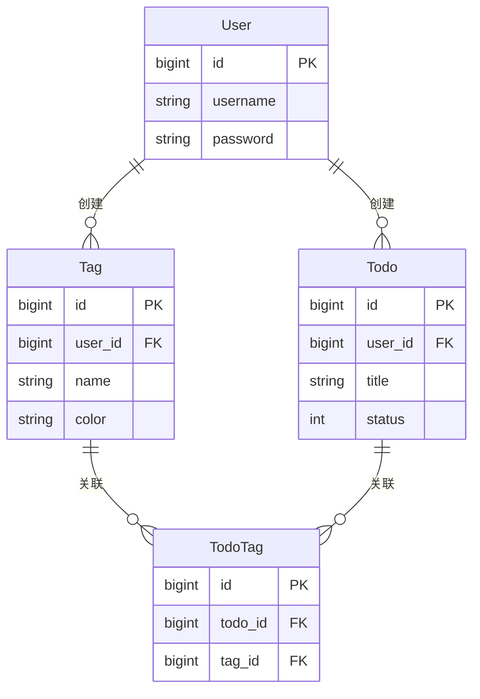

# 任务标签功能 - 数据库迁移总结

| 版本 | 1.0 |
|------|-----|
| 创建日期 | 2026-03-16 |
| 功能模块 | 任务标签 |
| SDLC 阶段 | Stage 5: Database Migration |

---

## 1. 迁移脚本列表

| 文件名 | 版本 | 描述 | 状态 |
|--------|------|------|------|
| V1.0.0__Init_schema.sql | 1.0.0 | 初始化数据库（user, category, todo） | ✅ 已完成 |
| V1.0.1__create_tag_table.sql | 1.0.1 | 创建任务标签表 | ✅ 已完成 |
| V1.0.2__create_todo_tag_table.sql | 1.0.2 | 创建任务标签关联表 | ✅ 已完成 |

---

## 2. 表结构设计

### 2.1 t_tag（任务标签表）

| 字段 | 类型 | 约束 | 说明 |
|------|------|------|------|
| id | BIGINT | PK, AUTO_INCREMENT | 主键ID |
| user_id | BIGINT | NOT NULL, FK | 用户ID |
| name | VARCHAR(20) | NOT NULL | 标签名称 |
| color | VARCHAR(7) | DEFAULT '#999999' | 标签颜色（HEX） |
| created_at | DATETIME | DEFAULT CURRENT_TIMESTAMP | 创建时间 |
| updated_at | DATETIME | ON UPDATE CURRENT_TIMESTAMP | 更新时间 |

**索引与约束：**
- 主键：`PRIMARY KEY (id)`
- 唯一约束：`UNIQUE KEY uk_user_name (user_id, name)` - 同一用户下标签名唯一
- 普通索引：`KEY idx_user_id (user_id)` - 按用户查询标签
- 外键：`FOREIGN KEY (user_id) REFERENCES user(id) ON DELETE CASCADE`

### 2.2 t_todo_tag（任务标签关联表）

| 字段 | 类型 | 约束 | 说明 |
|------|------|------|------|
| id | BIGINT | PK, AUTO_INCREMENT | 主键ID |
| todo_id | BIGINT | NOT NULL, FK | 任务ID |
| tag_id | BIGINT | NOT NULL, FK | 标签ID |
| created_at | DATETIME | DEFAULT CURRENT_TIMESTAMP | 创建时间 |

**索引与约束：**
- 主键：`PRIMARY KEY (id)`
- 唯一约束：`UNIQUE KEY uk_todo_tag (todo_id, tag_id)` - 防止重复关联
- 普通索引：`KEY idx_tag_id (tag_id)` - 按标签查询任务
- 普通索引：`KEY idx_todo_id (todo_id)` - 按任务查询标签
- 外键：`FOREIGN KEY (todo_id) REFERENCES todo(id) ON DELETE CASCADE`
- 外键：`FOREIGN KEY (tag_id) REFERENCES t_tag(id) ON DELETE CASCADE`

---

## 3. ER 图



---

## 4. 级联删除策略

| 场景 | 级联操作 | 结果 |
|------|----------|------|
| 删除用户 | `t_tag.user_id` → CASCADE | 用户的所有标签被删除 |
| 删除任务 | `t_todo_tag.todo_id` → CASCADE | 任务的标签关联被删除 |
| 删除标签 | `t_todo_tag.tag_id` → CASCADE | 标签的关联关系被删除 |

---

## 5. 索引使用场景

| 查询场景 | 使用索引 | SQL 示例 |
|----------|----------|----------|
| 查询用户标签列表 | `idx_user_id` | `SELECT * FROM t_tag WHERE user_id = ?` |
| 验证标签名唯一性 | `uk_user_name` | `SELECT COUNT(*) FROM t_tag WHERE user_id = ? AND name = ?` |
| 按标签筛选任务 | `idx_tag_id` | `SELECT todo_id FROM t_todo_tag WHERE tag_id IN (?)` |
| 查询任务标签 | `idx_todo_id` | `SELECT tag_id FROM t_todo_tag WHERE todo_id = ?` |
| 防止重复关联 | `uk_todo_tag` | 插入时自动校验 |

---

## 6. 迁移执行

### 6.1 开发环境

```bash
# 方式一：Spring Boot 自动执行（推荐）
mvn spring-boot:run

# 方式二：Flyway CLI
flyway migrate -url=jdbc:mysql://localhost:3306/todolist \
               -user=root \
               -password=password \
               -locations=filesystem:src/main/resources/db/migration
```

### 6.2 验证迁移

```bash
# 查看迁移历史
flyway info -url=jdbc:mysql://localhost:3306/todolist \
            -user=root \
            -password=password

# 验证表结构
mysql -u root -p todolist -e "SHOW CREATE TABLE t_tag;"
mysql -u root -p todolist -e "SHOW CREATE TABLE t_todo_tag;"
```

### 6.3 回滚策略

Flyway 不支持自动回滚，需手动执行：

```sql
-- 回滚 V1.0.2
DROP TABLE t_todo_tag;

-- 回滚 V1.0.1
DROP TABLE t_tag;
```

---

## 7. 测试数据

### 7.1 测试标签数据

```sql
-- 插入测试标签（假设 user_id = 1）
INSERT INTO t_tag (user_id, name, color) VALUES
(1, '工作', '#FF6B6B'),
(1, '个人', '#4ECDC4'),
(1, '重要', '#45B7D1'),
(1, '紧急', '#EF4444'),
(1, '学习', '#BB8FCE');
```

### 7.2 测试关联数据

```sql
-- 为任务添加标签（假设 todo_id = 1, 2, 3）
INSERT INTO t_todo_tag (todo_id, tag_id) VALUES
(1, 1), -- 任务1 + 工作
(1, 3), -- 任务1 + 重要
(2, 1), -- 任务2 + 工作
(2, 4), -- 任务2 + 紧急
(3, 2), -- 任务3 + 个人
(3, 5); -- 任务3 + 学习
```

### 7.3 验证查询

```sql
-- 查询某个任务的所有标签
SELECT t.* FROM t_tag t
INNER JOIN t_todo_tag tt ON t.id = tt.tag_id
WHERE tt.todo_id = 1;

-- 按标签筛选任务（AND 逻辑：同时拥有标签1和3的任务）
SELECT t.* FROM todo t
WHERE EXISTS (
    SELECT 1 FROM t_todo_tag tt
    WHERE tt.todo_id = t.id
      AND tt.tag_id IN (1, 3)
    GROUP BY tt.todo_id
    HAVING COUNT(DISTINCT tt.tag_id) = 2
);
```

---

## 8. 变更记录

| 版本 | 日期 | 变更内容 | 作者 |
|------|------|----------|------|
| 1.0 | 2026-03-16 | 初始版本 | Claude Code |
