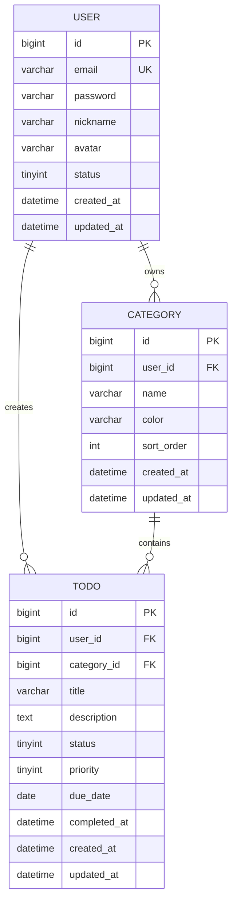

# 详细设计: TodoList 待办事项管理

> **文档信息**
> - 版本: 1.0
> - 创建日期: 2026-03-16
> - 作者: Claude Code (Backend Developer Role)
> - 状态: 已完成

---

## 1. API 设计规范

### 1.1 基础 URL
```
开发环境: http://localhost:8080/api
生产环境: https://api.example.com/api
```

### 1.2 通用响应格式

```json
{
  "code": 200,
  "message": "success",
  "data": { ... }
}
```

### 1.3 错误响应格式

```json
{
  "code": 400,
  "message": "错误描述",
  "data": null
}
```

### 1.4 状态码定义

| 状态码 | 说明 |
|--------|------|
| 200 | 成功 |
| 400 | 请求参数错误 |
| 401 | 未登录或 Token 失效 |
| 403 | 无权限 |
| 404 | 资源不存在 |
| 500 | 服务器内部错误 |

---

## 2. 认证 API

### 2.1 用户注册

**POST** `/auth/register`

**请求体**:
```json
{
  "email": "user@example.com",
  "password": "password123",
  "nickname": "用户昵称"
}
```

**响应**:
```json
{
  "code": 200,
  "message": "注册成功",
  "data": {
    "id": 1,
    "email": "user@example.com",
    "nickname": "用户昵称"
  }
}
```

---

### 2.2 用户登录

**POST** `/auth/login`

**请求体**:
```json
{
  "email": "user@example.com",
  "password": "password123"
}
```

**响应**:
```json
{
  "code": 200,
  "message": "登录成功",
  "data": {
    "token": "eyJhbGciOiJIUzI1NiIs...",
    "user": {
      "id": 1,
      "email": "user@example.com",
      "nickname": "用户昵称"
    }
  }
}
```

---

### 2.3 获取用户信息

**GET** `/auth/info`

**请求头**:
```
Authorization: Bearer <token>
```

**响应**:
```json
{
  "code": 200,
  "message": "success",
  "data": {
    "id": 1,
    "email": "user@example.com",
    "nickname": "用户昵称",
    "avatar": null,
    "createdAt": "2026-03-16T10:00:00"
  }
}
```

---

## 3. 任务 API

### 3.1 获取任务列表

**GET** `/todos`

**请求头**:
```
Authorization: Bearer <token>
```

**查询参数**:
| 参数 | 类型 | 必填 | 说明 |
|------|------|------|------|
| page | int | 否 | 页码，默认 1 |
| size | int | 否 | 每页数量，默认 10 |
| status | int | 否 | 状态: 0-待办, 1-进行中, 2-已完成 |
| priority | int | 否 | 优先级: 0-低, 1-中, 2-高 |
| categoryId | long | 否 | 分类 ID |

**响应**:
```json
{
  "code": 200,
  "message": "success",
  "data": {
    "records": [
      {
        "id": 1,
        "title": "完成项目报告",
        "description": "编写 Q1 季度项目报告",
        "status": 0,
        "priority": 2,
        "categoryId": 1,
        "categoryName": "工作",
        "dueDate": "2026-03-20",
        "completedAt": null,
        "createdAt": "2026-03-16T10:00:00",
        "updatedAt": "2026-03-16T10:00:00"
      }
    ],
    "total": 100,
    "current": 1,
    "size": 10,
    "pages": 10
  }
}
```

---

### 3.2 获取任务详情

**GET** `/todos/{id}`

**响应**:
```json
{
  "code": 200,
  "message": "success",
  "data": {
    "id": 1,
    "title": "完成项目报告",
    "description": "编写 Q1 季度项目报告",
    "status": 0,
    "priority": 2,
    "categoryId": 1,
    "categoryName": "工作",
    "dueDate": "2026-03-20",
    "completedAt": null,
    "createdAt": "2026-03-16T10:00:00",
    "updatedAt": "2026-03-16T10:00:00"
  }
}
```

---

### 3.3 创建任务

**POST** `/todos`

**请求体**:
```json
{
  "title": "完成项目报告",
  "description": "编写 Q1 季度项目报告",
  "priority": 2,
  "categoryId": 1,
  "dueDate": "2026-03-20"
}
```

**响应**:
```json
{
  "code": 200,
  "message": "创建成功",
  "data": {
    "id": 1,
    "title": "完成项目报告",
    ...
  }
}
```

---

### 3.4 更新任务

**PUT** `/todos/{id}`

**请求体**:
```json
{
  "title": "完成项目报告（修订版）",
  "description": "编写 Q1 季度项目报告",
  "priority": 2,
  "categoryId": 1,
  "dueDate": "2026-03-21"
}
```

---

### 3.5 删除任务

**DELETE** `/todos/{id}`

**响应**:
```json
{
  "code": 200,
  "message": "删除成功",
  "data": null
}
```

---

### 3.6 完成任务

**PUT** `/todos/{id}/complete`

**响应**:
```json
{
  "code": 200,
  "message": "操作成功",
  "data": {
    "id": 1,
    "status": 2,
    "completedAt": "2026-03-16T15:30:00"
  }
}
```

---

### 3.7 取消完成

**PUT** `/todos/{id}/uncomplete`

---

## 4. 分类 API

### 4.1 获取分类列表

**GET** `/categories`

**响应**:
```json
{
  "code": 200,
  "message": "success",
  "data": [
    {
      "id": 1,
      "name": "工作",
      "color": "#409EFF",
      "sortOrder": 0
    },
    {
      "id": 2,
      "name": "生活",
      "color": "#67C23A",
      "sortOrder": 1
    }
  ]
}
```

---

### 4.2 创建分类

**POST** `/categories`

**请求体**:
```json
{
  "name": "学习",
  "color": "#E6A23C",
  "sortOrder": 2
}
```

---

### 4.3 更新分类

**PUT** `/categories/{id}`

---

### 4.4 删除分类

**DELETE** `/categories/{id}`

---

## 5. 数据模型

### 5.1 ER 图



### 5.2 数据表设计

#### user 表

| 字段 | 类型 | 约束 | 说明 |
|------|------|------|------|
| id | BIGINT | PK, AUTO_INCREMENT | 用户 ID |
| email | VARCHAR(100) | UK, NOT NULL | 邮箱 |
| password | VARCHAR(255) | NOT NULL | 密码(BCrypt) |
| nickname | VARCHAR(50) | | 昵称 |
| avatar | VARCHAR(255) | | 头像 URL |
| status | TINYINT | DEFAULT 1 | 状态: 0-禁用, 1-正常 |
| created_at | DATETIME | DEFAULT NOW | 创建时间 |
| updated_at | DATETIME | ON UPDATE NOW | 更新时间 |

#### todo 表

| 字段 | 类型 | 约束 | 说明 |
|------|------|------|------|
| id | BIGINT | PK, AUTO_INCREMENT | 任务 ID |
| user_id | BIGINT | FK, NOT NULL | 用户 ID |
| category_id | BIGINT | FK | 分类 ID |
| title | VARCHAR(200) | NOT NULL | 标题 |
| description | TEXT | | 描述 |
| status | TINYINT | DEFAULT 0 | 状态: 0-待办, 1-进行中, 2-已完成 |
| priority | TINYINT | DEFAULT 1 | 优先级: 0-低, 1-中, 2-高 |
| due_date | DATE | | 截止日期 |
| completed_at | DATETIME | | 完成时间 |
| created_at | DATETIME | DEFAULT NOW | 创建时间 |
| updated_at | DATETIME | ON UPDATE NOW | 更新时间 |

#### category 表

| 字段 | 类型 | 约束 | 说明 |
|------|------|------|------|
| id | BIGINT | PK, AUTO_INCREMENT | 分类 ID |
| user_id | BIGINT | FK, NOT NULL | 用户 ID |
| name | VARCHAR(50) | NOT NULL | 分类名称 |
| color | VARCHAR(20) | DEFAULT '#409EFF' | 颜色 |
| sort_order | INT | DEFAULT 0 | 排序 |
| created_at | DATETIME | DEFAULT NOW | 创建时间 |
| updated_at | DATETIME | ON UPDATE NOW | 更新时间 |

---

## 6. 质量门禁检查

### 阶段 4 质量门禁
- [x] API 规范已定义
- [x] 数据模型已设计
- [x] ER 图已绘制
- [x] 请求/响应格式已确定
- [x] 错误码已定义

---

## 下一步

详细设计完成后，执行：
```
/flyway-migration
```
