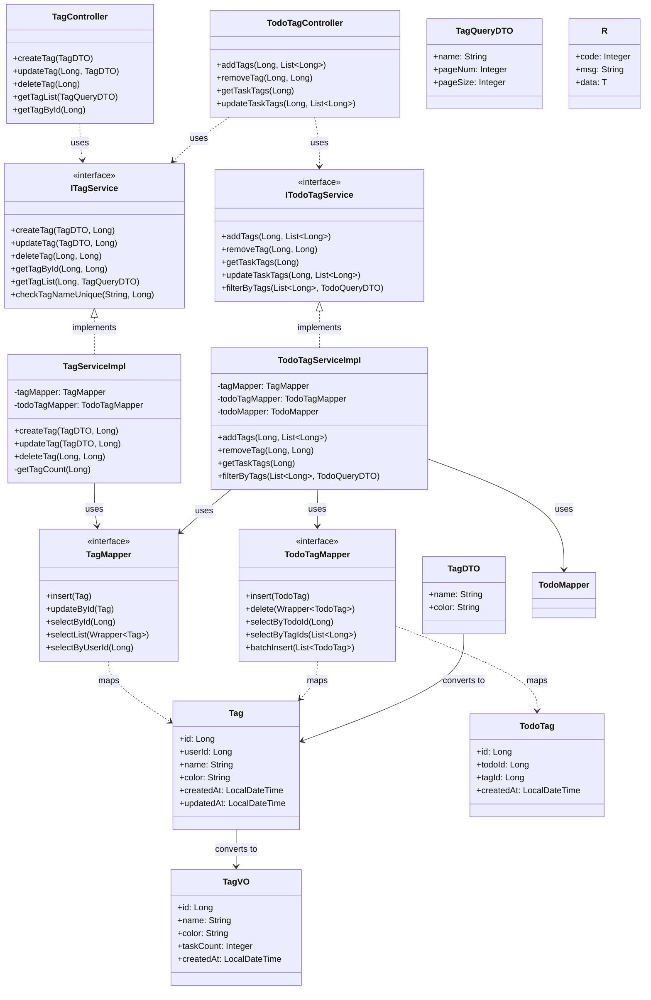
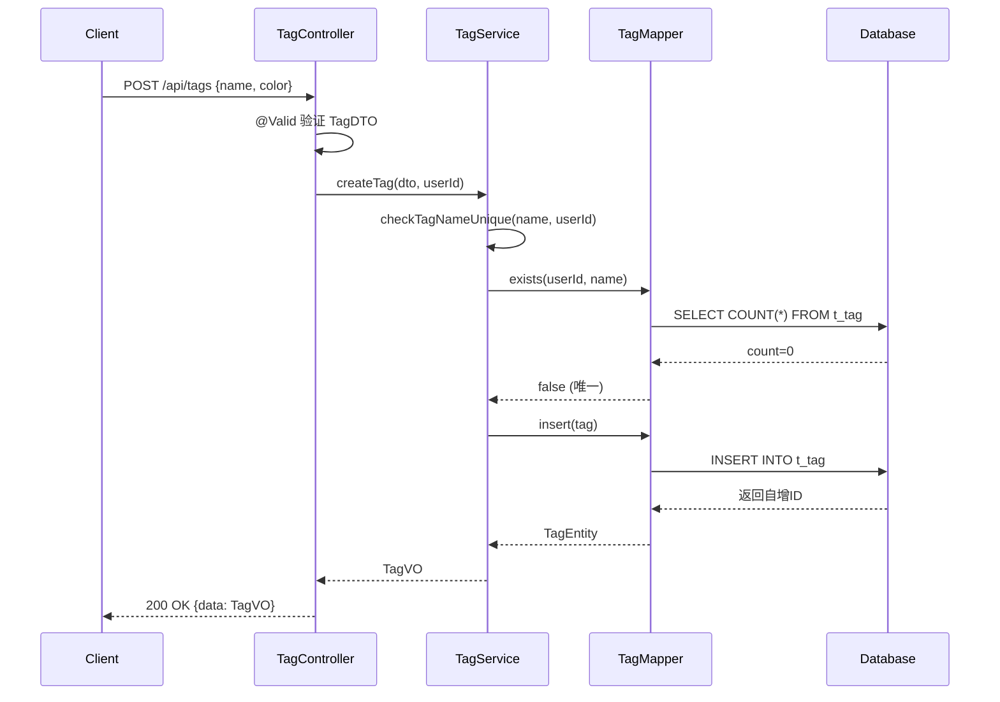
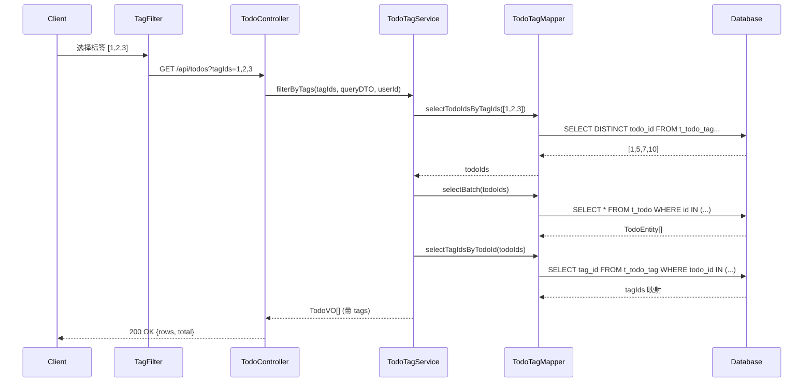

# 任务标签功能 - 类设计

| 版本 | 1.0 |
|------|-----|
| 创建日期 | 2026-03-16 |
| 功能模块 | 任务标签 |

---

## 1. 类图概览



---

## 2. 后端类设计

### 2.1 Controller 层

#### TagController

**职责**：处理标签相关的 HTTP 请求

```java
@RestController
@RequestMapping("/api/tags")
public class TagController {

    @Autowired
    private ITagService tagService;

    /**
     * 创建标签
     * POST /api/tags
     */
    @PostMapping
    public R<TagVO> createTag(@RequestBody @Valid TagDTO dto) {
        Long userId = SecurityUtils.getUserId();
        TagVO tag = tagService.createTag(dto, userId);
        return R.ok(tag);
    }

    /**
     * 更新标签
     * PUT /api/tags/{id}
     */
    @PutMapping("/{id}")
    public R<TagVO> updateTag(
        @PathVariable Long id,
        @RequestBody @Valid TagDTO dto
    ) {
        Long userId = SecurityUtils.getUserId();
        TagVO tag = tagService.updateTag(dto, userId);
        return R.ok(tag);
    }

    /**
     * 删除标签
     * DELETE /api/tags/{id}
     */
    @DeleteMapping("/{id}")
    public R<Void> deleteTag(@PathVariable Long id) {
        Long userId = SecurityUtils.getUserId();
        tagService.deleteTag(id, userId);
        return R.ok();
    }

    /**
     * 分页查询标签
     * GET /api/tags?pageNum=1&pageSize=10
     */
    @GetMapping
    public R<PageResult<TagVO>> getTagList(
        @Valid TagQueryDTO dto
    ) {
        Long userId = SecurityUtils.getUserId();
        PageResult<TagVO> result = tagService.getTagList(userId, dto);
        return R.ok(result);
    }

    /**
     * 查询标签详情
     * GET /api/tags/{id}
     */
    @GetMapping("/{id}")
    public R<TagVO> getTagById(@PathVariable Long id) {
        Long userId = SecurityUtils.getUserId();
        TagVO tag = tagService.getTagById(id, userId);
        return R.ok(tag);
    }
}
```

#### TodoTagController

**职责**：处理任务标签关联的 HTTP 请求

```java
@RestController
@RequestMapping("/api/todos/{todoId}/tags")
public class TodoTagController {

    @Autowired
    private ITodoTagService todoTagService;

    /**
     * 为任务添加标签
     * POST /api/todos/{todoId}/tags
     */
    @PostMapping
    public R<List<TagVO>> addTags(
        @PathVariable Long todoId,
        @RequestBody @Valid TodoTagsDTO dto
    ) {
        Long userId = SecurityUtils.getUserId();
        List<TagVO> tags = todoTagService.addTags(todoId, dto.getTagIds(), userId);
        return R.ok(tags);
    }

    /**
     * 移除任务标签
     * DELETE /api/todos/{todoId}/tags/{tagId}
     */
    @DeleteMapping("/{tagId}")
    public R<Void> removeTag(
        @PathVariable Long todoId,
        @PathVariable Long tagId
    ) {
        Long userId = SecurityUtils.getUserId();
        todoTagService.removeTag(todoId, tagId, userId);
        return R.ok();
    }

    /**
     * 查询任务的所有标签
     * GET /api/todos/{todoId}/tags
     */
    @GetMapping
    public R<List<TagVO>> getTaskTags(@PathVariable Long todoId) {
        Long userId = SecurityUtils.getUserId();
        List<TagVO> tags = todoTagService.getTaskTags(todoId, userId);
        return R.ok(tags);
    }

    /**
     * 批量更新任务标签
     * PUT /api/todos/{todoId}/tags
     */
    @PutMapping
    public R<List<TagVO>> updateTaskTags(
        @PathVariable Long todoId,
        @RequestBody @Valid TodoTagsDTO dto
    ) {
        Long userId = SecurityUtils.getUserId();
        List<TagVO> tags = todoTagService.updateTaskTags(todoId, dto.getTagIds(), userId);
        return R.ok(tags);
    }
}
```

---

### 2.2 Service 层

#### ITagService 接口

```java
public interface ITagService {

    /**
     * 创建标签
     * @param dto 标签数据
     * @param userId 用户ID
     * @return 标签VO
     * @throws BusinessException 标签名称已存在
     */
    TagVO createTag(TagDTO dto, Long userId);

    /**
     * 更新标签
     * @param dto 标签数据
     * @param userId 用户ID
     * @return 标签VO
     * @throws BusinessException 标签不存在或无权限
     */
    TagVO updateTag(TagDTO dto, Long userId);

    /**
     * 删除标签
     * @param tagId 标签ID
     * @param userId 用户ID
     * @throws BusinessException 标签不存在或无权限
     */
    void deleteTag(Long tagId, Long userId);

    /**
     * 查询标签详情
     * @param tagId 标签ID
     * @param userId 用户ID
     * @return 标签VO
     * @throws BusinessException 标签不存在或无权限
     */
    TagVO getTagById(Long tagId, Long userId);

    /**
     * 分页查询标签
     * @param userId 用户ID
     * @param dto 查询条件
     * @return 分页结果
     */
    PageResult<TagVO> getTagList(Long userId, TagQueryDTO dto);

    /**
     * 检查标签名称唯一性
     * @param name 标签名称
     * @param userId 用户ID
     * @param excludeId 排除的标签ID
     * @return true=唯一, false=重复
     */
    boolean checkTagNameUnique(String name, Long userId, Long excludeId);
}
```

#### TagServiceImpl

```java
@Service
public class TagServiceImpl implements ITagService {

    @Autowired
    private TagMapper tagMapper;

    @Autowired
    private TodoTagMapper todoTagMapper;

    @Autowired
    private TagConverter tagConverter;

    @Override
    @Transactional
    public TagVO createTag(TagDTO dto, Long userId) {
        // 验证名称唯一性
        if (!checkTagNameUnique(dto.getName(), userId, null)) {
            throw new BusinessException("标签名称已存在");
        }

        Tag tag = Tag.builder()
            .userId(userId)
            .name(dto.getName())
            .color(dto.getColor() != null ? dto.getColor() : "#999999")
            .build();

        tagMapper.insert(tag);
        return tagConverter.toVO(tag, 0);
    }

    @Override
    @Transactional
    public TagVO updateTag(TagDTO dto, Long userId) {
        Tag tag = tagMapper.selectById(dto.getId());
        if (tag == null || !tag.getUserId().equals(userId)) {
            throw new BusinessException("标签不存在或无权限");
        }

        // 验证名称唯一性
        if (!checkTagNameUnique(dto.getName(), userId, dto.getId())) {
            throw new BusinessException("标签名称已存在");
        }

        tag.setName(dto.getName());
        tag.setColor(dto.getColor());
        tagMapper.updateById(tag);

        Integer taskCount = todoTagMapper.selectCount(
            new LambdaQueryWrapper<TodoTag>()
                .eq(TodoTag::getTagId, tag.getId())
        );

        return tagConverter.toVO(tag, taskCount);
    }

    @Override
    @Transactional
    public void deleteTag(Long tagId, Long userId) {
        Tag tag = tagMapper.selectById(tagId);
        if (tag == null || !tag.getUserId().equals(userId)) {
            throw new BusinessException("标签不存在或无权限");
        }

        // 删除标签
        tagMapper.deleteById(tagId);

        // 删除任务标签关联
        todoTagMapper.delete(new LambdaQueryWrapper<TodoTag>()
            .eq(TodoTag::getTagId, tagId)
        );
    }

    @Override
    public TagVO getTagById(Long tagId, Long userId) {
        Tag tag = tagMapper.selectById(tagId);
        if (tag == null || !tag.getUserId().equals(userId)) {
            throw new BusinessException("标签不存在或无权限");
        }

        Integer taskCount = todoTagMapper.selectCount(
            new LambdaQueryWrapper<TodoTag>()
                .eq(TodoTag::getTagId, tagId)
        );

        return tagConverter.toVO(tag, taskCount);
    }

    @Override
    public PageResult<TagVO> getTagList(Long userId, TagQueryDTO dto) {
        LambdaQueryWrapper<Tag> wrapper = new LambdaQueryWrapper<>();
        wrapper.eq(Tag::getUserId, userId);

        if (StringUtils.isNotBlank(dto.getName())) {
            wrapper.like(Tag::getName, dto.getName());
        }

        wrapper.orderByDesc(Tag::getCreatedAt);

        Page<Tag> page = tagMapper.selectPage(
            new Page<>(dto.getPageNum(), dto.getPageSize()),
            wrapper
        );

        List<TagVO> voList = tagConverter.toVOList(page.getRecords());

        return PageResult.of(page, voList);
    }

    @Override
    public boolean checkTagNameUnique(String name, Long userId, Long excludeId) {
        LambdaQueryWrapper<Tag> wrapper = new LambdaQueryWrapper<>();
        wrapper.eq(Tag::getUserId, userId)
            .eq(Tag::getName, name);

        if (excludeId != null) {
            wrapper.ne(Tag::getId, excludeId);
        }

        return !tagMapper.exists(wrapper);
    }
}
```

#### ITodoTagService 接口

```java
public interface ITodoTagService {

    /**
     * 为任务添加标签
     * @param todoId 任务ID
     * @param tagIds 标签ID列表
     * @param userId 用户ID
     * @return 添加后的标签列表
     */
    List<TagVO> addTags(Long todoId, List<Long> tagIds, Long userId);

    /**
     * 移除任务标签
     * @param todoId 任务ID
     * @param tagId 标签ID
     * @param userId 用户ID
     */
    void removeTag(Long todoId, Long tagId, Long userId);

    /**
     * 查询任务的所有标签
     * @param todoId 任务ID
     * @param userId 用户ID
     * @return 标签列表
     */
    List<TagVO> getTaskTags(Long todoId, Long userId);

    /**
     * 批量更新任务标签
     * @param todoId 任务ID
     * @param tagIds 标签ID列表
     * @param userId 用户ID
     * @return 更新后的标签列表
     */
    List<TagVO> updateTaskTags(Long todoId, List<Long> tagIds, Long userId);

    /**
     * 按标签筛选任务
     * @param tagIds 标签ID列表（AND逻辑）
     * @param queryDTO 查询条件
     * @param userId 用户ID
     * @return 任务分页结果
     */
    PageResult<TodoVO> filterByTags(List<Long> tagIds, TodoQueryDTO queryDTO, Long userId);
}
```

---

### 2.3 Mapper 层

#### TagMapper

```java
@Mapper
public interface TagMapper extends BaseMapper<Tag> {

    /**
     * 查询用户的所有标签
     * @param userId 用户ID
     * @return 标签列表
     */
    @Select("SELECT * FROM t_tag WHERE user_id = #{userId} ORDER BY created_at DESC")
    List<Tag> selectByUserId(@Param("userId") Long userId);
}
```

#### TodoTagMapper

```java
@Mapper
public interface TodoTagMapper extends BaseMapper<TodoTag> {

    /**
     * 查询任务的所有标签
     * @param todoId 任务ID
     * @return 标签ID列表
     */
    @Select("SELECT tag_id FROM t_todo_tag WHERE todo_id = #{todoId}")
    List<Long> selectTagIdsByTodoId(@Param("todoId") Long todoId);

    /**
     * 批量插入任务标签关联
     * @param todoTags 关联记录列表
     * @return 插入数量
     */
    int batchInsert(@Param("todoTags") List<TodoTag> todoTags);

    /**
     * 查询包含指定标签的任务ID列表
     * @param tagIds 标签ID列表
     * @param userId 用户ID
     * @return 任务ID列表
     */
    @Select("<script>" +
            "SELECT DISTINCT tt.todo_id " +
            "FROM t_todo_tag tt " +
            "WHERE tt.tag_id IN " +
            "<foreach collection='tagIds' item='tagId' open='(' separator=',' close=')'>" +
            "#{tagId}" +
            "</foreach>" +
            "</script>")
    List<Long> selectTodoIdsByTagIds(@Param("tagIds") List<Long> tagIds);
}
```

---

### 2.4 Entity 层

#### Tag 实体

```java
package com.todolist.entity;

import com.baomidou.mybatisplus.annotation.*;
import lombok.Data;
import lombok.Builder;

import java.time.LocalDateTime;

/**
 * 任务标签实体
 *
 * @author Claude Code
 * @since 2026-03-16
 */
@Data
@Builder
@TableName("t_tag")
public class Tag {

    /**
     * 主键ID
     */
    @TableId(type = IdType.AUTO)
    private Long id;

    /**
     * 用户ID
     */
    private Long userId;

    /**
     * 标签名称
     */
    private String name;

    /**
     * 标签颜色（HEX格式）
     */
    private String color;

    /**
     * 创建时间
     */
    @TableField(fill = FieldFill.INSERT)
    private LocalDateTime createdAt;

    /**
     * 更新时间
     */
    @TableField(fill = FieldFill.INSERT_UPDATE)
    private LocalDateTime updatedAt;
}
```

#### TodoTag 实体

```java
package com.todolist.entity;

import com.baomidou.mybatisplus.annotation.*;
import lombok.Data;

import java.time.LocalDateTime;

/**
 * 任务标签关联实体
 *
 * @author Claude Code
 * @since 2026-03-16
 */
@Data
@TableName("t_todo_tag")
public class TodoTag {

    /**
     * 主键ID
     */
    @TableId(type = IdType.AUTO)
    private Long id;

    /**
     * 任务ID
     */
    private Long todoId;

    /**
     * 标签ID
     */
    private Long tagId;

    /**
     * 创建时间
     */
    @TableField(fill = FieldFill.INSERT)
    private LocalDateTime createdAt;
}
```

---

### 2.5 DTO/VO 设计

#### TagDTO

```java
package com.todolist.dto;

import lombok.Data;

import javax.validation.constraints.NotBlank;
import javax.validation.constraints.Pattern;
import javax.validation.constraints.Size;

/**
 * 标签创建/更新DTO
 */
@Data
public class TagDTO {

    /**
     * 标签ID（更新时需要）
     */
    private Long id;

    /**
     * 标签名称
     */
    @NotBlank(message = "标签名称不能为空")
    @Size(min = 1, max = 20, message = "标签名称长度为1-20字符")
    private String name;

    /**
     * 标签颜色（HEX格式）
     */
    @Pattern(regexp = "^#[0-9A-Fa-f]{6}$", message = "颜色格式不正确")
    private String color;
}
```

#### TagVO

```java
package com.todolist.vo;

import lombok.Data;

import java.time.LocalDateTime;

/**
 * 标签响应VO
 */
@Data
public class TagVO {

    /**
     * 标签ID
     */
    private Long id;

    /**
     * 标签名称
     */
    private String name;

    /**
     * 标签颜色
     */
    private String color;

    /**
     * 关联的任务数量
     */
    private Integer taskCount;

    /**
     * 创建时间
     */
    private LocalDateTime createdAt;
}
```

#### TagQueryDTO

```java
package com.todolist.query;

import lombok.Data;

/**
 * 标签查询DTO
 */
@Data
public class TagQueryDTO extends PageQuery {

    /**
     * 标签名称（模糊搜索）
     */
    private String name;

    /**
     * 排序字段
     */
    private String orderBy = "createdAt";

    /**
     * 排序方式
     */
    private String orderDirection = "DESC";
}
```

#### TodoTagsDTO

```java
package com.todolist.dto;

import lombok.Data;

import javax.validation.constraints.NotEmpty;
import java.util.List;

/**
 * 任务标签DTO
 */
@Data
public class TodoTagsDTO {

    /**
     * 标签ID列表
     */
    @NotEmpty(message = "请选择标签")
    private List<Long> tagIds;
}
```

---

## 3. 前端类设计

### 3.1 API 模块

```typescript
// api/tag.ts
import request from '@/utils/request';

export interface Tag {
  id: number;
  name: string;
  color: string;
  taskCount?: number;
  createdAt: string;
}

export interface CreateTagDto {
  name: string;
  color: string;
}

export interface UpdateTagDto extends CreateTagDto {
  id: number;
}

// 创建标签
export function createTag(data: CreateTagDto) {
  return request.post<Tag>('/api/tags', data);
}

// 更新标签
export function updateTag(data: UpdateTagDto) {
  return request.put<Tag>(`/api/tags/${data.id}`, data);
}

// 删除标签
export function deleteTag(id: number) {
  return request.delete(`/api/tags/${id}`);
}

// 查询标签列表
export function getTags(params?: PageParams) {
  return request.get<PageResult<Tag>>('/api/tags', { params });
}

// 查询标签详情
export function getTagById(id: number) {
  return request.get<Tag>(`/api/tags/${id}`);
}
```

```typescript
// api/todo-tag.ts
import request from '@/utils/request';

// 为任务添加标签
export function addTags(todoId: number, tagIds: number[]) {
  return request.post<Tag[]>(`/api/todos/${todoId}/tags`, { tagIds });
}

// 移除任务标签
export function removeTag(todoId: number, tagId: number) {
  return request.delete(`/api/todos/${todoId}/tags/${tagId}`);
}

// 查询任务的所有标签
export function getTaskTags(todoId: number) {
  return request.get<Tag[]>(`/api/todos/${todoId}/tags`);
}

// 批量更新任务标签
export function updateTaskTags(todoId: number, tagIds: number[]) {
  return request.put<Tag[]>(`/api/todos/${todoId}/tags`, { tagIds });
}

// 按标签筛选任务
export function filterTodosByTags(tagIds: number[], params?: PageParams) {
  return request.get<PageResult<Todo>>('/api/todos', {
    params: { tagIds: tagIds.join(','), ...params }
  });
}
```

### 3.2 Store 模块

```typescript
// stores/tag.ts
import { defineStore } from 'pinia';
import { ref, computed } from 'vue';
import * as tagApi from '@/api/tag';
import type { Tag, CreateTagDto } from '@/api/tag';

export const useTagStore = defineStore('tag', () => {
  // State
  const tags = ref<Tag[]>([]);
  const currentTag = ref<Tag | null>(null);

  // Getters
  const tagById = computed(() => {
    return (id: number) => tags.value.find(t => t.id === id);
  });

  const tagsByTaskCount = computed(() => {
    return [...tags.value].sort((a, b) => (b.taskCount || 0) - (a.taskCount || 0));
  });

  // Actions
  async function fetchTags() {
    const { data } = await tagApi.getTags({ pageNum: 1, pageSize: 100 });
    tags.value = data.rows;
  }

  async function createTag(dto: CreateTagDto) {
    const { data } = await tagApi.createTag(dto);
    tags.value.unshift(data);
    return data;
  }

  async function updateTag(dto: CreateTagDto & { id: number }) {
    const { data } = await tagApi.updateTag(dto);
    const index = tags.value.findIndex(t => t.id === dto.id);
    if (index !== -1) {
      tags.value[index] = data;
    }
    return data;
  }

  async function deleteTag(id: number) {
    await tagApi.deleteTag(id);
    tags.value = tags.value.filter(t => t.id !== id);
  }

  function setCurrentTag(tag: Tag | null) {
    currentTag.value = tag;
  }

  return {
    tags,
    currentTag,
    tagById,
    tagsByTaskCount,
    fetchTags,
    createTag,
    updateTag,
    deleteTag,
    setCurrentTag,
  };
});
```

---

## 4. 责任分配

| 类 | 职责 |
|------|------|
| TagController | 处理 HTTP 请求，参数验证，调用 Service |
| TodoTagController | 处理任务标签 HTTP 请求 |
| ITagService | 标签业务逻辑接口定义 |
| TagServiceImpl | 标签业务逻辑实现 |
| ITodoTagService | 任务标签业务逻辑接口定义 |
| TodoTagServiceImpl | 任务标签业务逻辑实现 |
| TagMapper | 标签数据访问接口 |
| TodoTagMapper | 任务标签关联数据访问接口 |
| Tag | 标签实体 |
| TodoTag | 任务标签关联实体 |
| TagDTO | 标签请求 DTO |
| TagVO | 标签响应 VO |
| TagConverter | 实体与 VO 转换器 |

---

## 5. 设计模式应用

### 5.1 使用的设计模式

| 模式 | 应用位置 | 说明 |
|------|----------|------|
| **分层架构** | 整体架构 | Controller-Service-Mapper 分层 |
| **接口隔离** | Service 层 | ITagService、ITodoTagService |
| **依赖注入** | Service 层 | @Autowired 注入依赖 |
| **DTO 模式** | 数据传输 | TagDTO、TagVO 数据分离 |
| **Builder 模式** | Entity 构建 | Tag.builder() 构建对象 |
| **策略模式** | 查询条件 | TagQueryDTO 封装查询条件 |
| **转换器模式** | 对象转换 | TagConverter 封装转换逻辑 |

---

## 6. 时序图

### 6.1 创建标签时序



### 6.2 标签筛选时序



---

## 7. 变更记录

| 版本 | 日期 | 变更内容 | 作者 |
|------|------|----------|------|
| 1.0 | 2026-03-16 | 初始版本 | Claude Code |
