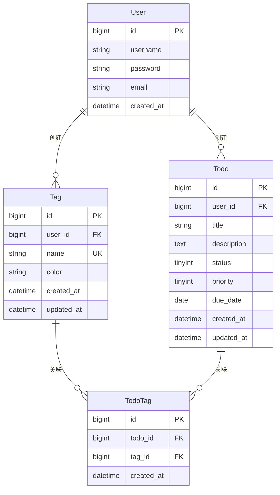

# 任务标签功能 - 数据模型设计

| 版本 | 1.0 |
|------|-----|
| 创建日期 | 2026-03-16 |
| 功能模块 | 任务标签 |

---

## 1. 实体关系图



---

## 2. 实体详细设计

### 2.1 Tag（标签表）

#### 基本信息

| 属性 | 值 |
|------|------|
| 表名 | `t_tag` |
| 实体名 | `Tag` |
| 描述 | 任务标签，用于灵活分类任务 |

#### 字段设计

| 字段名 | 类型 | 长度 | 允许空 | 默认值 | 说明 |
|--------|------|------|--------|--------|------|
| id | BIGINT | - | NO | AUTO | 主键ID |
| user_id | BIGINT | - | NO | - | 用户ID |
| name | VARCHAR | 20 | NO | - | 标签名称 |
| color | VARCHAR | 7 | NO | #999999 | 标签颜色（HEX） |
| created_at | DATETIME | - | NO | CURRENT_TIMESTAMP | 创建时间 |
| updated_at | DATETIME | - | NO | CURRENT_TIMESTAMP | 更新时间 |

#### 约束条件

```sql
-- 主键
PRIMARY KEY (id)

-- 唯一约束
UNIQUE KEY uk_user_name (user_id, name)

-- 索引
KEY idx_user_id (user_id)
```

#### 实体类

```java
package com.todolist.entity;

import com.baomidou.mybatisplus.annotation.*;
import lombok.Data;
import lombok.Builder;

import java.time.LocalDateTime;

/**
 * 任务标签实体
 *
 * @author Claude Code
 * @since 2026-03-16
 */
@Data
@Builder
@TableName("t_tag")
public class Tag {

    /**
     * 主键ID
     */
    @TableId(type = IdType.AUTO)
    private Long id;

    /**
     * 用户ID
     */
    private Long userId;

    /**
     * 标签名称
     */
    private String name;

    /**
     * 标签颜色（HEX格式，#RRGGBB）
     */
    private String color;

    /**
     * 创建时间
     */
    @TableField(fill = FieldFill.INSERT)
    private LocalDateTime createdAt;

    /**
     * 更新时间
     */
    @TableField(fill = FieldFill.INSERT_UPDATE)
    private LocalDateTime updatedAt;
}
```

---

### 2.2 TodoTag（任务标签关联表）

#### 基本信息

| 属性 | 值 |
|------|------|
| 表名 | `t_todo_tag` |
| 实体名 | `TodoTag` |
| 描述 | 任务与标签的多对多关联表 |

#### 字段设计

| 字段名 | 类型 | 长度 | 允许空 | 默认值 | 说明 |
|--------|------|------|--------|--------|------|
| id | BIGINT | - | NO | AUTO | 主键ID |
| todo_id | BIGINT | - | NO | - | 任务ID |
| tag_id | BIGINT | - | NO | - | 标签ID |
| created_at | DATETIME | - | NO | CURRENT_TIMESTAMP | 创建时间 |

#### 约束条件

```sql
-- 主键
PRIMARY KEY (id)

-- 唯一约束
UNIQUE KEY uk_todo_tag (todo_id, tag_id)

-- 索引
KEY idx_tag_id (tag_id)
KEY idx_todo_id (todo_id)

-- 外键
FOREIGN KEY (todo_id) REFERENCES t_todo(id) ON DELETE CASCADE
FOREIGN KEY (tag_id) REFERENCES t_tag(id) ON DELETE CASCADE
```

#### 实体类

```java
package com.todolist.entity;

import com.baomidou.mybatisplus.annotation.*;
import lombok.Data;

import java.time.LocalDateTime;

/**
 * 任务标签关联实体
 *
 * @author Claude Code
 * @since 2026-03-16
 */
@Data
@TableName("t_todo_tag")
public class TodoTag {

    /**
     * 主键ID
     */
    @TableId(type = IdType.AUTO)
    private Long id;

    /**
     * 任务ID
     */
    private Long todoId;

    /**
     * 标签ID
     */
    private Long tagId;

    /**
     * 创建时间
     */
    @TableField(fill = FieldFill.INSERT)
    private LocalDateTime createdAt;
}
```

---

## 3. 数据字典

### 3.1 Tag 表字段字典

| 字段 | 说明 | 取值范围 |
|------|------|----------|
| status | 状态 | - |
| color | 颜色 | HEX格式 #000000-#FFFFFF |
| name | 名称 | 1-20字符，同用户下唯一 |

### 3.2 TodoTag 表字段字典

| 字段 | 说明 | 取值范围 |
|------|------|----------|
| todo_id | 任务ID | 关联 t_todo.id |
| tag_id | 标签ID | 关联 t_tag.id |

---

## 4. 数据关系

### 4.1 一对多关系

| 关系 | 源实体 | 目标实体 | 外键 |
|------|--------|----------|------|
| User → Tag | One | Many | Tag.user_id |
| User → Todo | One | Many | Todo.user_id |

### 4.2 多对多关系

| 关系 | 实体1 | 实体2 | 中间表 |
|------|------|------|--------|
| Todo ↔ Tag | Todo | Tag | TodoTag |

```
Todo (1) ←→ (N) TodoTag ←→ (1) Tag
```

---

## 5. 索引设计

### 5.1 索引列表

| 表名 | 索引名 | 字段 | 类型 | 说明 |
|------|--------|------|------|------|
| t_tag | PRIMARY | id | PRIMARY | 主键索引 |
| t_tag | uk_user_name | user_id, name | UNIQUE | 用户标签名唯一 |
| t_tag | idx_user_id | user_id | INDEX | 查询用户标签 |
| t_todo_tag | PRIMARY | id | PRIMARY | 主键索引 |
| t_todo_tag | uk_todo_tag | todo_id, tag_id | UNIQUE | 防止重复关联 |
| t_todo_tag | idx_tag_id | tag_id | INDEX | 按标签查询任务 |
| t_todo_tag | idx_todo_id | todo_id | INDEX | 查询任务标签 |

### 5.2 索引使用场景

```sql
-- 查询用户所有标签
SELECT * FROM t_tag WHERE user_id = ?;
-- 使用 idx_user_id

-- 验证标签名唯一性
SELECT COUNT(*) FROM t_tag WHERE user_id = ? AND name = ?;
-- 使用 uk_user_name

-- 按标签筛选任务
SELECT DISTINCT tt.todo_id
FROM t_todo_tag tt
WHERE tt.tag_id IN (1, 2, 3);
-- 使用 idx_tag_id

-- 查询任务的所有标签
SELECT tt.tag_id
FROM t_todo_tag tt
WHERE tt.todo_id = ?;
-- 使用 idx_todo_id
```

---

## 6. 数据完整性

### 6.1 实体完整性

- **主键约束**: 每个表都有自增主键
- **外键约束**: TodoTag 关联 Todo 和 Tag

### 6.2 引用完整性

```sql
-- 级联删除
FOREIGN KEY (todo_id) REFERENCES t_todo(id) ON DELETE CASCADE
FOREIGN KEY (tag_id) REFERENCES t_tag(id) ON DELETE CASCADE
```

### 6.3 业务规则

1. **标签名唯一性**: 同一用户下标签名不能重复
2. **关联唯一性**: 同一任务不能重复添加同一标签
3. **用户隔离**: 用户只能访问自己的标签

---

## 7. 数据字典

### 7.1 枚举值

#### 标签预设颜色

```java
public enum TagColor {
    RED("#FF6B6B"),
    ORANGE("#FFA07A"),
    AMBER("#F7DC6F"),
    GREEN("#4ECDC4"),
    CYAN("#45B7D1"),
    BLUE("#5C9DED"),
    PURPLE("#BB8FCE"),
    PINK("#FF9FF3");

    private final String hex;

    TagColor(String hex) {
        this.hex = hex;
    }

    public String getHex() {
        return hex;
    }
}
```

### 7.2 常量定义

```java
public class TagConstants {
    /** 默认标签颜色 */
    public static final String DEFAULT_COLOR = "#999999";

    /** 标签名称最大长度 */
    public static final int MAX_NAME_LENGTH = 20;

    /** 标签名称最小长度 */
    public static final int MIN_NAME_LENGTH = 1;

    /** 标签颜色正则 */
    public static final String COLOR_PATTERN = "^#[0-9A-Fa-f]{6}$";
}
```

---

## 8. 数据迁移

### 8.1 Flyway 脚本

```sql
-- V1.0.1__create_tag_table.sql
CREATE TABLE t_tag (
    id BIGINT AUTO_INCREMENT PRIMARY KEY COMMENT '主键ID',
    user_id BIGINT NOT NULL COMMENT '用户ID',
    name VARCHAR(20) NOT NULL COMMENT '标签名称',
    color VARCHAR(7) DEFAULT '#999999' COMMENT '标签颜色',
    created_at DATETIME DEFAULT CURRENT_TIMESTAMP COMMENT '创建时间',
    updated_at DATETIME DEFAULT CURRENT_TIMESTAMP ON UPDATE CURRENT_TIMESTAMP COMMENT '更新时间',

    UNIQUE KEY uk_user_name (user_id, name),
    KEY idx_user_id (user_id)
) ENGINE=InnoDB DEFAULT CHARSET=utf8mb4 COMMENT='任务标签表';
```

```sql
-- V1.0.2__create_todo_tag_table.sql
CREATE TABLE t_todo_tag (
    id BIGINT AUTO_INCREMENT PRIMARY KEY COMMENT '主键ID',
    todo_id BIGINT NOT NULL COMMENT '任务ID',
    tag_id BIGINT NOT NULL COMMENT '标签ID',
    created_at DATETIME DEFAULT CURRENT_TIMESTAMP COMMENT '创建时间',

    UNIQUE KEY uk_todo_tag (todo_id, tag_id),
    KEY idx_tag_id (tag_id),
    KEY idx_todo_id (todo_id)
) ENGINE=InnoDB DEFAULT CHARSET=utf8mb4 COMMENT='任务标签关联表';
```

---

## 9. 变更记录

| 版本 | 日期 | 变更内容 | 作者 |
|------|------|----------|------|
| 1.0 | 2026-03-16 | 初始版本 | Claude Code |
