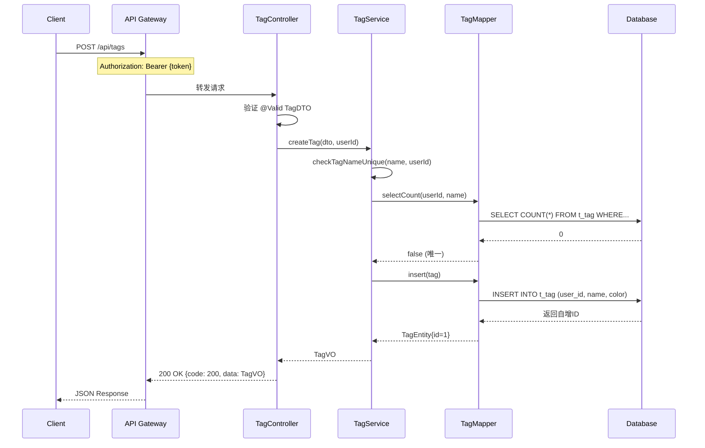
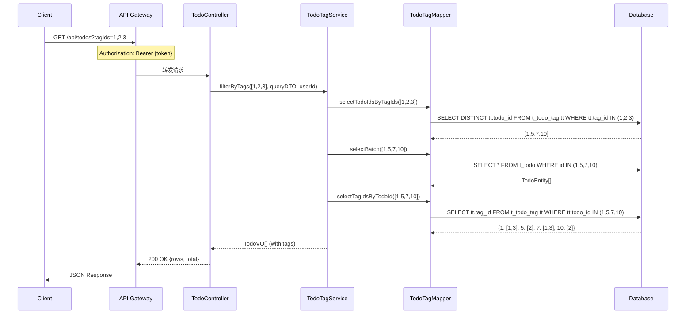

# 任务标签功能 - API 详细设计

| 版本 | 1.0 |
|------|-----|
| 创建日期 | 2026-03-16 |
| 功能模块 | 任务标签 |

---

## 1. API 设计规范

### 1.1 基础 URL

```
开发环境: http://localhost:8080/api
生产环境: https://api.example.com/api
```

### 1.2 统一响应格式

```json
{
  "code": 200,
  "msg": "success",
  "data": {}
}
```

### 1.3 状态码定义

| 状态码 | 说明 |
|--------|------|
| 200 | 成功 |
| 400 | 请求参数错误 |
| 401 | 未登录或 Token 失效 |
| 403 | 无权限 |
| 404 | 资源不存在 |
| 409 | 资源冲突（如标签名重复） |
| 500 | 服务器内部错误 |

---

## 2. 标签管理 API

### 2.1 创建标签

**请求**

```
POST /api/tags
Authorization: Bearer {token}
Content-Type: application/json
```

**请求体**

```json
{
  "name": "工作",
  "color": "#FF6B6B"
}
```

**参数说明**

| 参数 | 类型 | 必填 | 说明 |
|------|------|------|------|
| name | String | 是 | 标签名称，1-20字符 |
| color | String | 否 | 标签颜色，HEX格式，默认#999999 |

**响应**

```json
{
  "code": 200,
  "msg": "创建成功",
  "data": {
    "id": 1,
    "name": "工作",
    "color": "#FF6B6B",
    "taskCount": 0,
    "createdAt": "2026-03-16T10:00:00"
  }
}
```

**错误响应**

```json
{
  "code": 409,
  "msg": "标签名称已存在",
  "data": null
}
```

---

### 2.2 更新标签

**请求**

```
PUT /api/tags/{id}
Authorization: Bearer {token}
Content-Type: application/json
```

**路径参数**

| 参数 | 类型 | 必填 | 说明 |
|------|------|------|------|
| id | Long | 是 | 标签ID |

**请求体**

```json
{
  "name": "工作事务",
  "color": "#FF5555"
}
```

**响应**

```json
{
  "code": 200,
  "msg": "更新成功",
  "data": {
    "id": 1,
    "name": "工作事务",
    "color": "#FF5555",
    "taskCount": 5,
    "createdAt": "2026-03-16T10:00:00"
  }
}
```

---

### 2.3 删除标签

**请求**

```
DELETE /api/tags/{id}
Authorization: Bearer {token}
```

**响应**

```json
{
  "code": 200,
  "msg": "删除成功",
  "data": null
}
```

---

### 2.4 查询标签列表

**请求**

```
GET /api/tags?pageNum=1&pageSize=10&name=工作
Authorization: Bearer {token}
```

**查询参数**

| 参数 | 类型 | 必填 | 说明 |
|------|------|------|------|
| pageNum | Integer | 否 | 页码，默认1 |
| pageSize | Integer | 否 | 每页数量，默认10 |
| name | String | 否 | 标签名称（模糊搜索） |

**响应**

```json
{
  "code": 200,
  "msg": "查询成功",
  "rows": [
    {
      "id": 1,
      "name": "工作",
      "color": "#FF6B6B",
      "taskCount": 5,
      "createdAt": "2026-03-16T10:00:00"
    },
    {
      "id": 2,
      "name": "个人",
      "color": "#4ECDC4",
      "taskCount": 3,
      "createdAt": "2026-03-16T11:00:00"
    }
  ],
  "total": 8
}
```

---

### 2.5 查询标签详情

**请求**

```
GET /api/tags/{id}
Authorization: Bearer {token}
```

**响应**

```json
{
  "code": 200,
  "msg": "查询成功",
  "data": {
    "id": 1,
    "name": "工作",
    "color": "#FF6B6B",
    "taskCount": 5,
    "createdAt": "2026-03-16T10:00:00",
    "updatedAt": "2026-03-16T12:00:00"
  }
}
```

---

## 3. 任务标签 API

### 3.1 为任务添加标签

**请求**

```
POST /api/todos/{todoId}/tags
Authorization: Bearer {token}
Content-Type: application/json
```

**路径参数**

| 参数 | 类型 | 必填 | 说明 |
|------|------|------|------|
| todoId | Long | 是 | 任务ID |

**请求体**

```json
{
  "tagIds": [1, 3, 5]
}
```

**参数说明**

| 参数 | 类型 | 必填 | 说明 |
|------|------|------|------|
| tagIds | Array[Long] | 是 | 标签ID列表 |

**响应**

```json
{
  "code": 200,
  "msg": "添加成功",
  "data": [
    {
      "id": 1,
      "name": "工作",
      "color": "#FF6B6B"
    },
    {
      "id": 3,
      "name": "重要",
      "color": "#45B7D1"
    },
    {
      "id": 5,
      "name": "紧急",
      "color": "#EF4444"
    }
  ]
}
```

**错误响应**

```json
{
  "code": 400,
  "msg": "标签已存在于任务上",
  "data": null
}
```

---

### 3.2 移除任务标签

**请求**

```
DELETE /api/todos/{todoId}/tags/{tagId}
Authorization: Bearer {token}
```

**路径参数**

| 参数 | 类型 | 必填 | 说明 |
|------|------|------|------|
| todoId | Long | 是 | 任务ID |
| tagId | Long | 是 | 标签ID |

**响应**

```json
{
  "code": 200,
  "msg": "移除成功",
  "data": null
}
```

---

### 3.3 查询任务的所有标签

**请求**

```
GET /api/todos/{todoId}/tags
Authorization: Bearer {token}
```

**响应**

```json
{
  "code": 200,
  "msg": "查询成功",
  "data": [
    {
      "id": 1,
      "name": "工作",
      "color": "#FF6B6B"
    },
    {
      "id": 3,
      "name": "重要",
      "color": "#45B7D1"
    }
  ]
}
```

---

### 3.4 批量更新任务标签

**请求**

```
PUT /api/todos/{todoId}/tags
Authorization: Bearer {token}
Content-Type: application/json
```

**请求体**

```json
{
  "tagIds": [1, 3, 5]
}
```

**说明**

- 完全替换任务的标签列表
- 传入空数组 `[]` 则清空所有标签

**响应**

```json
{
  "code": 200,
  "msg": "更新成功",
  "data": [
    {
      "id": 1,
      "name": "工作",
      "color": "#FF6B6B"
    },
    {
      "id": 3,
      "name": "重要",
      "color": "#45B7D1"
    },
    {
      "id": 5,
      "name": "紧急",
      "color": "#EF4444"
    }
  ]
}
```

---

## 4. 标签筛选 API

### 4.1 按标签筛选任务

**请求**

```
GET /api/todos?tagIds=1,2,3&status=0&priority=2&pageNum=1&pageSize=10
Authorization: Bearer {token}
```

**查询参数**

| 参数 | 类型 | 必填 | 说明 |
|------|------|------|------|
| tagIds | String | 是 | 标签ID列表，逗号分隔（AND逻辑） |
| status | Integer | 否 | 任务状态：0-待办, 1-进行中, 2-已完成 |
| priority | Integer | 否 | 优先级：0-低, 1-中, 2-高 |
| pageNum | Integer | 否 | 页码，默认1 |
| pageSize | Integer | 否 | 每页数量，默认10 |

**筛选逻辑**

- `tagIds` 之间使用 **AND 逻辑**：任务必须同时包含所有选中的标签
- 其他条件与标签条件也使用 **AND 逻辑**

**响应**

```json
{
  "code": 200,
  "msg": "查询成功",
  "rows": [
    {
      "id": 1,
      "title": "完成项目需求文档并评审",
      "description": "需要完成用户管理模块的详细需求文档...",
      "status": 0,
      "priority": 2,
      "dueDate": "2026-03-20",
      "tags": [
        {
          "id": 1,
          "name": "工作",
          "color": "#FF6B6B"
        },
        {
          "id": 3,
          "name": "重要",
          "color": "#45B7D1"
        }
      ],
      "createdAt": "2026-03-16T09:00:00",
      "updatedAt": "2026-03-16T09:00:00"
    }
  ],
  "total": 5
}
```

---

## 5. DTO 定义

### 5.1 TagDTO

```java
package com.todolist.dto;

import lombok.Data;

import javax.validation.constraints.NotBlank;
import javax.validation.constraints.Pattern;
import javax.validation.constraints.Size;

/**
 * 标签创建/更新DTO
 */
@Data
public class TagDTO {

    /**
     * 标签ID（更新时需要）
     */
    private Long id;

    /**
     * 标签名称
     */
    @NotBlank(message = "标签名称不能为空")
    @Size(min = 1, max = 20, message = "标签名称长度为1-20字符")
    private String name;

    /**
     * 标签颜色（HEX格式）
     */
    @Pattern(regexp = "^#[0-9A-Fa-f]{6}$", message = "颜色格式不正确")
    private String color;
}
```

### 5.2 TagVO

```java
package com.todolist.vo;

import lombok.Data;

import java.time.LocalDateTime;

/**
 * 标签响应VO
 */
@Data
public class TagVO {

    /**
     * 标签ID
     */
    private Long id;

    /**
     * 标签名称
     */
    private String name;

    /**
     * 标签颜色
     */
    private String color;

    /**
     * 关联的任务数量
     */
    private Integer taskCount;

    /**
     * 创建时间
     */
    private LocalDateTime createdAt;
}
```

### 5.3 TodoTagsDTO

```java
package com.todolist.dto;

import lombok.Data;

import javax.validation.constraints.NotEmpty;
import java.util.List;

/**
 * 任务标签DTO
 */
@Data
public class TodoTagsDTO {

    /**
     * 标签ID列表
     */
    @NotEmpty(message = "请选择标签")
    private List<Long> tagIds;
}
```

### 5.4 TagQueryDTO

```java
package com.todolist.query;

import lombok.Data;

/**
 * 标签查询DTO
 */
@Data
public class TagQueryDTO extends PageQuery {

    /**
     * 标签名称（模糊搜索）
     */
    private String name;

    /**
     * 排序字段
     */
    private String orderBy = "createdAt";

    /**
     * 排序方式
     */
    private String orderDirection = "DESC";
}
```

---

## 6. 时序图

### 6.1 创建标签时序



### 6.2 标签筛选时序



---

## 7. 错误处理

### 7.1 错误码定义

| 错误码 | HTTP状态 | 说明 | 示例 |
|--------|----------|------|------|
| TAG_001 | 409 | 标签名称已存在 | 创建标签时名称重复 |
| TAG_002 | 404 | 标签不存在 | 更新/删除的标签不存在 |
| TAG_003 | 409 | 标签名称重复 | 更新时名称与其他标签重复 |
| TAG_004 | 403 | 无权限操作标签 | 尝试操作其他用户的标签 |
| TODO_TAG_001 | 409 | 标签已存在 | 任务上已有该标签 |
| TODO_TAG_002 | 404 | 标签不存在 | 任务上没有该标签 |
| TODO_TAG_003 | 403 | 无权限操作任务标签 | 尝试操作其他任务的标签 |

### 7.2 错误响应示例

```json
{
  "code": 409,
  "msg": "标签名称已存在",
  "data": null
}
```

---

## 8. 变更记录

| 版本 | 日期 | 变更内容 | 作者 |
|------|------|----------|------|
| 1.0 | 2026-03-16 | 初始版本 | Claude Code |
