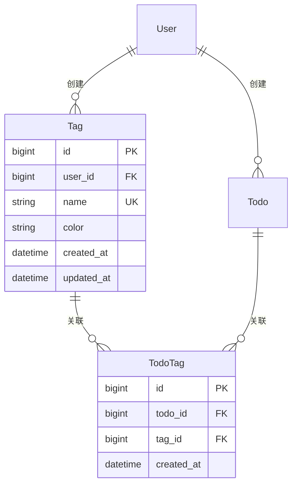

# 任务标签功能 - 开发文档

| 版本 | 1.0 |
|------|-----|
| 创建日期 | 2026-03-16 |
| 功能模块 | 任务标签 |

---

## 目录

1. [快速开始](#1-快速开始)
2. [技术架构](#2-技术架构)
3. [数据模型](#3-数据模型)
4. [API 接口](#4-api-接口)
5. [核心逻辑](#5-核心逻辑)
6. [扩展指南](#6-扩展指南)
7. [故障排查](#7-故障排查)

---

## 1. 快速开始

### 1.1 环境要求

| 软件 | 版本要求 |
|------|----------|
| JDK | 17+ |
| Maven | 3.6+ |
| IDE | IntelliJ IDEA / Eclipse / VS Code |

### 1.2 启动应用（使用 H2 数据库）

项目默认配置使用 H2 内存数据库，无需额外安装数据库即可启动。

#### 启动命令

```bash
# 进入项目目录
cd backend

# 方式一：使用 Maven 启动（推荐）
mvn spring-boot:run

# 方式二：使用 Maven 打包后启动
mvn clean package
java -jar target/todolist-sdlc-1.0.0.jar

# 方式三：IDE 中直接运行
# 运行 com.todolist.TodoListApplication 主类
```

#### 访问应用

启动成功后，访问以下地址：

| 功能 | 地址 |
|------|------|
| 应用首页 | http://localhost:8080 |
| API 文档 (Knife4j) | http://localhost:8080/doc.html |
| H2 控制台 | http://localhost:8080/h2-console |

#### H2 数据库控制台

**连接信息**：
- JDBC URL: `jdbc:h2:mem:todolist`
- 用户名: `sa`
- 密码: (留空)

**查看表结构**：
```sql
-- 查看标签表
SELECT * FROM t_tag;

-- 查看关联表
SELECT * FROM t_todo_tag;

-- 查看表结构
SHOW TABLES;
DESCRIBE t_tag;
```

### 1.3 使用 MySQL 数据库

如需使用 MySQL 代替 H2，修改 `application.yml` 配置：

```yaml
spring:
  datasource:
    url: jdbc:mysql://localhost:3306/todolist?useUnicode=true&characterEncoding=utf8
    username: root
    password: your_password
    driver-class-name: com.mysql.cj.jdbc.Driver
  h2:
    enabled: false
```

启动前确保 MySQL 服务已运行且数据库已创建。

### 1.4 Maven 常用命令

```bash
# 清理编译
mvn clean

# 编译项目
mvn compile

# 运行测试
mvn test

# 打包（跳过测试）
mvn clean package -DskipTests

# 查看依赖树
mvn dependency:tree
```

---

## 2. 技术架构

### 1.1 技术栈

| 层级 | 技术 | 版本 |
|------|------|------|
| 后端框架 | Spring Boot | 3.2.3 |
| ORM 框架 | MyBatis-Plus | 3.5.5 |
| 数据库 | MySQL | 8.0 |
| 数据库迁移 | Flyway | - |
| API 文档 | Knife4j | 4.4.0 |
| 测试框架 | JUnit 5 | - |

### 1.2 模块结构

```
com.todolist
├── controller/          # 控制器层
│   ├── TagController.java
│   └── TodoTagController.java
├── service/             # 服务层
│   ├── TagService.java
│   ├── TodoTagService.java
│   └── impl/
│       ├── TagServiceImpl.java
│       └── TodoTagServiceImpl.java
├── mapper/              # 数据访问层
│   ├── TagMapper.java
│   └── TodoTagMapper.java
├── entity/              # 实体层
│   ├── Tag.java
│   └── TodoTag.java
├── dto/                 # 数据传输对象
│   ├── TagDTO.java
│   ├── TagQueryDTO.java
│   └── TodoTagsDTO.java
└── vo/                  # 视图对象
    └── TagVO.java
```

---

## 2. 数据模型

### 2.1 ER 图



### 2.2 表结构

#### t_tag（标签表）

| 字段 | 类型 | 约束 | 说明 |
|------|------|------|------|
| id | BIGINT | PK, AUTO | 主键 |
| user_id | BIGINT | NOT NULL, FK | 用户ID |
| name | VARCHAR(20) | NOT NULL | 标签名称 |
| color | VARCHAR(7) | DEFAULT '#999999' | 颜色(HEX) |
| created_at | DATETIME | DEFAULT NOW | 创建时间 |
| updated_at | DATETIME | ON UPDATE NOW | 更新时间 |

**索引**：
- PRIMARY KEY (id)
- UNIQUE KEY uk_user_name (user_id, name)
- KEY idx_user_id (user_id)

#### t_todo_tag（关联表）

| 字段 | 类型 | 约束 | 说明 |
|------|------|------|------|
| id | BIGINT | PK, AUTO | 主键 |
| todo_id | BIGINT | NOT NULL, FK | 任务ID |
| tag_id | BIGINT | NOT NULL, FK | 标签ID |
| created_at | DATETIME | DEFAULT NOW | 创建时间 |

**索引**：
- PRIMARY KEY (id)
- UNIQUE KEY uk_todo_tag (todo_id, tag_id)
- KEY idx_tag_id (tag_id)
- KEY idx_todo_id (todo_id)

---

## 3. API 接口

### 3.1 标签管理 API

#### 创建标签

```http
POST /api/tags
Authorization: Bearer {token}
Content-Type: application/json

{
  "name": "工作",
  "color": "#FF6B6B"
}
```

**响应**：
```json
{
  "code": 200,
  "message": "创建成功",
  "data": {
    "id": 1,
    "name": "工作",
    "color": "#FF6B6B",
    "taskCount": 0,
    "createdAt": "2026-03-16T10:00:00"
  }
}
```

#### 更新标签

```http
PUT /api/tags/{id}
Authorization: Bearer {token}
Content-Type: application/json

{
  "name": "工作事务",
  "color": "#FF5555"
}
```

#### 删除标签

```http
DELETE /api/tags/{id}
Authorization: Bearer {token}
```

#### 查询标签列表

```http
GET /api/tags?page=1&size=10&name=工作
Authorization: Bearer {token}
```

### 3.2 任务标签 API

#### 为任务添加标签

```http
POST /api/todos/{todoId}/tags
Authorization: Bearer {token}
Content-Type: application/json

{
  "tagIds": [1, 3, 5]
}
```

#### 移除任务标签

```http
DELETE /api/todos/{todoId}/tags/{tagId}
Authorization: Bearer {token}
```

#### 查询任务标签

```http
GET /api/todos/{todoId}/tags
Authorization: Bearer {token}
```

#### 批量更新任务标签

```http
PUT /api/todos/{todoId}/tags
Authorization: Bearer {token}
Content-Type: application/json

{
  "tagIds": [1, 3, 5]
}
```

---

## 4. 核心逻辑

### 4.1 标签筛选逻辑（AND）

**业务规则**：多标签筛选时，任务必须**同时包含所有选中标签**。

**SQL 实现**：
```sql
SELECT t.* FROM t_todo t
WHERE t.user_id = #{userId}
  AND EXISTS (
    SELECT 1 FROM t_todo_tag tt
    WHERE tt.todo_id = t.id
      AND tt.tag_id IN (1, 2, 3)
    HAVING COUNT(*) = 3
  )
```

**Java 实现**：
```java
wrapper.and(w -> {
    for (Long tagId : tagIds) {
        w.exists("SELECT 1 FROM t_todo_tag tt WHERE tt.todo_id = t.id AND tt.tag_id = {0}", tagId);
    }
});
```

### 4.2 标签名称唯一性

**规则**：同一用户下标签名称不能重复。

```java
public boolean isNameUnique(Long userId, String name, Long excludeId) {
    LambdaQueryWrapper<Tag> wrapper = new LambdaQueryWrapper<>();
    wrapper.eq(Tag::getUserId, userId)
           .eq(Tag::getName, name);
    if (excludeId != null) {
        wrapper.ne(Tag::getId, excludeId);
    }
    return this.count(wrapper) == 0;
}
```

### 4.3 级联删除策略

**数据库级联**：
- 删除用户 → 删除用户的所有标签
- 删除任务 → 删除任务的标签关联
- 删除标签 → 删除标签的关联关系

```sql
FOREIGN KEY (user_id) REFERENCES user(id) ON DELETE CASCADE
FOREIGN KEY (todo_id) REFERENCES todo(id) ON DELETE CASCADE
FOREIGN KEY (tag_id) REFERENCES t_tag(id) ON DELETE CASCADE
```

---

## 5. 扩展指南

### 5.1 添加标签颜色预设

在 `TagConstants.java` 中添加：

```java
public enum TagColor {
    RED("#FF6B6B"),
    ORANGE("#FFA07A"),
    // 添加新颜色
    CUSTOM("#XXXXXX");

    private final String hex;
}
```

### 5.2 扩展标签属性

1. 更新数据库迁移脚本：
```sql
ALTER TABLE t_tag ADD COLUMN icon VARCHAR(50);
```

2. 更新实体类：
```java
private String icon;
```

3. 更新 DTO 和 VO

### 5.3 实现标签分组

1. 创建新表 `t_tag_group`
2. 添加 `group_id` 外键到 `t_tag`
3. 更新 API 支持分组查询

### 5.4 添加标签统计

```java
public TagStatisticsVO getStatistics(Long userId) {
    // 统计标签使用频率
    // 统计标签组合情况
    // 统计标签趋势
}
```

---

## 6. 故障排查

### 6.1 常见问题

#### 问题：标签筛选结果不正确

**排查步骤**：
1. 检查 SQL 查询是否正确
2. 验证 AND 逻辑实现
3. 确认索引是否生效

```sql
-- 查看执行计划
EXPLAIN SELECT * FROM t_todo ...
```

#### 问题：标签名称重复

**排查步骤**：
1. 检查唯一约束是否生效
2. 验证业务逻辑中的唯一性检查
3. 确认数据库事务隔离级别

#### 问题：性能问题

**排查步骤**：
1. 检查索引使用情况
2. 分析慢查询日志
3. 考虑添加缓存

```sql
-- 查看慢查询
SHOW VARIABLES LIKE 'slow_query%';

-- 分析查询
EXPLAIN SELECT ...
```

### 6.2 调试 SQL

```java
// 开启 MyBatis SQL 日志
logging:
  level:
    com.todolist.mapper: DEBUG
```

### 6.3 性能优化建议

| 场景 | 优化方案 |
|------|----------|
| 大量标签查询 | 添加 Redis 缓存 |
| 标签筛选慢 | 优化 EXISTS 子查询 |
| 统计查询慢 | 使用物化视图 |

---

## 7. 相关文档

- [需求规格说明书](../requirements/requirements-spec-tags.md)
- [API 详细设计](../detailed-design/tag-api-specs.md)
- [数据模型设计](../detailed-design/data-models.md)
- [测试总结](../testing/test-summary.md)
- [用户指南](../user-guide/tag-feature-guide.md)

---

## 8. 变更记录

| 版本 | 日期 | 变更内容 | 作者 |
|------|------|----------|------|
| 1.0 | 2026-03-16 | 初始版本 | Claude Code |
| 1.1 | 2026-03-16 | 添加 H2 数据库启动说明 | Claude Code |
