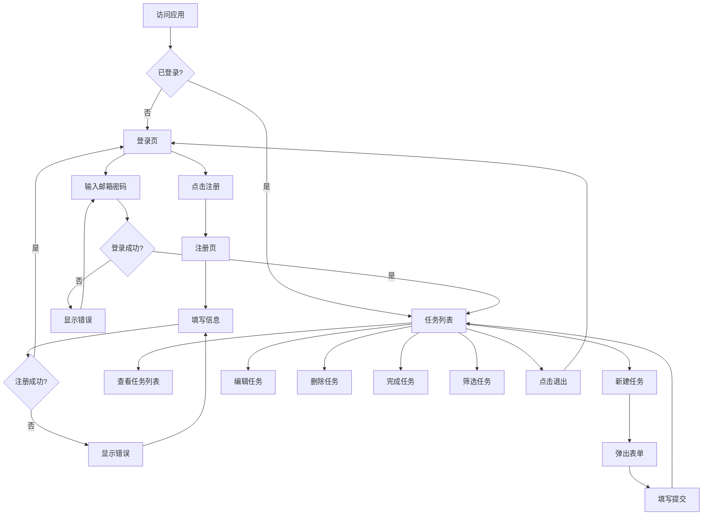

# 产品设计文档: TodoList 待办事项管理

> **文档信息**
> - 版本: 1.0
> - 创建日期: 2026-03-16
> - 作者: Claude Code (Frontend Developer Role)
> - 状态: 已完成

---

## 1. 设计概览

### 1.1 设计原则
- **简洁**: 界面清爽，减少视觉干扰
- **高效**: 常用操作一键完成
- **一致**: 遵循 Element Plus 设计规范

### 1.2 设计风格
- 主色调: Element Plus 默认蓝色 (#409EFF)
- 布局: 左侧导航 + 右侧内容
- 字体: 系统默认字体

---

## 2. 页面结构

### 2.1 页面清单

| 页面 | 路由 | 说明 |
|------|------|------|
| 登录页 | /login | 用户登录 |
| 注册页 | /register | 用户注册 |
| 任务列表 | /todos | 主页面，显示任务列表 |
| 任务详情 | /todos/:id | 查看任务详情（可选） |

---

## 3. 页面线框图

### 3.1 登录页

```
┌─────────────────────────────────────────────────────────┐
│                                                         │
│                    📋 TodoList                          │
│                                                         │
│              ┌─────────────────────┐                    │
│              │  📧 邮箱            │                    │
│              └─────────────────────┘                    │
│              ┌─────────────────────┐                    │
│              │  🔒 密码            │                    │
│              └─────────────────────┘                    │
│                                                         │
│              [    登  录    ]                           │
│                                                         │
│              没有账号？立即注册                          │
│                                                         │
└─────────────────────────────────────────────────────────┘
```

### 3.2 任务列表页

```
┌─────────────────────────────────────────────────────────────────────┐
│  📋 TodoList                              [用户名] [退出]            │
├─────────────────────────────────────────────────────────────────────┤
│                                                                     │
│  ┌──────────┐ ┌──────────┐ ┌──────────┐ ┌──────────┐               │
│  │ 全部(10) │ │ 待办(5)  │ │ 进行中(3)│ │ 已完成(2)│               │
│  └──────────┘ └──────────┘ └──────────┘ └──────────┘               │
│                                                                     │
│  ┌─────────────────────────────────────────────────────────────┐   │
│  │  🔍 搜索任务...                    [+ 新建任务]              │   │
│  └─────────────────────────────────────────────────────────────┘   │
│                                                                     │
│  ┌─────────────────────────────────────────────────────────────┐   │
│  │ ⬜ [高] 完成项目报告                    工作    2026-03-20   │   │
│  ├─────────────────────────────────────────────────────────────┤   │
│  │ ⬜ [中] 购买办公用品                    生活    2026-03-18   │   │
│  ├─────────────────────────────────────────────────────────────┤   │
│  │ ✅ [低] 整理桌面                        生活    已完成       │   │
│  └─────────────────────────────────────────────────────────────┘   │
│                                                                     │
│  ◀ 1 2 3 ... 10 ▶                                                  │
│                                                                     │
└─────────────────────────────────────────────────────────────────────┘
```

### 3.3 新建/编辑任务弹窗

```
┌─────────────────────────────────────────────┐
│  新建任务                              [×]  │
├─────────────────────────────────────────────┤
│                                             │
│  任务标题 *                                 │
│  ┌─────────────────────────────────────┐   │
│  │                                     │   │
│  └─────────────────────────────────────┘   │
│                                             │
│  任务描述                                   │
│  ┌─────────────────────────────────────┐   │
│  │                                     │   │
│  │                                     │   │
│  │                                     │   │
│  └─────────────────────────────────────┘   │
│                                             │
│  优先级          分类            截止日期   │
│  [ 中 ▼ ]       [ 工作 ▼ ]     [ 📅 选择 ] │
│                                             │
│              [取消]        [确定]          │
│                                             │
└─────────────────────────────────────────────┘
```

---

## 4. UI 流程图



---

## 5. 组件设计

### 5.1 组件清单

| 组件名 | 路径 | 说明 |
|--------|------|------|
| LoginForm | views/Login.vue | 登录表单 |
| RegisterForm | views/Register.vue | 注册表单 |
| Layout | components/Layout.vue | 页面布局 |
| TodoList | views/TodoList.vue | 任务列表 |
| TodoItem | components/TodoItem.vue | 任务项 |
| TodoForm | components/TodoForm.vue | 任务表单 |
| StatusTabs | components/StatusTabs.vue | 状态标签页 |

### 5.2 状态管理 (Pinia Stores)

| Store | 文件 | 说明 |
|-------|------|------|
| userStore | stores/user.js | 用户状态 |
| todoStore | stores/todo.js | 任务状态 |

---

## 6. 质量门禁检查

### 阶段 2 质量门禁
- [x] 页面清单已定义
- [x] 线框图已绘制
- [x] UI 流程图已绘制
- [x] 组件结构已设计
- [x] 状态管理已规划

---

## 下一步

产品设计完成后，执行：
```
/architecture-design
```
