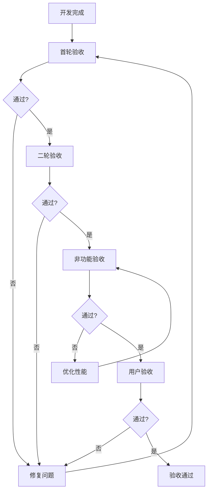

# 任务标签功能 - 验收标准

| 文档版本 | 1.0 |
|----------|-----|
| 创建日期 | 2026-03-16 |
| 功能模块 | 任务标签 |

---

## 1. 验收标准概述

本文档定义任务标签功能的验收标准，用于功能测试和用户验收。

---

## 2. 功能验收标准

### 2.1 标签管理 (TAG-001)

#### AC-TAG-001-01: 创建标签

| 验收项 | 验收标准 | 测试方法 |
|--------|----------|----------|
| TC-001 | 输入有效标签名称和颜色，创建成功 | 输入标签名"工作"，颜色"#FF0000"，提交后验证标签存在 |
| TC-002 | 标签名称为空时显示错误 | 不输入名称直接提交，验证错误提示 |
| TC-003 | 标签名称超过20字符时显示错误 | 输入21字符名称，验证错误提示 |
| TC-004 | 标签名称重复时显示错误 | 创建同名标签，验证错误提示 |
| TC-005 | 不选择颜色时使用默认颜色 | 不选择颜色提交，验证默认颜色为#999999 |
| TC-006 | 只能看到自己创建的标签 | 创建标签后，用其他账号登录验证不可见 |

#### AC-TAG-001-02: 编辑标签

| 验收项 | 验收标准 | 测试方法 |
|--------|----------|----------|
| TC-007 | 修改标签名称成功 | 编辑标签名为"工作2"，验证更新成功 |
| TC-008 | 修改标签颜色成功 | 修改标签颜色为"#00FF00"，验证更新成功 |
| TC-009 | 不能编辑其他用户的标签 | 尝试编辑他人标签，验证权限错误 |
| TC-010 | 编辑后任务上的标签同步更新 | 修改标签后，查看任务验证标签显示更新 |

#### AC-TAG-001-03: 删除标签

| 验收项 | 验收标准 | 测试方法 |
|--------|----------|----------|
| TC-011 | 删除标签成功 | 删除标签后，验证标签不存在 |
| TC-012 | 删除后任务标签关联自动清除 | 删除标签后，验证任务上该标签被移除 |
| TC-013 | 不能删除其他用户的标签 | 尝试删除他人标签，验证权限错误 |
| TC-014 | 删除需要确认 | 点击删除后验证确认提示 |

#### AC-TAG-001-04: 查看标签列表

| 验收项 | 验收标准 | 测试方法 |
|--------|----------|----------|
| TC-015 | 显示所有标签 | 查看标签列表，验证所有标签都显示 |
| TC-016 | 按创建时间倒序排列 | 验证标签列表排序规则 |
| TC-017 | 显示标签关联任务数 | 验证每个标签显示任务数量 |

### 2.2 任务标签关联 (TAG-002)

#### AC-TAG-002-01: 为任务添加标签

| 验收项 | 验收标准 | 测试方法 |
|--------|----------|----------|
| TC-018 | 为任务添加单个标签成功 | 为任务添加标签"工作"，验证添加成功 |
| TC-019 | 为任务添加多个标签成功 | 为任务添加3个标签，验证全部添加成功 |
| TC-020 | 不能重复添加同一标签 | 尝试重复添加，验证错误提示 |
| TC-021 | 只能为自己的任务添加标签 | 尝试为他人任务添加标签，验证权限错误 |
| TC-022 | 添加后任务卡片显示标签 | 添加标签后刷新页面，验证标签显示 |

#### AC-TAG-002-02: 移除任务标签

| 验收项 | 验收标准 | 测试方法 |
|--------|----------|----------|
| TC-023 | 从任务移除标签成功 | 点击标签删除按钮，验证标签被移除 |
| TC-024 | 移除不影响标签本身 | 移除任务标签后，验证标签仍存在 |
| TC-025 | 只能移除自己任务的标签 | 尝试移除他人任务的标签，验证权限错误 |

### 2.3 标签筛选 (TAG-003)

#### AC-TAG-003-01: 按标签筛选任务

| 验收项 | 验收标准 | 测试方法 |
|--------|----------|----------|
| TC-026 | 单标签筛选正确 | 选择标签"工作"，验证只显示有该标签的任务 |
| TC-027 | 多标签筛选使用AND逻辑 | 选择两个标签，验证只显示同时有这两个标签的任务 |
| TC-028 | 筛选无结果时显示提示 | 选择不存在的标签组合，验证空状态提示 |
| TC-029 | 可以清除筛选条件 | 点击清除按钮，验证显示所有任务 |
| TC-030 | 筛选状态在URL保持 | 刷新页面，验证筛选状态保持 |

---

## 3. 非功能验收标准

### 3.1 性能标准

| 指标 | 验收标准 | 测试方法 |
|------|----------|----------|
| NF-001 | 标签列表加载 < 100ms | 计时测量 |
| NF-002 | 任务标签查询 < 200ms | 计时测量 |
| NF-003 | 标签筛选响应 < 300ms | 计时测量 |

### 3.2 安全标准

| 指标 | 验收标准 | 测试方法 |
|------|----------|----------|
| NF-004 | 用户只能访问自己的标签 | 用其他账号尝试访问 |
| NF-005 | 标签名称防XSS | 输入脚本标签，验证被转义 |
| NF-006 | API需要认证 | 未登录访问API，验证401错误 |

### 3.3 可用性标准

| 指标 | 验收标准 | 测试方法 |
|------|----------|----------|
| NF-007 | 标签颜色选择器可用 | 验证预设颜色可点击选择 |
| NF-008 | 标签操作有明确反馈 | 添加/删除标签后有提示 |
| NF-009 | 标签筛选操作直观 | 用户测试满意度 > 80% |

---

## 4. 验收测试清单

### 4.1 第一轮验收 (核心功能)

- [ ] TC-001: 创建标签成功
- [ ] TC-002: 标签名称为空时显示错误
- [ ] TC-003: 标签名称过长时显示错误
- [ ] TC-004: 标签名称重复时显示错误
- [ ] TC-011: 删除标签成功
- [ ] TC-012: 删除后任务标签关联自动清除
- [ ] TC-018: 为任务添加单个标签成功
- [ ] TC-019: 为任务添加多个标签成功
- [ ] TC-020: 不能重复添加同一标签
- [ ] TC-023: 从任务移除标签成功
- [ ] TC-026: 单标签筛选正确

### 4.2 第二轮验收 (完整功能)

- [ ] TC-005: 不选择颜色时使用默认颜色
- [ ] TC-006: 只能看到自己创建的标签
- [ ] TC-007: 修改标签名称成功
- [ ] TC-008: 修改标签颜色成功
- [ ] TC-009: 不能编辑其他用户的标签
- [ ] TC-010: 编辑后任务上的标签同步更新
- [ ] TC-013: 不能删除其他用户的标签
- [ ] TC-014: 删除需要确认
- [ ] TC-015: 显示所有标签
- [ ] TC-016: 按创建时间倒序排列
- [ ] TC-017: 显示标签关联任务数
- [ ] TC-021: 只能为自己的任务添加标签
- [ ] TC-022: 添加后任务卡片显示标签
- [ ] TC-024: 移除不影响标签本身
- [ ] TC-025: 只能移除自己任务的标签
- [ ] TC-027: 多标签筛选使用AND逻辑
- [ ] TC-028: 筛选无结果时显示提示
- [ ] TC-029: 可以清除筛选条件
- [ ] TC-030: 筛选状态在URL保持

### 4.3 第三轮验收 (非功能)

- [ ] NF-001: 标签列表加载 < 100ms
- [ ] NF-002: 任务标签查询 < 200ms
- [ ] NF-003: 标签筛选响应 < 300ms
- [ ] NF-004: 用户只能访问自己的标签
- [ ] NF-005: 标签名称防XSS
- [ ] NF-006: API需要认证

---

## 5. 验收流程

---

## 6. 验收签字

| 角色 | 姓名 | 签字 | 日期 |
|------|------|------|------|
| 产品负责人 | | | |
| 开发负责人 | | | |
| 测试负责人 | | | |
| 用户代表 | | | |

---

## 7. 变更记录

| 版本 | 日期 | 变更内容 | 作者 |
|------|------|----------|------|
| 1.0 | 2026-03-16 | 初始版本 | Claude Code |
