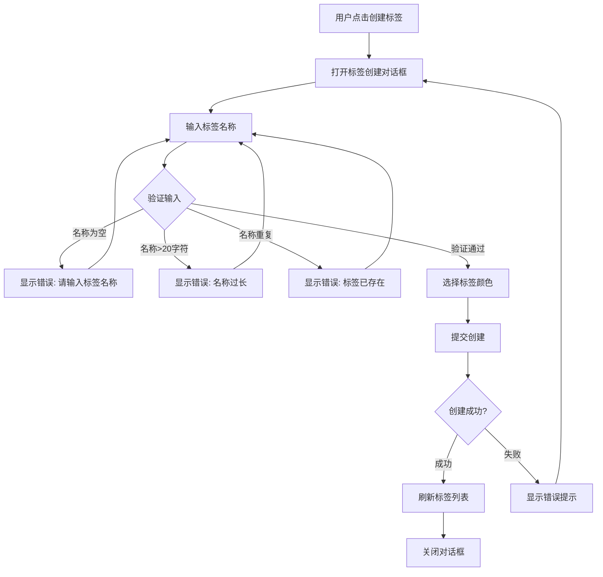
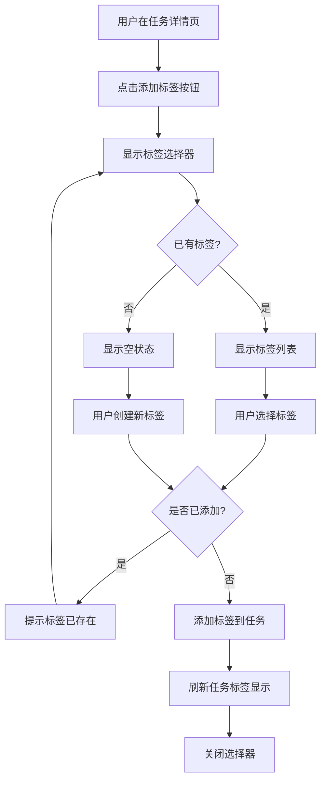
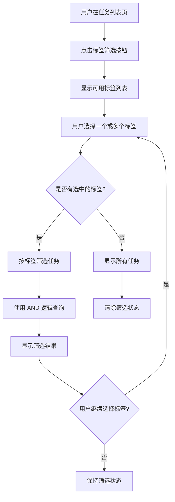
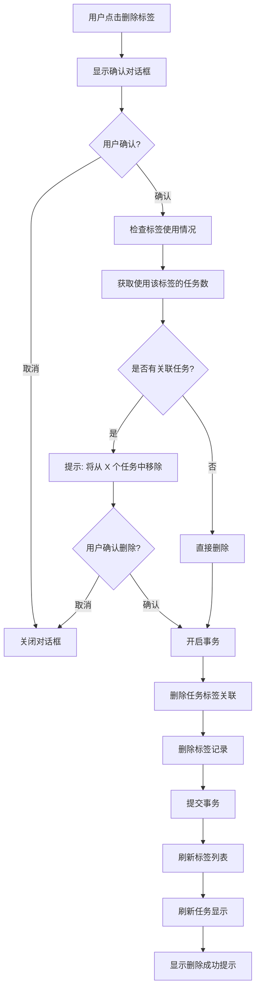
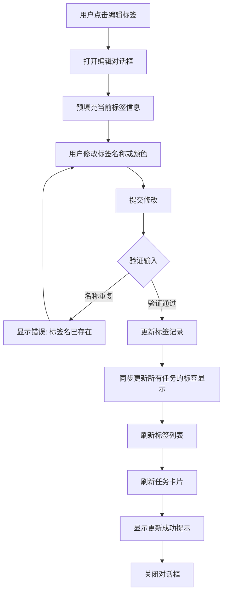
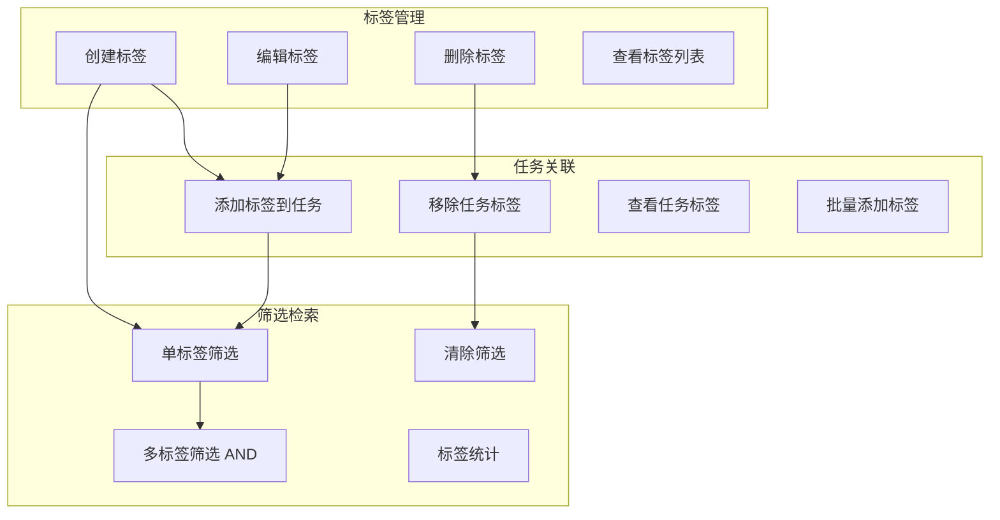

# 任务标签功能 - 业务流程图

## 标签创建流程

```mermaid
flowchart TD
    A[用户点击创建标签] --> B[打开标签创建对话框]
    B --> C[输入标签名称]
    C --> D{验证输入}
    D -->|名称为空| E[显示错误: 请输入标签名称]
    D -->|名称>20字符| F[显示错误: 名称过长]
    D -->|名称重复| G[显示错误: 标签已存在]
    D -->|验证通过| H[选择标签颜色]
    E --> C
    F --> C
    G --> C
    H --> I[提交创建]
    I --> J{创建成功?}
    J -->|成功| K[刷新标签列表]
    J -->|失败| L[显示错误提示]
    K --> M[关闭对话框]
    L --> B
```

## 任务标签添加流程

```mermaid
flowchart TD
    A[用户在任务详情页] --> B[点击添加标签按钮]
    B --> C[显示标签选择器]
    C --> D{已有标签?}
    D -->|是| E[显示标签列表]
    D -->|否| F[显示空状态]
    E --> G[用户选择标签]
    F --> H[用户创建新标签]
    G --> I{是否已添加?}
    I -->|是| J[提示标签已存在]
    I -->|否| K[添加标签到任务]
    H --> I
    K --> L[刷新任务标签显示]
    J --> C
    L --> M[关闭选择器]
```

## 标签筛选流程

```mermaid
flowchart TD
    A[用户在任务列表页] --> B[点击标签筛选按钮]
    B --> C[显示可用标签列表]
    C --> D[用户选择一个或多个标签]
    D --> E{是否有选中的标签?}
    E -->|否| F[显示所有任务]
    E -->|是| G[按标签筛选任务]
    G --> H[使用 AND 逻辑查询]
    H --> I[显示筛选结果]
    I --> J{用户继续选择标签?}
    J -->|是| D
    J -->|否| K[保持筛选状态]
    F --> L[清除筛选状态]
```

## 标签删除流程

```mermaid
flowchart TD
    A[用户点击删除标签] --> B[显示确认对话框]
    B --> C{用户确认?}
    C -->|取消| D[关闭对话框]
    C -->|确认| E[检查标签使用情况]
    E --> F[获取使用该标签的任务数]
    F --> G{是否有关联任务?}
    G -->|是| H[提示: 将从 X 个任务中移除]
    G -->|否| I[直接删除]
    H --> J{用户确认删除?}
    J -->|取消| D
    J -->|确认| K[开启事务]
    I --> K
    K --> L[删除任务标签关联]
    L --> M[删除标签记录]
    M --> N[提交事务]
    N --> O[刷新标签列表]
    O --> P[刷新任务显示]
    P --> Q[显示删除成功提示]
```

## 标签编辑流程

```mermaid
flowchart TD
    A[用户点击编辑标签] --> B[打开编辑对话框]
    B --> C[预填充当前标签信息]
    C --> D[用户修改标签名称或颜色]
    D --> E[提交修改]
    E --> F{验证输入}
    F -->|名称重复| G[显示错误: 标签名已存在]
    F -->|验证通过| H[更新标签记录]
    G --> D
    H --> I[同步更新所有任务的标签显示]
    I --> J[刷新标签列表]
    J --> K[刷新任务卡片]
    K --> L[显示更新成功提示]
    L --> M[关闭对话框]
```

## 完整标签功能流程

```mermaid
flowchart TD
    subgraph 标签管理
        A1[创建标签]
        A2[编辑标签]
        A3[删除标签]
        A4[查看标签列表]
    end

    subgraph 任务关联
        B1[添加标签到任务]
        B2[移除任务标签]
        B3[查看任务标签]
        B4[批量添加标签]
    end

    subgraph 筛选检索
        C1[单标签筛选]
        C2[多标签筛选 AND]
        C3[清除筛选]
        C4[标签统计]
    end

    A1 --> B1
    A1 --> C1
    A2 --> B1
    A3 --> B2
    B1 --> C1
    B2 --> C3
    C1 --> C2
```
