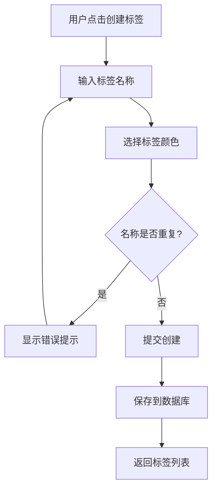
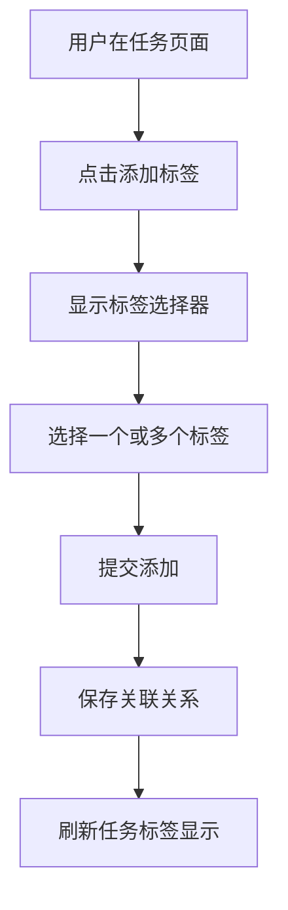
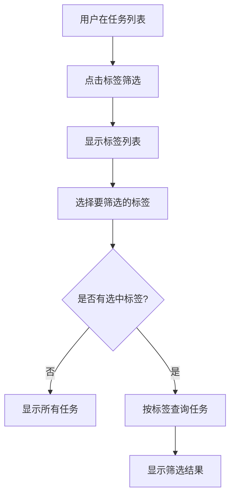

# 任务标签功能 - 需求规格说明书

| 文档版本 | 1.0 |
|----------|-----|
| 创建日期 | 2026-03-16 |
| 项目名称 | TodoList |
| 功能模块 | 任务标签 |

---

## 1. 文档概述

### 1.1 文档目的

本文档详细描述 TodoList 项目中任务标签功能的需求规格，为开发、测试和验收提供依据。

### 1.2 适用范围

本文档适用于 TodoList 项目的任务标签功能开发，包括后端 API、前端 UI 和数据库设计。

### 1.3 术语定义

| 术语 | 定义 |
|------|------|
| 标签 (Tag) | 用于分类和标记任务的元数据，包含名称和颜色 |
| 多对多关系 | 一个任务可以有多个标签，一个标签可以用于多个任务 |
| 标签筛选 | 根据选定标签过滤显示任务列表 |

---

## 2. 业务背景

### 2.1 背景

当前 TodoList 项目已支持任务分类功能，但分类是一对多关系（一个任务只能属于一个分类）。用户反馈希望有更灵活的任务组织方式，能够为一个任务添加多个标记。

### 2.2 业务目标

- 提升任务组织的灵活性
- 支持跨分类的任务标记
- 便于任务筛选和检索

### 2.3 目标用户

| 用户角色 | 描述 |
|----------|------|
| 普通用户 | 创建和管理个人任务的用户 |
| 管理员 | 系统管理和维护 |

---

## 3. 功能需求

### 3.1 功能概述

任务标签功能允许用户为任务添加多个标签，通过标签对任务进行灵活分类和筛选。

### 3.2 功能列表

#### 3.2.1 标签管理 (TAG-001)

| 功能编号 | 功能名称 | 优先级 |
|----------|----------|--------|
| TAG-001-01 | 创建标签 | Must |
| TAG-001-02 | 编辑标签 | Must |
| TAG-001-03 | 删除标签 | Must |
| TAG-001-04 | 查看标签列表 | Must |
| TAG-001-05 | 标签颜色选择 | Should |

#### 3.2.2 任务标签关联 (TAG-002)

| 功能编号 | 功能名称 | 优先级 |
|----------|----------|--------|
| TAG-002-01 | 为任务添加标签 | Must |
| TAG-002-02 | 移除任务标签 | Must |
| TAG-002-03 | 查看任务的所有标签 | Must |
| TAG-002-04 | 批量添加标签 | Should |

#### 3.2.3 标签筛选 (TAG-003)

| 功能编号 | 功能名称 | 优先级 |
|----------|----------|--------|
| TAG-003-01 | 按标签筛选任务 | Must |
| TAG-003-02 | 多标签筛选（AND/OR） | Should |
| TAG-003-03 | 标签统计 | Could |

### 3.3 功能详情

#### 3.3.1 创建标签 (TAG-001-01)

**功能描述**：用户可以创建新标签，指定标签名称和颜色。

**输入**：
- 标签名称（1-20字符）
- 标签颜色（HEX 颜色值）

**处理规则**：
- 标签名称在同一用户下唯一
- 标签名称不能为空
- 颜色默认为 #999999

**输出**：创建成功的标签信息

#### 3.3.2 编辑标签 (TAG-001-02)

**功能描述**：用户可以修改标签的名称和颜色。

**输入**：
- 标签ID
- 新标签名称（可选）
- 新标签颜色（可选）

**处理规则**：
- 只能编辑自己创建的标签
- 标签名称不能与其他标签重复

**输出**：更新后的标签信息

#### 3.3.3 删除标签 (TAG-001-03)

**功能描述**：用户可以删除标签，删除后所有任务上的该标签关联自动解除。

**输入**：标签ID

**处理规则**：
- 只能删除自己创建的标签
- 删除标签时同步删除任务标签关联
- 删除操作不可恢复

**输出**：删除确认

#### 3.3.4 为任务添加标签 (TAG-002-01)

**功能描述**：用户可以为任务添加一个或多个标签。

**输入**：
- 任务ID
- 标签ID列表

**处理规则**：
- 不能重复添加同一标签
- 只能为自己的任务添加标签

**输出**：添加成功后的任务标签列表

#### 3.3.5 按标签筛选任务 (TAG-003-01)

**功能描述**：用户可以选择一个或多个标签来筛选显示任务。

**输入**：标签ID列表

**处理规则**：
- 支持单标签筛选
- 支持多标签组合筛选（AND 逻辑：同时拥有所有标签）

**输出**：符合条件的任务列表

---

## 4. 数据需求

### 4.1 数据实体

#### 4.1.1 标签表 (t_tag)

| 字段名 | 类型 | 说明 | 约束 |
|--------|------|------|------|
| id | BIGINT | 主键 | PK, AUTO |
| user_id | BIGINT | 用户ID | NOT NULL, FK |
| name | VARCHAR(20) | 标签名称 | NOT NULL |
| color | VARCHAR(7) | 标签颜色 | DEFAULT '#999999' |
| created_at | DATETIME | 创建时间 | AUTO |
| updated_at | DATETIME | 更新时间 | AUTO |

**索引**：
- UNIQUE KEY `uk_user_name` (user_id, name)

#### 4.1.2 任务标签关联表 (t_todo_tag)

| 字段名 | 类型 | 说明 | 约束 |
|--------|------|------|------|
| id | BIGINT | 主键 | PK, AUTO |
| todo_id | BIGINT | 任务ID | NOT NULL, FK |
| tag_id | BIGINT | 标签ID | NOT NULL, FK |
| created_at | DATETIME | 创建时间 | AUTO |

**索引**：
- UNIQUE KEY `uk_todo_tag` (todo_id, tag_id)
- INDEX `idx_tag_id` (tag_id)

---

## 5. 非功能需求

### 5.1 性能需求

| 指标 | 要求 |
|------|------|
| 标签列表响应时间 | < 100ms |
| 任务标签查询响应时间 | < 200ms |
| 标签筛选响应时间 | < 300ms |

### 5.2 安全需求

- 用户只能访问自己的标签
- 用户只能为自己的任务添加标签
- 标签名称防止 XSS 攻击

### 5.3 可用性需求

- 标签颜色支持预设颜色选择器
- 支持标签快速添加和删除
- 标签筛选操作直观易懂

---

## 6. 业务流程

### 6.1 标签创建流程

### 6.2 任务标签添加流程

### 6.3 标签筛选流程

---

## 7. 状态定义

### 7.1 标签生命周期

标签没有复杂的状态管理，创建后即处于活跃状态，删除后即从系统中移除。

---

## 8. 界面原型

原型页面位于：`docs/requirements/prototypes/`

- `tag-management.html` - 标签管理页面
- `tag-filter.html` - 标签筛选演示
- `task-with-tags.html` - 任务标签展示

---

## 9. 验收标准

详见：`docs/requirements/acceptance-criteria-tags.md`

---

## 10. 变更记录

| 版本 | 日期 | 变更内容 | 作者 |
|------|------|----------|------|
| 1.0 | 2026-03-16 | 初始版本 | Claude Code |
