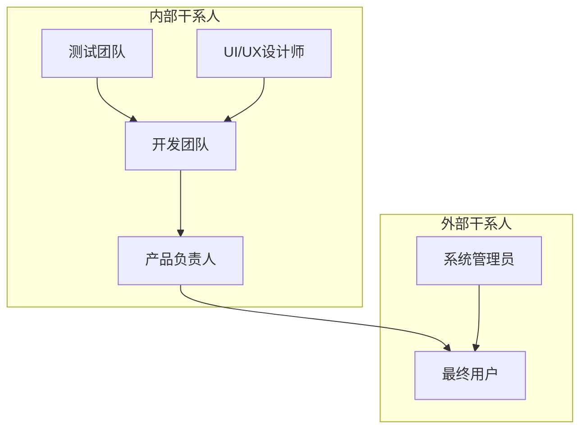
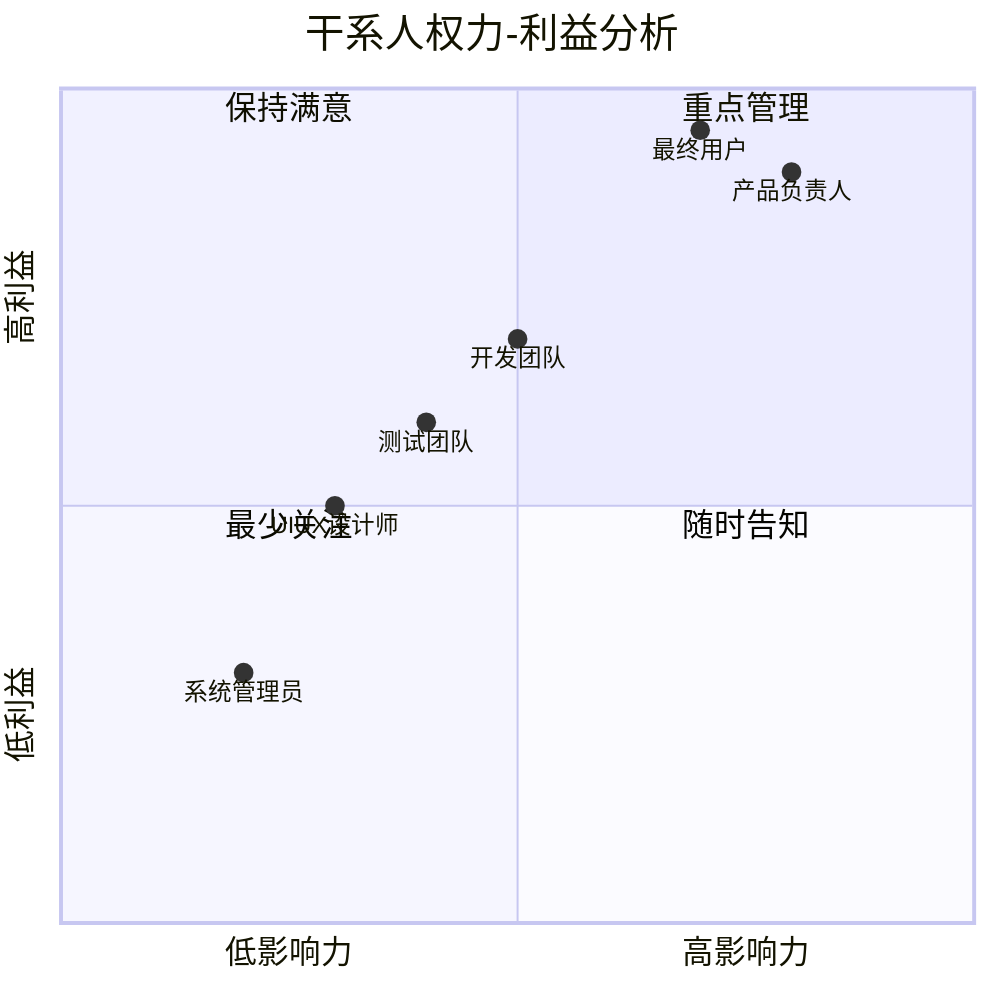

# 任务标签功能 - 干系人分析

| 文档版本 | 1.0 |
|----------|-----|
| 创建日期 | 2026-03-16 |
| 功能模块 | 任务标签 |

---

## 1. 干系人概述

### 1.1 干系人定义

干系人是指影响任务标签功能开发或受其影响的个人、团队或组织。

### 1.2 干系人地图

---

## 2. 干系人列表

### 2.1 产品负责人 (Product Owner)

| 属性 | 内容 |
|------|------|
| 姓名 | [待定] |
| 角色 | 产品负责人 |
| 职责 | 需求定义、优先级决策、验收 |
| 参与度 | 高 |
| 影响力 | 高 |

**期望**：
- 功能满足用户需求
- 按时交付
- 质量达标

**关注点**：
- 用户价值
- ROI (投入产出比)
- 市场竞争力

---

### 2.2 开发团队 (Development Team)

| 属性 | 内容 |
|------|------|
| 角色 | 后端开发、前端开发 |
| 职责 | 功能开发、代码实现、单元测试 |
| 参与度 | 高 |
| 影响力 | 中 |

**期望**：
- 需求明确清晰
- 设计文档完整
- 开发时间合理

**关注点**：
- 技术可行性
- 代码质量
- 开发效率

---

### 2.3 测试团队 (QA Team)

| 属性 | 内容 |
|------|------|
| 角色 | 测试工程师 |
| 职责 | 功能测试、集成测试、用户验收 |
| 参与度 | 中 |
| 影响力 | 中 |

**期望**：
- 验收标准明确
- 测试环境可用
- 缺陷及时修复

**关注点**：
- 功能完整性
- 用户体验
- 系统稳定性

---

### 2.4 UI/UX 设计师

| 属性 | 内容 |
|------|------|
| 角色 | 设计师 |
| 职责 | 界面设计、交互设计、原型设计 |
| 参与度 | 中 |
| 影响力 | 中 |

**期望**：
- 设计需求明确
- 有充足的设计时间
- 设计被正确实现

**关注点**：
- 用户体验
- 视觉一致性
- 交互流畅性

---

### 2.5 最终用户 (End Users)

| 属性 | 内容 |
|------|------|
| 角色 | TodoList 使用者 |
| 职责 | 使用功能、提供反馈 |
| 参与度 | 低 |
| 影响力 | 高 |

**期望**：
- 功能易用
- 性能良好
- 满足需求

**关注点**：
- 日常使用效率
- 数据安全
- 操作便捷

**用户画像**：

| 用户类型 | 特征 | 主要需求 |
|----------|------|----------|
| 个人用户 | 管理个人任务 | 简单易用、快速操作 |
| 团队用户 | 协作完成任务 | 多用户支持、权限控制 |
| 重度用户 | 大量任务管理 | 高效筛选、批量操作 |

---

### 2.6 系统管理员 (System Administrator)

| 属性 | 内容 |
|------|------|
| 角色 | 运维人员 |
| 职责 | 系统部署、监控、维护 |
| 参与度 | 低 |
| 影响力 | 低 |

**期望**：
- 部署简单
- 监控完善
- 问题易排查

**关注点**：
- 系统稳定性
- 性能指标
- 日志完整

---

## 3. 干系人沟通计划

| 干系人 | 沟通频率 | 沟通方式 | 沟通内容 |
|--------|----------|----------|----------|
| 产品负责人 | 每日 | 站会 | 进度、问题 |
| 开发团队 | 每日 | 站会 | 任务分配、技术讨论 |
| 测试团队 | 每周 | 会议 | 需求澄清、验收标准 |
| UI/UX设计师 | 按需 | 会议 | 设计评审 |
| 最终用户 | 迭代末 | 演示 | 功能演示、反馈收集 |
| 系统管理员 | 部署时 | 文档 | 部署说明、监控配置 |

---

## 4. 干系人影响分析

### 4.1 权力-利益矩阵

### 4.2 管理策略

| 干系人 | 策略 | 具体行动 |
|--------|------|----------|
| 产品负责人 | 重点管理 | 每日沟通、及时汇报、主动寻求决策 |
| 最终用户 | 重点管理 | 定期演示、收集反馈、快速响应 |
| 开发团队 | 随时告知 | 任务透明、技术分享、问题同步 |
| 测试团队 | 随时告知 | 提前介入、需求澄清、问题跟踪 |
| UI/UX设计师 | 保持满意 | 尊重设计、及时反馈、充分沟通 |
| 系统管理员 | 最少关注 | 提供文档、部署支持 |

---

## 5. 干系人风险评估

| 干系人 | 风险 | 影响 | 缓解措施 |
|--------|------|------|----------|
| 产品负责人 | 需求变更频繁 | 高 | 建立变更流程、明确优先级 |
| 最终用户 | 期望过高 | 中 | 提前沟通功能范围、管理预期 |
| 开发团队 | 技术难度低估 | 中 | 技术预研、预留缓冲时间 |
| 测试团队 | 测试时间不足 | 中 | 提前制定测试计划、自动化测试 |
| UI/UX设计师 | 设计与实现偏差 | 低 | 设计评审、开发跟进 |

---

## 6. 变更记录

| 版本 | 日期 | 变更内容 | 作者 |
|------|------|----------|------|
| 1.0 | 2026-03-16 | 初始版本 | Claude Code |
