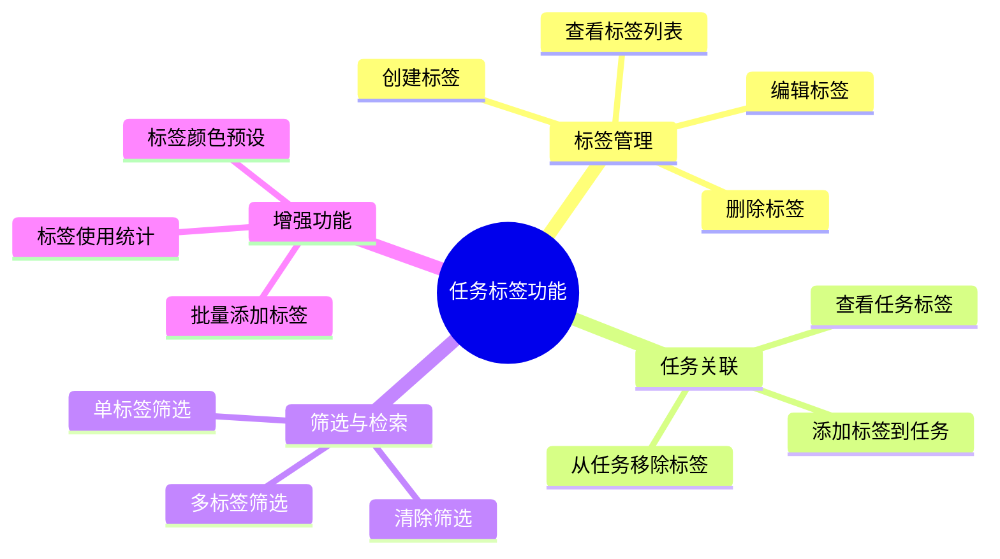

# 任务标签功能 - 用户故事

| 文档版本 | 1.0 |
|----------|-----|
| 创建日期 | 2026-03-16 |
| 功能模块 | 任务标签 |

---

## 1. 用户故事列表

### 故事 1: 创建标签

**编号**: US-TAG-001
**优先级**: High
**作为**: 普通用户
**我想要**: 创建自定义标签
**以便**: 为任务添加更灵活的分类方式

**验收标准**:
- [ ] 可以输入标签名称（1-20字符）
- [ ] 可以选择标签颜色
- [ ] 标签名称在我的账号下唯一
- [ ] 创建成功后标签出现在标签列表中
- [ ] 空标签名称显示错误提示

**故事点**: 3

---

### 故事 2: 编辑标签

**编号**: US-TAG-002
**优先级**: High
**作为**: 普通用户
**我想要**: 修改标签的名称和颜色
**以便**: 调整标签的组织方式

**验收标准**:
- [ ] 可以修改标签名称
- [ ] 可以修改标签颜色
- [ ] 只能编辑自己创建的标签
- [ ] 修改后所有使用该标签的任务同步更新
- [ ] 名称重复时显示错误提示

**故事点**: 2

---

### 故事 3: 删除标签

**编号**: US-TAG-003
**优先级**: High
**作为**: 普通用户
**我想要**: 删除不需要的标签
**以便**: 保持标签列表的整洁

**验收标准**:
- [ ] 只能删除自己创建的标签
- [ ] 删除前需要确认操作
- [ ] 删除后任务上的该标签自动移除
- [ ] 删除操作不可恢复

**故事点**: 2

---

### 故事 4: 为任务添加标签

**编号**: US-TAG-004
**优先级**: High
**作为**: 普通用户
**我想要**: 为任务添加多个标签
**以便**: 从多个维度组织和分类任务

**验收标准**:
- [ ] 可以为任务添加多个标签
- [ ] 可以从已有标签中选择
- [ ] 可以快速创建新标签并添加
- [ ] 不能重复添加同一标签
- [ ] 任务卡片上显示所有标签

**故事点**: 5

---

### 故事 5: 移除任务标签

**编号**: US-TAG-005
**优先级**: High
**作为**: 普通用户
**我想要**: 从任务上移除标签
**以便**: 调整任务的标签归属

**验收标准**:
- [ ] 可以点击标签上的删除按钮移除
- [ ] 移除后立即刷新显示
- [ ] 移除操作不需要确认

**故事点**: 1

---

### 故事 6: 按标签筛选任务

**编号**: US-TAG-006
**优先级**: High
**作为**: 普通用户
**我想要**: 根据标签筛选显示任务
**以便**: 快速找到特定类型的任务

**验收标准**:
- [ ] 点击标签可以筛选任务
- [ ] 可以选择多个标签进行筛选
- [ ] 筛选结果只显示包含所有选中标签的任务
- [ ] 可以清除筛选条件
- [ ] 筛选状态在 URL 中可保存

**故事点**: 5

---

### 故事 7: 查看所有标签

**编号**: US-TAG-007
**优先级**: Medium
**作为**: 普通用户
**我想要**: 查看我创建的所有标签
**以便**: 了解标签使用情况

**验收标准**:
- [ ] 显示所有标签列表
- [ ] 显示每个标签的颜色
- [ ] 显示每个标签关联的任务数量
- [ ] 可以按名称或颜色排序

**故事点**: 3

---

### 故事 8: 标签颜色预设

**编号**: US-TAG-008
**优先级**: Low
**作为**: 普通用户
**我想要**: 从预设颜色中选择标签颜色
**以便**: 保持标签颜色的协调美观

**验收标准**:
- [ ] 提供一组预设颜色
- [ ] 预设颜色涵盖常用颜色
- [ ] 仍支持自定义 HEX 颜色值

**故事点**: 2

---

## 2. 用户故事优先级

### Must Have (必须有)
- US-TAG-001: 创建标签
- US-TAG-002: 编辑标签
- US-TAG-003: 删除标签
- US-TAG-004: 为任务添加标签
- US-TAG-005: 移除任务标签
- US-TAG-006: 按标签筛选任务

### Should Have (应该有)
- US-TAG-007: 查看所有标签

### Could Have (可以有)
- US-TAG-008: 标签颜色预设

---

## 3. 用户故事地图

---

## 4. 总故事点

| 优先级 | 故事数量 | 总故事点 |
|--------|----------|----------|
| Must Have | 6 | 18 |
| Should Have | 1 | 3 |
| Could Have | 1 | 2 |
| **合计** | **8** | **23** |

---

## 5. 迭代计划

### Sprint 1 (核心功能)
- US-TAG-001: 创建标签 (3点)
- US-TAG-002: 编辑标签 (2点)
- US-TAG-003: 删除标签 (2点)
- **小计**: 7 点

### Sprint 2 (任务关联)
- US-TAG-004: 为任务添加标签 (5点)
- US-TAG-005: 移除任务标签 (1点)
- **小计**: 6 点

### Sprint 3 (筛选与增强)
- US-TAG-006: 按标签筛选任务 (5点)
- US-TAG-007: 查看所有标签 (3点)
- US-TAG-008: 标签颜色预设 (2点)
- **小计**: 10 点

---

## 6. 变更记录

| 版本 | 日期 | 变更内容 | 作者 |
|------|------|----------|------|
| 1.0 | 2026-03-16 | 初始版本 | Claude Code |
