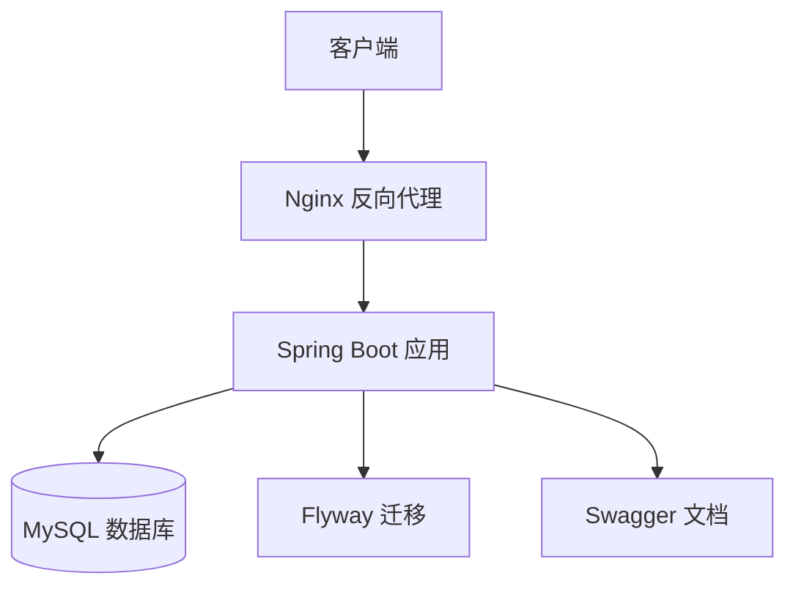

# TodoList 待办事项管理系统

<div align="center">


一个基于 Spring Boot 3.2.0 的轻量级待办事项管理系统，演示完整的 SDLC（软件开发生命周期）框架应用。

[功能特性](#功能特性) • [快速开始](#快速开始) • [API 文档](#api-文档) • [部署指南](#部署指南) • [贡献指南](#贡献指南)

</div>

---

## 目录

- [项目简介](#项目简介)
- [功能特性](#功能特性)
- [技术栈](#技术栈)
- [系统架构](#系统架构)
- [快速开始](#快速开始)
- [项目结构](#项目结构)
- [API 文档](#api-文档)
- [开发指南](#开发指南)
- [测试指南](#测试指南)
- [部署指南](#部署指南)
- [常见问题](#常见问题)
- [贡献指南](#贡献指南)
- [作者](#作者)
- [许可证](#许可证)

---

## 项目简介

TodoList 待办事项管理系统是一个用于演示 SDLC（软件开发生命周期）框架的示例应用程序。该系统展示了从需求分析、设计、开发、测试到部署的完整软件开发流程，为开发团队提供标准化的项目管理参考实例。

### 核心目标

- **教育目标**: 演示完整的 SDLC 流程和最佳实践
- **技术目标**: 构建基于 Spring Boot 的 RESTful API 应用
- **质量目标**: 代码符合规范，测试覆盖率 >= 80%
- **文档目标**: 完整的需求、设计、开发和部署文档

---

## 功能特性

### 用户管理
- ✅ 用户注册（用户名/密码认证）
- ✅ 用户登录（JWT Token 认证）
- ✅ 密码加密存储（BCrypt）
- ✅ 个人信息管理
- ✅ 密码修改

### 待办事项管理
- ✅ 创建待办事项
- ✅ 查询待办列表（支持分页、搜索、过滤）
- ✅ 更新待办事项
- ✅ 删除待办事项（软删除）
- ✅ 标记完成状态
- ✅ 优先级设置（高、中、低）
- ✅ 截止日期管理

### 分类管理
- ✅ 创建自定义分类
- ✅ 分类颜色标识
- ✅ 多分类关联
- ✅ 分类使用统计

### 安全特性
- ✅ JWT 无状态认证
- ✅ 用户数据隔离
- ✅ SQL 注入防护
- ✅ 参数验证
- ✅ 统一异常处理

---

## 技术栈

### 后端技术

| 技术 | 版本 | 说明 |
|------|------|------|
| **Java** | 17 | 编程语言（LTS 版本） |
| **Spring Boot** | 3.2.0 | 应用框架 |
| **Spring Security** | 6.x | 安全框架 |
| **MyBatis-Plus** | 3.5.5 | ORM 框架 |
| **JWT (JJWT)** | 0.12.3 | Token 认证 |
| **Knife4j** | 4.3.0 | API 文档（Swagger 增强版） |
| **Hutool** | 5.8.24 | Java 工具库 |

### 数据库

| 技术 | 版本 | 说明 |
|------|------|------|
| **MySQL** | 8.0+ | 生产数据库 |
| **H2** | 2.x | 开发/测试内存数据库 |
| **Flyway** | 9.x | 数据库版本迁移 |

### 开发工具

| 工具 | 版本 | 说明 |
|------|------|------|
| **Maven** | 3.9+ | 依赖管理和构建 |
| **Git** | 2.x | 版本控制 |
| **JUnit** | 5.x | 单元测试 |
| **Docker** | 20.x+ | 容器化部署（可选） |

---

## 系统架构

### 分层架构

```
┌─────────────────────────────────────┐
│     Controller Layer (表现层)        │  ← REST API Controllers
├─────────────────────────────────────┤
│      Service Layer (业务层)          │  ← 业务逻辑、事务管理
├─────────────────────────────────────┤
│      Mapper Layer (持久层)           │  ← MyBatis-Plus Mappers
├─────────────────────────────────────┤
│      Domain Layer (领域层)           │  ← Entities, DTOs, Enums
└─────────────────────────────────────┘
```

### 技术架构



---

## 快速开始

### 环境要求

- **JDK**: 17+
- **Maven**: 3.9+
- **MySQL**: 8.0+（生产环境）
- **内存**: 最低 4GB，推荐 8GB

### 本地运行

#### 1. 克隆代码

```bash
git clone https://github.com/your-org/todolist-project.git
cd todolist-project
```

#### 2. 创建数据库

```sql
CREATE DATABASE todolist CHARACTER SET utf8mb4 COLLATE utf8mb4_unicode_ci;

CREATE USER 'todolist'@'localhost' IDENTIFIED BY 'todolist123';
GRANT ALL PRIVILEGES ON todolist.* TO 'todolist'@'localhost';
FLUSH PRIVILEGES;
```

#### 3. 配置应用

编辑 `src/main/resources/application.yml`:

```yaml
spring:
  datasource:
    url: jdbc:mysql://localhost:3306/todolist?useUnicode=true&characterEncoding=utf8&serverTimezone=UTC
    username: todolist
    password: todolist123
```

#### 4. 构建项目

```bash
mvn clean install
```

#### 5. 运行应用

```bash
mvn spring-boot:run
```

或使用 JAR：

```bash
java -jar target/todolist-project-1.0.0.jar
```

#### 6. 访问应用

- **应用地址**: http://localhost:8080
- **API 文档**: http://localhost:8080/doc.html
- **健康检查**: http://localhost:8080/actuator/health

#### 7. 测试 API

```bash
# 用户注册
curl -X POST http://localhost:8080/api/v1/auth/register \
  -H "Content-Type: application/json" \
  -d '{
    "username": "testuser",
    "password": "Test1234",
    "confirmPassword": "Test1234"
  }'

# 用户登录
curl -X POST http://localhost:8080/api/v1/auth/login \
  -H "Content-Type: application/json" \
  -d '{
    "username": "testuser",
    "password": "Test1234"
  }'
```

### Docker 运行

#### 使用 Docker Compose

```bash
# 启动所有服务（MySQL + 应用）
docker-compose up -d

# 查看日志
docker-compose logs -f app

# 停止服务
docker-compose down
```

---

## 项目结构

```
todolist-project/
├── docs/                              # 项目文档
│   ├── requirements/                   # 需求文档
│   │   ├── requirements-spec.md        # 需求规格说明书
│   │   ├── user-stories.md             # 用户故事
│   │   └── acceptance-criteria.md      # 验收标准
│   ├── design/                         # 设计文档
│   │   ├── design-system.md            # 设计系统
│   │   └── user-flow.md                # 用户流程
│   ├── architecture/                   # 架构文档
│   │   ├── architecture.md             # 系统架构
│   │   ├── technology-stack.md         # 技术栈
│   │   └── deployment-architecture.md  # 部署架构
│   ├── detailed-design/                # 详细设计
│   │   ├── api-specs.md                # API 规范
│   │   ├── database-design.md          # 数据库设计
│   │   └── class-design.md             # 类设计
│   ├── development/                    # 开发文档
│   │   └── code-summary.md             # 代码总结
│   ├── testing/                        # 测试文档
│   │   └── test-summary.md             # 测试总结
│   ├── user/                           # 用户文档
│   │   └── user-manual.md              # 用户手册
│   └── deployment/                     # 部署文档
│       ├── deployment-guide.md         # 部署指南
│       └── operations-manual.md        # 运维手册
│
├── src/                               # 源代码
│   ├── main/
│   │   ├── java/com/todolist/
│   │   │   ├── TodoListApplication.java    # 主应用类
│   │   │   ├── common/                      # 通用组件
│   │   │   │   ├── config/                 # 配置类
│   │   │   │   ├── exception/              # 异常处理
│   │   │   │   ├── response/               # 响应对象
│   │   │   │   └── util/                   # 工具类
│   │   │   ├── domain/                     # 领域层
│   │   │   │   ├── entity/                 # 实体类
│   │   │   │   └── enums/                  # 枚举类
│   │   │   ├── dto/                        # 数据传输对象
│   │   │   │   ├── request/                # 请求 DTO
│   │   │   │   └── response/               # 响应 VO
│   │   │   ├── mapper/                     # 数据访问层
│   │   │   ├── service/                    # 业务逻辑层
│   │   │   │   ├── I*Service.java          # 服务接口
│   │   │   │   └── impl/                   # 服务实现
│   │   │   ├── controller/                 # 控制器层
│   │   │   └── security/                   # 安全配置
│   │   └── resources/
│   │       ├── application.yml             # 应用配置
│   │       ├── logback-spring.xml          # 日志配置
│   │       ├── db/migration/               # 数据库迁移脚本
│   │       └── mapper/                     # MyBatis Mapper XML
│   └── test/                                # 测试代码
│       └── java/com/todolist/
│
├── pom.xml                                   # Maven 配置
├── Dockerfile                                # Docker 镜像
├── docker-compose.yml                        # Docker Compose
└── README.md                                 # 项目说明
```

---

## API 文档

### 在线文档

项目使用 Knife4j (Swagger 增强版) 自动生成 API 文档。

- **Swagger UI**: http://localhost:8080/doc.html
- **OpenAPI JSON**: http://localhost:8080/v3/api-docs

### 核心 API

#### 认证模块

| 接口 | 方法 | 说明 |
|------|------|------|
| `/api/v1/auth/register` | POST | 用户注册 |
| `/api/v1/auth/login` | POST | 用户登录 |
| `/api/v1/auth/logout` | POST | 用户登出 |
| `/api/v1/auth/refresh` | POST | 刷新 Token |

#### 待办事项模块

| 接口 | 方法 | 说明 |
|------|------|------|
| `/api/v1/todos/list` | GET | 查询待办列表 |
| `/api/v1/todos/{id}` | GET | 获取待办详情 |
| `/api/v1/todos` | POST | 创建待办事项 |
| `/api/v1/todos` | PUT | 更新待办事项 |
| `/api/v1/todos/{ids}` | DELETE | 批量删除待办 |
| `/api/v1/todos/{id}/toggle` | PATCH | 切换完成状态 |

#### 分类模块

| 接口 | 方法 | 说明 |
|------|------|------|
| `/api/v1/categories/list` | GET | 查询分类列表 |
| `/api/v1/categories` | POST | 创建分类 |
| `/api/v1/categories` | PUT | 更新分类 |
| `/api/v1/categories/{ids}` | DELETE | 批量删除分类 |

详细的 API 文档请访问在线文档或查看 [API 规范文档](docs/detailed-design/api-specs.md)。

---

## 开发指南

### 代码规范

项目遵循阿里巴巴 Java 开发规范：

- 命名规范：类名大驼峰，方法名小驼峰，常量全大写
- 注释规范：公共方法必须添加 Javadoc 注释
- 异常处理：统一使用全局异常处理器
- 日志规范：使用 Slf4j，合理使用日志级别

### 分支管理

采用 Git Flow 分支策略：

- `main`: 主分支，保持稳定
- `develop`: 开发分支
- `feature/*`: 功能分支
- `hotfix/*`: 紧急修复分支

### 提交规范

使用约定式提交（Conventional Commits）：

```
<type>(<scope>): <subject>

<body>

<footer>
```

**类型（type）**:
- `feat`: 新功能
- `fix`: Bug 修复
- `docs`: 文档更新
- `style`: 代码格式调整
- `refactor`: 代码重构
- `test`: 测试相关
- `chore`: 构建/工具链相关

**示例**:
```
feat(auth): 添加 JWT Token 刷新功能

实现 Refresh Token 机制，允许用户使用 Refresh Token
获取新的 Access Token，提升用户体验。

Closes #123
```

---

## 测试指南

### 运行测试

```bash
# 运行所有测试
mvn test

# 运行特定测试类
mvn test -Dtest=UserServiceTest

# 生成测试覆盖率报告
mvn jacoco:report
```

### 测试覆盖

- 单元测试：Service 层业务逻辑测试
- 集成测试：Controller 层 API 测试
- 测试覆盖率目标：>= 80%

详细的测试文档请参考 [测试总结](docs/testing/test-summary.md)。

---

## 部署指南

### 传统部署

```bash
# 1. 打包应用
mvn clean package -DskipTests

# 2. 上传到服务器
scp target/todolist-project-1.0.0.jar user@server:/opt/todolist/

# 3. 启动应用
java -jar /opt/todolist/todolist-project-1.0.0.jar
```

### Docker 部署

```bash
# 1. 构建镜像
docker build -t todolist-app:1.0.0 .

# 2. 运行容器
docker run -d \
  --name todolist-app \
  -p 8080:8080 \
  todolist-app:1.0.0
```

### 使用 Docker Compose

```bash
# 启动所有服务（MySQL + 应用）
docker-compose up -d

# 查看服务状态
docker-compose ps

# 查看日志
docker-compose logs -f app
```

详细的部署指南请参考：
- [部署指南](docs/deployment/deployment-guide.md)
- [运维手册](docs/deployment/operations-manual.md)

---

## 常见问题

### Q1: 应用启动失败，提示端口被占用？

**A**: 修改 `application.yml` 中的端口号，或停止占用 8080 端口的进程。

```bash
# 查找占用端口的进程
netstat -tunlp | grep 8080

# 停止进程
kill -9 <PID>
```

### Q2: 数据库连接失败？

**A**: 检查 MySQL 服务是否启动，用户名密码是否正确。

```bash
# 测试数据库连接
mysql -h localhost -u todolist -p todolist
```

### Q3: 如何重置管理员密码？

**A**: 使用 Flyway 迁移脚本中的默认管理员账户：
- 用户名: `admin`
- 密码: `admin123`

或手动更新数据库：

```sql
UPDATE sys_user
SET password = '$2a$10$N.zmdr9k7uOCQb376NoUnuTJ8iAt6Z5EHsM8lE9lBOsl7iKTVKIUi'
WHERE username = 'admin';
```

### Q4: 如何查看应用日志？

**A**:
```bash
# 实时查看日志
tail -f /var/log/todolist/todolist.log

# 查看错误日志
tail -f /var/log/todolist/todolist-error.log
```

更多常见问题请参考 [用户手册](docs/user/user-manual.md)。

---

## 贡献指南

我们欢迎任何形式的贡献！

### 贡献流程

1. Fork 本仓库
2. 创建功能分支 (`git checkout -b feature/AmazingFeature`)
3. 提交更改 (`git commit -m 'feat: 添加某个功能'`)
4. 推送到分支 (`git push origin feature/AmazingFeature`)
5. 创建 Pull Request

### 开发规范

- 遵循阿里巴巴 Java 开发规范
- 编写单元测试，确保测试覆盖率
- 更新相关文档
- 提交信息使用约定式提交格式

### 代码审查

所有 Pull Request 都需要通过代码审查：
- 代码质量检查
- 单元测试通过
- 文档更新完整
- 提交信息规范

---

## 项目文档

完整的 SDLC 文档位于 `docs/` 目录：

### 需求阶段
- [需求规格说明书](docs/requirements/requirements-spec.md)
- [用户故事](docs/requirements/user-stories.md)
- [验收标准](docs/requirements/acceptance-criteria.md)

### 设计阶段
- [系统架构设计](docs/architecture/architecture.md)
- [技术栈文档](docs/architecture/technology-stack.md)
- [API 规范](docs/detailed-design/api-specs.md)
- [数据库设计](docs/detailed-design/database-design.md)

### 开发阶段
- [代码总结](docs/development/code-summary.md)
- [类设计](docs/detailed-design/class-design.md)

### 测试阶段
- [测试总结](docs/testing/test-summary.md)

### 部署阶段
- [用户手册](docs/user/user-manual.md)
- [部署指南](docs/deployment/deployment-guide.md)
- [运维手册](docs/deployment/operations-manual.md)

---

## 作者

### 核心团队

- **产品经理**: 需求分析、产品规划
- **系统架构师**: 架构设计、技术选型
- **后端工程师**: 功能开发、代码实现
- **测试工程师**: 测试计划、质量保证
- **运维工程师**: 部署运维、系统监控

### 致谢

感谢所有为本项目做出贡献的开发者！

---

## 许可证

本项目采用 MIT 许可证 - 详见 [LICENSE](LICENSE) 文件

```
MIT License

Copyright (c) 2026 TodoList Project

Permission is hereby granted, free of charge, to any person obtaining a copy
of this software and associated documentation files (the "Software"), to deal
in the Software without restriction, including without limitation the rights
to use, copy, modify, merge, publish, distribute, sublicense, and/or sell
copies of the Software, and to permit persons to whom the Software is
furnished to do so, subject to the following conditions:

The above copyright notice and this permission notice shall be included in all
copies or substantial portions of the Software.

THE SOFTWARE IS PROVIDED "AS IS", WITHOUT WARRANTY OF ANY KIND, EXPRESS OR
IMPLIED, INCLUDING BUT NOT LIMITED TO THE WARRANTIES OF MERCHANTABILITY,
FITNESS FOR A PARTICULAR PURPOSE AND NONINFRINGEMENT. IN NO EVENT SHALL THE
AUTHORS OR COPYRIGHT HOLDERS BE LIABLE FOR ANY CLAIM, DAMAGES OR OTHER
LIABILITY, WHETHER IN AN ACTION OF CONTRACT, TORT OR OTHERWISE, ARISING FROM,
OUT OF OR IN CONNECTION WITH THE SOFTWARE OR THE USE OR OTHER DEALINGS IN THE
SOFTWARE.
```

---

## 联系方式

- **项目主页**: https://github.com/your-org/todolist-project
- **问题反馈**: https://github.com/your-org/todolist-project/issues
- **邮件**: support@todolist.com

---

<div align="center">

**如果这个项目对您有帮助，请给一个 Star ⭐**

**Made with ❤️ by TodoList Team**

</div>
