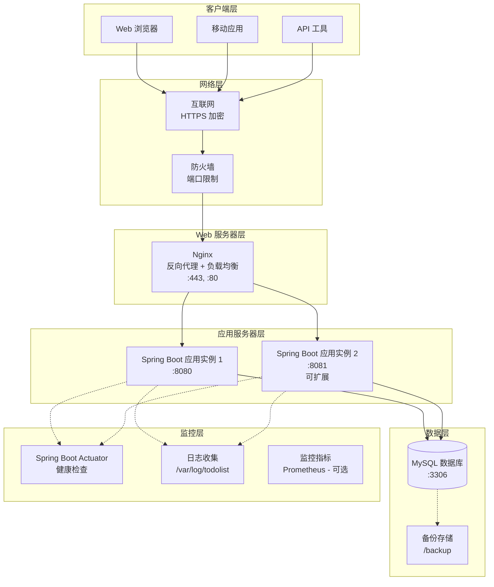

# 部署架构文档 (Deployment Architecture)

> **项目**: TodoList 待办事项管理系统
> **版本**: 1.0
> **最后更新**: 2026-01-26

---

## 1. 概述

本文档描述 TodoList 系统的部署架构，包括部署拓扑、环境划分、部署流程和运维监控。

### 1.1 部署目标

- **简单性**: 单体应用，简化部署和运维
- **可靠性**: 确保服务高可用（99%）
- **可扩展性**: 支持水平扩展，应对增长
- **安全性**: 保护数据和接口安全
- **可维护性**: 便于监控、日志和问题排查

### 1.2 部署策略

采用**单机部署**策略，适合演示项目和小规模应用。

**特点**:
- 单体应用，所有功能在一个进程中
- 使用内嵌 Tomcat，无需外部应用服务器
- 支持多实例部署，通过负载均衡分发请求
- 数据库独立部署

---

## 2. 部署拓扑

### 2.1 生产环境部署架构



### 2.2 开发环境部署架构


**特点**:
- 使用 H2 内存数据库，无需安装 MySQL
- 数据在应用重启后丢失
- 适合快速开发和单元测试

---

## 3. 环境划分

### 3.1 环境定义

| 环境 | 用途 | 数据库 | 部署方式 | 访问地址 |
|------|------|--------|----------|----------|
| **Development** | 本地开发 | H2 (内存) | IDE 启动 | http://localhost:8080 |
| **Testing** | 集成测试 | MySQL Docker | Docker Compose | http://localhost:8080 |
| **Staging** | 预生产 | MySQL 独立 | JAR 部署 | http://staging.example.com |
| **Production** | 生产环境 | MySQL 主从 | JAR 集群 | https://todolist.example.com |

### 3.2 环境配置

**配置文件结构**:
```
src/main/resources/
├── application.yml              # 通用配置
├── application-dev.yml          # 开发环境配置
├── application-test.yml         # 测试环境配置
├── application-staging.yml      # 预生产环境配置
└── application-prod.yml         # 生产环境配置
```

**激活配置**:
```yaml
# application.yml
spring:
  profiles:
    active: @spring.profiles.active@ # Maven 占位符
```

### 3.3 配置差异

| 配置项 | 开发环境 | 测试环境 | 预生产环境 | 生产环境 |
|--------|----------|----------|------------|----------|
| 数据库 | H2 内存 | MySQL Docker | MySQL 独立 | MySQL 主从 |
| 日志级别 | DEBUG | INFO | INFO | WARN |
| 端口 | 8080 | 8080 | 8080 | 8080 |
| JWT 密钥 | 开发密钥 | 测试密钥 | 预生产密钥 | 生产密钥（强） |
| CORS | 允许所有 | 允许指定域名 | 允许指定域名 | 允许指定域名 |
| Actuator | 启用所有 | 启用部分 | 启用部分 | 仅健康检查 |

---

## 4. 部署方式

### 4.1 传统 JAR 部署

#### 构建应用

```bash
# Maven 打包
mvn clean package -Dmaven.test.skip=true

# 生成文件: target/todolist-app-1.0.0.jar
```

#### 运行应用

```bash
# 前台运行
java -jar target/todolist-app-1.0.0.jar

# 后台运行
nohup java -jar target/todolist-app-1.0.0.jar > /dev/null 2>&1 &

# 指定配置文件
java -jar target/todolist-app-1.0.0.jar --spring.profiles.active=prod

# 指定 JVM 参数
java -Xms512m -Xmx1024m -jar target/todolist-app-1.0.0.jar
```

#### 停止应用

```bash
# 查找进程
ps aux | grep todolist-app

# 停止进程
kill <pid>

# 强制停止
kill -9 <pid>
```

### 4.2 Docker 部署

#### Dockerfile

```dockerfile
FROM openjdk:17-jdk-slim

LABEL maintainer="your-email@example.com"
LABEL version="1.0.0"

WORKDIR /app

COPY target/todolist-app-1.0.0.jar app.jar

EXPOSE 8080

ENTRYPOINT ["java", "-jar", "app.jar"]
```

#### 构建镜像

```bash
# 构建镜像
docker build -t todolist-app:1.0.0 .

# 查看镜像
docker images | grep todolist
```

#### 运行容器

```bash
# 运行容器
docker run -d \
  --name todolist-app \
  -p 8080:8080 \
  -e SPRING_PROFILES_ACTIVE=prod \
  todolist-app:1.0.0

# 查看日志
docker logs -f todolist-app

# 停止容器
docker stop todolist-app

# 启动容器
docker start todolist-app
```

### 4.3 Docker Compose 部署

#### docker-compose.yml

```yaml
version: '3.8'

services:
  mysql:
    image: mysql:8.0
    container_name: todolist-mysql
    environment:
      MYSQL_ROOT_PASSWORD: root123
      MYSQL_DATABASE: todolist
      MYSQL_USER: todolist
      MYSQL_PASSWORD: todolist123
    ports:
      - "3306:3306"
    volumes:
      - mysql-data:/var/lib/mysql
      - ./sql:/docker-entrypoint-initdb.d
    networks:
      - todolist-network

  app:
    build: .
    container_name: todolist-app
    environment:
      SPRING_PROFILES_ACTIVE: prod
      SPRING_DATASOURCE_URL: jdbc:mysql://mysql:3306/todolist
      SPRING_DATASOURCE_USERNAME: todolist
      SPRING_DATASOURCE_PASSWORD: todolist123
    ports:
      - "8080:8080"
    depends_on:
      - mysql
    networks:
      - todolist-network

volumes:
  mysql-data:

networks:
  todolist-network:
    driver: bridge
```

#### 启动服务

```bash
# 启动所有服务
docker-compose up -d

# 查看服务状态
docker-compose ps

# 查看日志
docker-compose logs -f app

# 停止所有服务
docker-compose down

# 停止并删除数据
docker-compose down -v
```

---

## 5. Nginx 配置

### 5.1 反向代理配置

```nginx
# /etc/nginx/conf.d/todolist.conf

upstream todolist_backend {
    server 127.0.0.1:8080;
    server 127.0.0.1:8081; # 可选: 第二个实例
    keepalive 32;
}

server {
    listen 80;
    server_name todolist.example.com;

    # 重定向到 HTTPS
    return 301 https://$server_name$request_uri;
}

server {
    listen 443 ssl http2;
    server_name todolist.example.com;

    # SSL 证书
    ssl_certificate /etc/nginx/ssl/todolist.crt;
    ssl_certificate_key /etc/nginx/ssl/todolist.key;
    ssl_protocols TLSv1.2 TLSv1.3;
    ssl_ciphers HIGH:!aNULL:!MD5;

    # 日志
    access_log /var/log/nginx/todolist-access.log;
    error_log /var/log/nginx/todolist-error.log;

    # 反向代理
    location / {
        proxy_pass http://todolist_backend;
        proxy_set_header Host $host;
        proxy_set_header X-Real-IP $remote_addr;
        proxy_set_header X-Forwarded-For $proxy_add_x_forwarded_for;
        proxy_set_header X-Forwarded-Proto $scheme;
    }

    # API 接口
    location /api/ {
        proxy_pass http://todolist_backend;
        proxy_set_header Host $host;
        proxy_set_header X-Real-IP $remote_addr;
        proxy_set_header X-Forwarded-For $proxy_add_x_forwarded_for;

        # CORS 头（可选）
        add_header Access-Control-Allow-Origin https://todolist.example.com;
        add_header Access-Control-Allow-Methods "GET, POST, PUT, DELETE, OPTIONS";
        add_header Access-Control-Allow-Headers "Authorization, Content-Type";
    }

    # Swagger 文档（生产环境可禁用）
    location /swagger-ui/ {
        proxy_pass http://todolist_backend;
        proxy_set_header Host $host;
    }

    # 静态资源缓存
    location ~* \.(jpg|jpeg|png|gif|ico|css|js)$ {
        proxy_pass http://todolist_backend;
        expires 1y;
        add_header Cache-Control "public, immutable";
    }
}
```

### 5.2 负载均衡策略

```nginx
upstream todolist_backend {
    # 轮询（默认）
    server 127.0.0.1:8080;
    server 127.0.0.1:8081;

    # IP 哈希（同一 IP 落在同一服务器）
    # ip_hash;

    # 最少连接
    # least_conn;

    # 权重
    # server 127.0.0.1:8080 weight=3;
    # server 127.0.0.1:8081 weight=1;

    keepalive 32;
}
```

---

## 6. 监控和日志

### 6.1 健康检查

**Actuator 端点**:

| 端点 | 描述 | 生产环境 |
|------|------|----------|
| `/actuator/health` | 健康检查 | 启用 |
| `/actuator/info` | 应用信息 | 启用 |
| `/actuator/metrics` | 监控指标 | 禁用 |
| `/actuator/loggers` | 日志配置 | 禁用 |
| `/actuator/threaddump` | 线程转储 | 禁用 |
| `/actuator/heapdump` | 堆转储 | 禁用 |

**配置**:
```yaml
# application-prod.yml
management:
  endpoints:
    web:
      exposure:
        include: health,info
      base-path: /actuator
  endpoint:
    health:
      show-details: when-authorized
```

**健康检查响应**:
```json
{
  "status": "UP",
  "components": {
    "db": {
      "status": "UP",
      "details": {
        "database": "MySQL",
        "validationQuery": "SELECT 1"
      }
    },
    "diskSpace": {
      "status": "UP",
      "details": {
        "total": 500000000000,
        "free": 250000000000,
        "threshold": 10485760
      }
    }
  }
}
```

### 6.2 日志配置

**Logback 配置** (`logback-spring.xml`):

```xml
<?xml version="1.0" encoding="UTF-8"?>
<configuration>
    <!-- 日志输出目录 -->
    <property name="LOG_PATH" value="/var/log/todolist"/>

    <!-- 日志格式 -->
    <property name="LOG_PATTERN"
              value="%d{yyyy-MM-dd HH:mm:ss.SSS} [%thread] %-5level %logger{36} - %msg%n"/>

    <!-- 控制台输出 -->
    <appender name="CONSOLE" class="ch.qos.logback.core.ConsoleAppender">
        <encoder>
            <pattern>${LOG_PATTERN}</pattern>
        </encoder>
    </appender>

    <!-- 文件输出 -->
    <appender name="FILE" class="ch.qos.logback.core.rolling.RollingFileAppender">
        <file>${LOG_PATH}/todolist.log</file>
        <encoder>
            <pattern>${LOG_PATTERN}</pattern>
        </encoder>
        <rollingPolicy class="ch.qos.logback.core.rolling.TimeBasedRollingPolicy">
            <fileNamePattern>${LOG_PATH}/todolist-%d{yyyy-MM-dd}.log</fileNamePattern>
            <maxHistory>30</maxHistory>
        </rollingPolicy>
    </appender>

    <!-- 错误日志 -->
    <appender name="ERROR_FILE" class="ch.qos.logback.core.rolling.RollingFileAppender">
        <filter class="ch.qos.logback.classic.filter.LevelFilter">
            <level>ERROR</level>
            <onMatch>ACCEPT</onMatch>
            <onMismatch>DENY</onMismatch>
        </filter>
        <file>${LOG_PATH}/todolist-error.log</file>
        <encoder>
            <pattern>${LOG_PATTERN}</pattern>
        </encoder>
        <rollingPolicy class="ch.qos.logback.core.rolling.TimeBasedRollingPolicy">
            <fileNamePattern>${LOG_PATH}/todolist-error-%d{yyyy-MM-dd}.log</fileNamePattern>
            <maxHistory>30</maxHistory>
        </rollingPolicy>
    </appender>

    <!-- Logger 配置 -->
    <logger name="com.todolist" level="INFO"/>
    <logger name="org.springframework" level="WARN"/>
    <logger name="org.hibernate" level="WARN"/>

    <!-- Root Logger -->
    <root level="INFO">
        <appender-ref ref="CONSOLE"/>
        <appender-ref ref="FILE"/>
        <appender-ref ref="ERROR_FILE"/>
    </root>
</configuration>
```

### 6.3 监控指标（可选）

**Prometheus 集成**:

```xml
<!-- pom.xml -->
<dependency>
    <groupId>io.micrometer</groupId>
    <artifactId>micrometer-registry-prometheus</artifactId>
</dependency>
```

```yaml
# application-prod.yml
management:
  endpoints:
    web:
      exposure:
        include: health,info,prometheus
  metrics:
    export:
      prometheus:
        enabled: true
```

**Grafana Dashboard**:
- JVM 内存使用率
- JVM 线程数
- HTTP 请求 QPS
- HTTP 响应时间
- 数据库连接池
- 异常统计

---

## 7. 数据库部署

### 7.1 MySQL 安装

**Ubuntu/Debian**:
```bash
sudo apt update
sudo apt install mysql-server

# 安全配置
sudo mysql_secure_installation
```

**CentOS/RHEL**:
```bash
sudo yum install mysql-server

# 启动服务
sudo systemctl start mysqld
sudo systemctl enable mysqld
```

### 7.2 数据库配置

**创建数据库和用户**:
```sql
CREATE DATABASE todolist CHARACTER SET utf8mb4 COLLATE utf8mb4_unicode_ci;

CREATE USER 'todolist'@'localhost' IDENTIFIED BY 'todolist123';
GRANT ALL PRIVILEGES ON todolist.* TO 'todolist'@'localhost';
FLUSH PRIVILEGES;
```

**Flyway 迁移**:
```bash
# 应用启动时自动执行迁移
# 或手动执行
java -jar todolist-app.jar flyway migrate
```

### 7.3 数据库备份

**备份脚本** (`backup.sh`):
```bash
#!/bin/bash

BACKUP_DIR="/backup/mysql"
DATE=$(date +%Y%m%d_%H%M%S)
BACKUP_FILE="$BACKUP_DIR/todolist_$DATE.sql"

mkdir -p $BACKUP_DIR

mysqldump -u todolist -p'todolist123' todolist > $BACKUP_FILE

# 压缩
gzip $BACKUP_FILE

# 删除 7 天前的备份
find $BACKUP_DIR -name "todolist_*.sql.gz" -mtime +7 -delete

echo "Backup completed: $BACKUP_FILE.gz"
```

**定时任务**:
```bash
# 每天凌晨 2 点执行备份
crontab -e

0 2 * * * /path/to/backup.sh
```

---

## 8. CI/CD 流程

### 8.1 持续集成（CI）

**GitLab CI 示例** (`.gitlab-ci.yml`):
```yaml
stages:
  - build
  - test
  - package

variables:
  MAVEN_OPTS: "-Dmaven.repo.local=$CI_PROJECT_DIR/.m2/repository"

build:
  stage: build
  image: maven:3.9-openjdk-17
  script:
    - mvn compile

test:
  stage: test
  image: maven:3.9-openjdk-17
  script:
    - mvn test
  coverage: '/Total.*?([0-9]{1,3})%/'

package:
  stage: package
  image: maven:3.9-openjdk-17
  script:
    - mvn package -DskipTests
  artifacts:
    paths:
      - target/*.jar
    expire_in: 1 week
```

### 8.2 持续部署（CD）

**部署脚本** (`deploy.sh`):
```bash
#!/bin/bash

JAR_FILE="target/todolist-app-1.0.0.jar"
PID_FILE="todolist.pid"

# 停止旧进程
if [ -f $PID_FILE ]; then
    OLD_PID=$(cat $PID_FILE)
    kill $OLD_PID
    rm $PID_FILE
    echo "Stopped old process: $OLD_PID"
fi

# 启动新进程
nohup java -jar $JAR_FILE --spring.profiles.active=prod > /dev/null 2>&1 &
NEW_PID=$!
echo $NEW_PID > $PID_FILE

echo "Started new process: $NEW_PID"
```

---

## 9. 部署检查清单

### 9.1 部署前检查

- [ ] 代码已通过 Code Review
- [ ] 单元测试覆盖率 >= 80%
- [ ] 集成测试全部通过
- [ ] 安全扫描无高危漏洞
- [ ] 配置文件已正确设置
- [ ] 数据库迁移脚本已准备
- [ ] 备份策略已确认

### 9.2 部署后验证

- [ ] 应用进程正常运行
- [ ] 健康检查接口返回 UP
- [ ] 日志无 ERROR 级别记录
- [ ] 数据库连接正常
- [ ] API 接口功能正常
- [ ] 性能指标正常
- [ ] 监控告警已配置

---

## 10. 故障排查

### 10.1 常见问题

**问题 1: 应用无法启动**
- 检查端口是否被占用: `netstat -tunlp | grep 8080`
- 检查 JVM 内存: `java -Xms512m -Xmx1024m`
- 查看启动日志: `tail -f /var/log/todolist/todolist.log`

**问题 2: 数据库连接失败**
- 检查 MySQL 是否运行: `systemctl status mysql`
- 检查连接信息: URL, 用户名, 密码
- 检查防火墙: `telnet localhost 3306`

**问题 3: API 响应慢**
- 检查数据库慢查询日志
- 检查 JVM GC 日志
- 使用 VisualVM 分析性能

### 10.2 日志位置

| 日志类型 | 位置 |
|----------|------|
| 应用日志 | /var/log/todolist/todolist.log |
| 错误日志 | /var/log/todolist/todolist-error.log |
| Nginx 日志 | /var/log/nginx/todolist-access.log |
| MySQL 日志 | /var/log/mysql/error.log |

---

## 11. 相关文档

- 系统架构设计: `docs/architecture/architecture.md`
- 架构图集: `docs/architecture/diagrams.md`
- 技术栈文档: `docs/architecture/technology-stack.md`
- 运维手册: （待创建）
