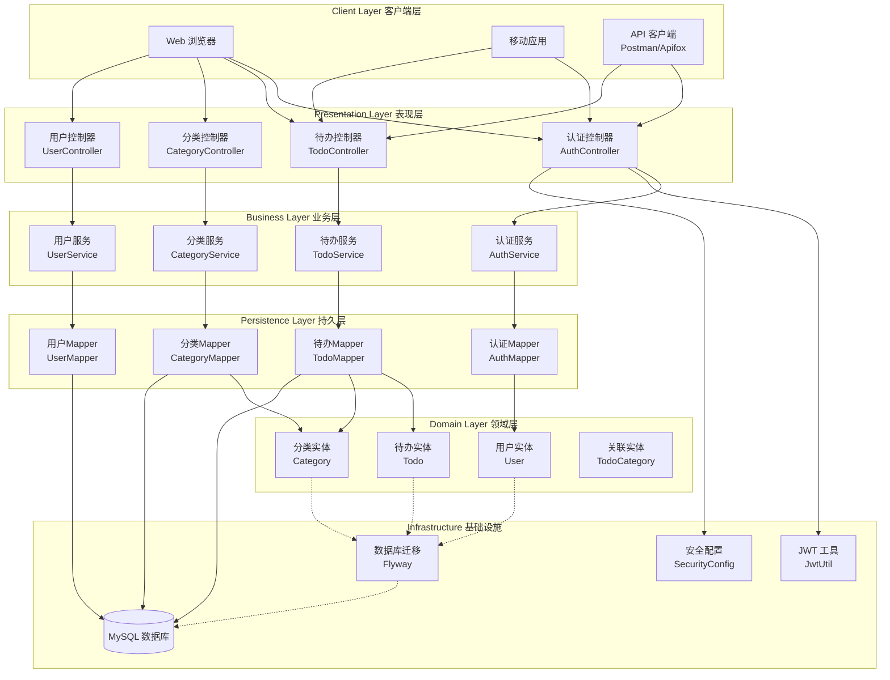
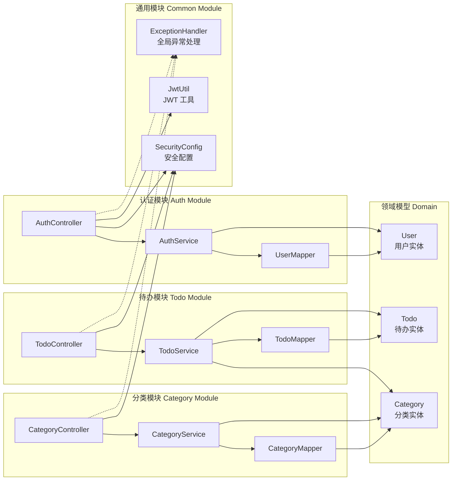
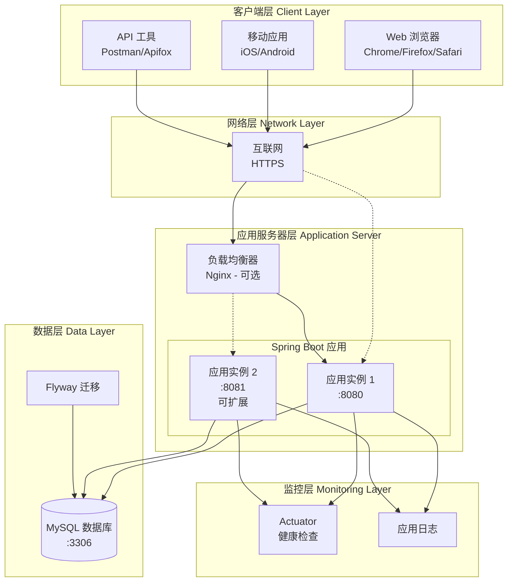
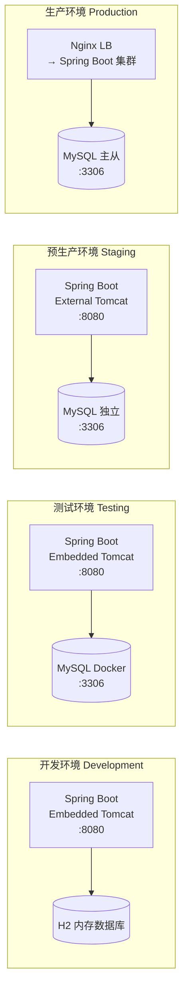
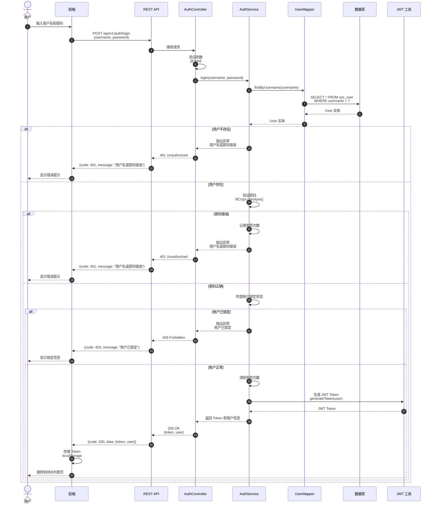
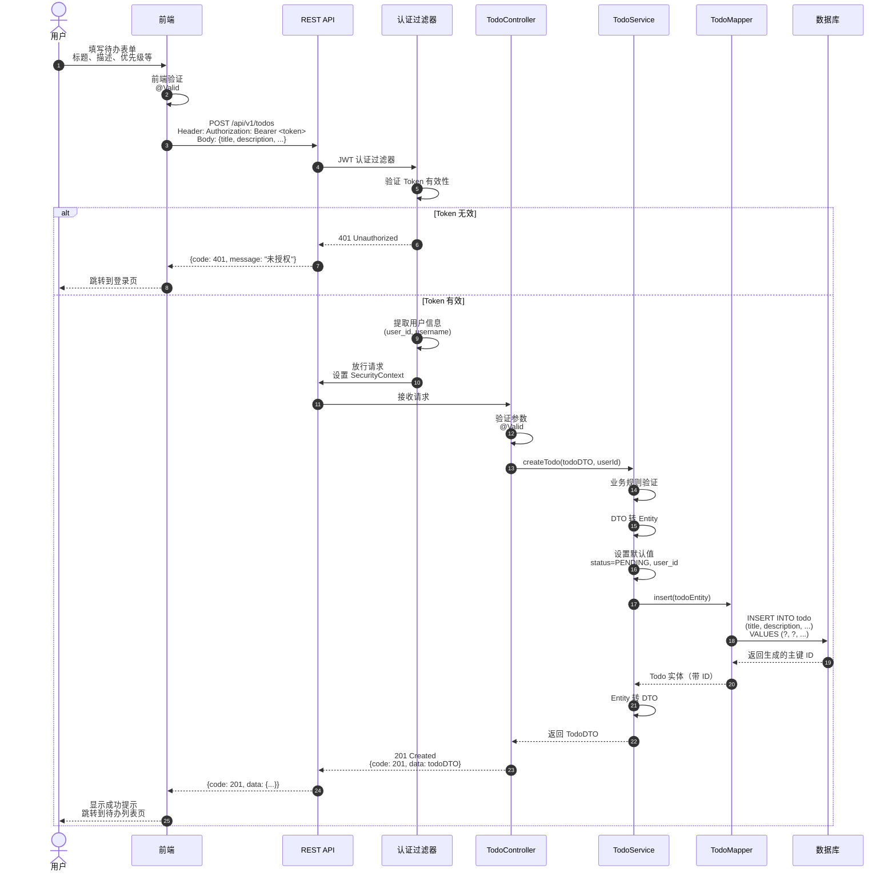
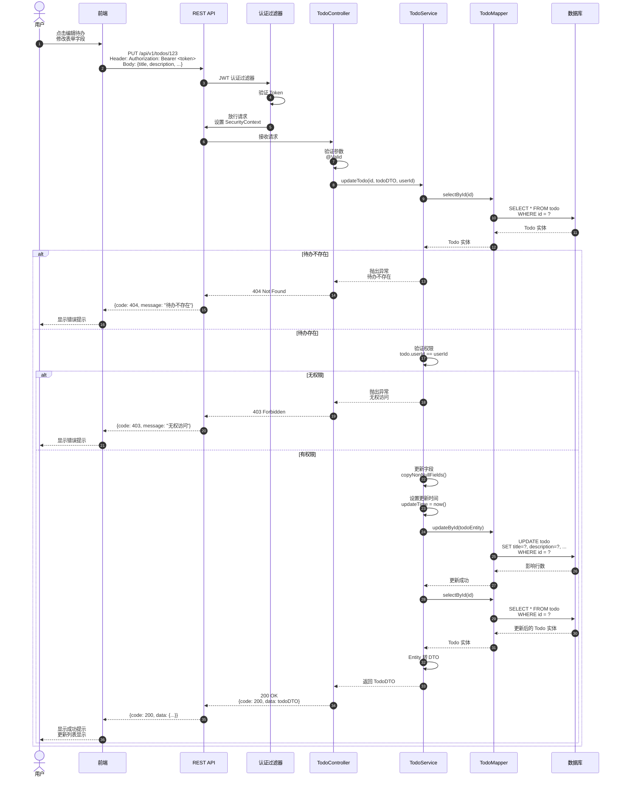
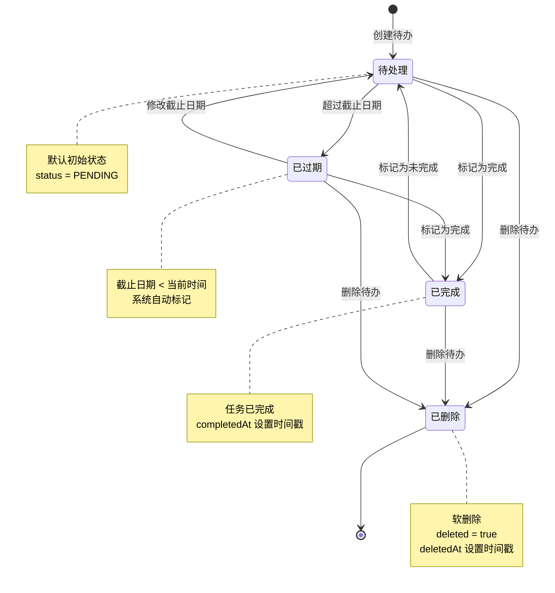
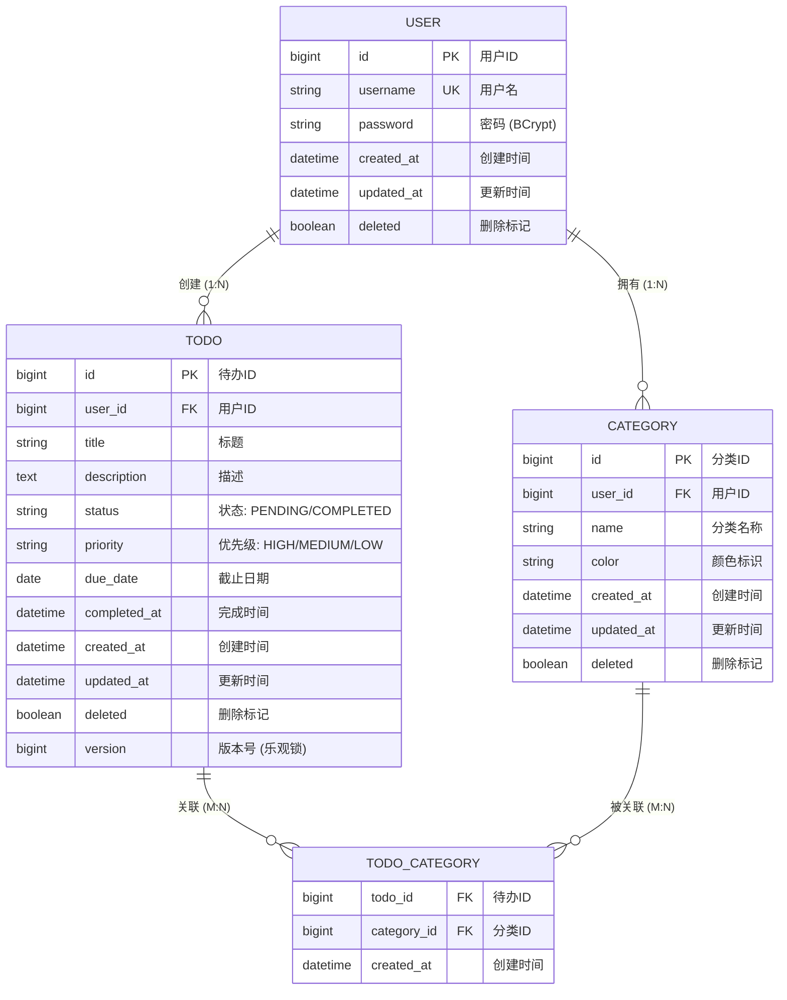
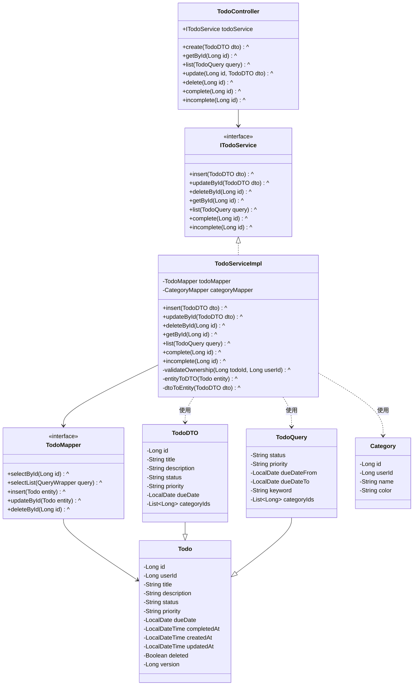

# 架构图集 (Architecture Diagrams)

> **项目**: TodoList 待办事项管理系统
> **版本**: 1.0
> **最后更新**: 2026-01-26

---

## 图表目录

| 图表类型 | 描述 | Mermaid 类型 |
|----------|------|--------------|
| 系统架构图 | 整体系统架构和层次关系 | graph |
| 组件图 | 核心组件及其关系 | graph |
| 部署架构图 | 部署拓扑和环境 | graph |
| 用户认证时序图 | 登录认证流程 | sequenceDiagram |
| 创建待办时序图 | 创建待办事项流程 | sequenceDiagram |
| 更新待办时序图 | 更新待办事项流程 | sequenceDiagram |
| 状态图 | 待办状态转换 | stateDiagram-v2 |
| ER 图 | 数据库实体关系 | erDiagram |
| 类图 | 核心类结构 | classDiagram |

---

## 1. 系统架构图

### 整体系统架构

---

## 2. 组件图

### 核心组件关系

---

## 3. 部署架构图

### 部署拓扑

### 环境划分

---

## 4. 时序图

### 4.1 用户认证时序图

### 4.2 创建待办事项时序图

### 4.3 更新待办事项时序图

---

## 5. 状态图

### 待办状态转换

---

## 6. ER 图

### 数据库实体关系

---

## 7. 类图

### 核心类结构

---

## 图表使用说明

### 如何查看图表

1. **GitHub/GitLab**: 直接在 Markdown 文件中渲染
2. **VS Code**: 安装 "Markdown Preview Mermaid Support" 插件
3. **在线工具**: 访问 https://mermaid.live/ 粘贴代码查看
4. **文档工具**: MkDocs, Hugo, Docusaurus 等支持 Mermaid

### 图表维护规范

- 保持图表简洁，避免过度复杂
- 使用中文标签，提高可读性
- 保持图表与代码同步更新
- 图表变更后更新文档修订日期
- 复杂图表添加注释说明

### 图表命名规范

- 系统架构图: `system-architecture`
- 组件图: `component-diagram`
- 部署架构图: `deployment-architecture`
- 时序图: `sequence-diagram-{功能}`
- 状态图: `state-diagram-{实体}`
- ER 图: `er-diagram`
- 类图: `class-diagram-{模块}`

---

## 相关文档

- 系统架构设计: `docs/architecture/architecture.md`
- 组件图文档: `docs/architecture/component-diagram.md`
- 部署架构文档: `docs/architecture/deployment-architecture.md`
- 数据库设计: （待创建）
- API 设计: （待创建）
