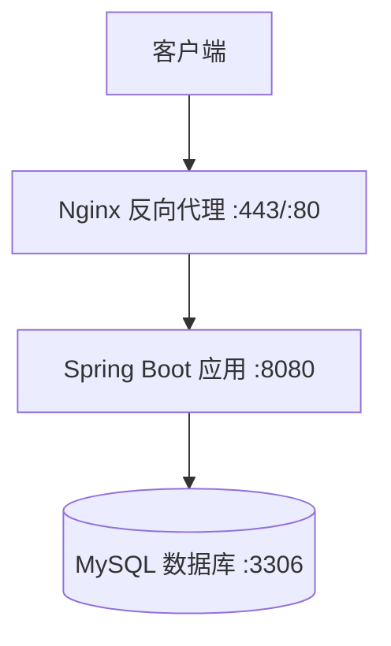

# TodoList 系统部署指南

> **项目**: TodoList 待办事项管理系统
> **版本**: 1.0.0
> **最后更新**: 2026-01-26
> **目标读者**: 运维工程师、开发工程师

---

## 目录

1. [部署概述](#1-部署概述)
2. [环境准备](#2-环境准备)
3. [本地开发部署](#3-本地开发部署)
4. [生产环境部署](#4-生产环境部署)
5. [Docker 部署](#5-docker-部署)
6. [数据库迁移](#6-数据库迁移)
7. [Nginx 配置](#7-nginx-配置)
8. [验证测试](#8-验证测试)
9. [回滚方案](#9-回滚方案)
10. [故障排查](#10-故障排查)

---

## 1. 部署概述

### 1.1 部署架构



### 1.2 环境要求

**最低配置**:
- CPU: 2 核
- 内存: 4GB
- 磁盘: 20GB

**推荐配置**:
- CPU: 4 核
- 内存: 8GB
- 磁盘: 50GB

### 1.3 软件依赖

| 软件 | 版本 | 用途 |
|------|------|------|
| Java JDK | 17+ | 运行环境 |
| MySQL | 8.0+ | 数据库 |
| Maven | 3.9+ | 构建工具 |
| Nginx | 1.24+ | 反向代理（可选） |
| Docker | 20.x+ | 容器化（可选） |

---

## 2. 环境准备

### 2.1 安装 JDK 17

**Ubuntu/Debian**:
```bash
sudo apt update
sudo apt install -y openjdk-17-jdk

# 验证安装
java -version
```

**CentOS/RHEL**:
```bash
sudo yum install -y java-17-openjdk-devel

# 验证安装
java -version
```

**macOS**:
```bash
brew install openjdk@17

# 配置环境变量
echo 'export PATH="/usr/local/opt/openjdk@17/bin:$PATH"' >> ~/.zshrc
source ~/.zshrc
```

**配置 JAVA_HOME**:
```bash
# Ubuntu/Debian
echo 'export JAVA_HOME=/usr/lib/jvm/java-17-openjdk-amd64' >> ~/.bashrc
echo 'export PATH=$JAVA_HOME/bin:$PATH' >> ~/.bashrc
source ~/.bashrc
```

### 2.2 安装 MySQL 8.0

**Ubuntu/Debian**:
```bash
sudo apt update
sudo apt install -y mysql-server

# 安全配置
sudo mysql_secure_installation

# 启动服务
sudo systemctl start mysql
sudo systemctl enable mysql
```

**CentOS/RHEL**:
```bash
sudo yum install -y mysql-server

# 启动服务
sudo systemctl start mysqld
sudo systemctl enable mysqld

# 获取临时密码
sudo grep 'temporary password' /var/log/mysqld.log
```

**macOS**:
```bash
brew install mysql

# 启动服务
brew services start mysql
```

### 2.3 安装 Maven

**Ubuntu/Debian**:
```bash
sudo apt install -y maven

# 验证安装
mvn -version
```

**CentOS/RHEL**:
```bash
sudo yum install -y maven
```

**macOS**:
```bash
brew install maven
```

### 2.4 安装 Nginx（可选）

**Ubuntu/Debian**:
```bash
sudo apt install -y nginx

# 启动服务
sudo systemctl start nginx
sudo systemctl enable nginx
```

**CentOS/RHEL**:
```bash
sudo yum install -y nginx

# 启动服务
sudo systemctl start nginx
sudo systemctl enable nginx
```

### 2.5 安装 Docker（可选）

**官方脚本安装**:
```bash
curl -fsSL https://get.docker.com -o get-docker.sh
sudo sh get-docker.sh

# 将当前用户添加到 docker 组
sudo usermod -aG docker $USER

# 重新登录或执行
newgrp docker

# 验证安装
docker --version
```

**安装 Docker Compose**:
```bash
sudo curl -L "https://github.com/docker/compose/releases/latest/download/docker-compose-$(uname -s)-$(uname -m)" -o /usr/local/bin/docker-compose
sudo chmod +x /usr/local/bin/docker-compose

# 验证安装
docker-compose --version
```

---

## 3. 本地开发部署

### 3.1 获取源代码

```bash
# 克隆代码仓库
git clone https://github.com/your-org/todolist-project.git
cd todolist-project
```

### 3.2 配置数据库

**创建数据库**:
```bash
# 登录 MySQL
mysql -u root -p

# 执行 SQL
CREATE DATABASE todolist CHARACTER SET utf8mb4 COLLATE utf8mb4_unicode_ci;

CREATE USER 'todolist'@'localhost' IDENTIFIED BY 'todolist123';
GRANT ALL PRIVILEGES ON todolist.* TO 'todolist'@'localhost';
FLUSH PRIVILEGES;

EXIT;
```

### 3.3 配置应用

编辑 `src/main/resources/application.yml`:

```yaml
server:
  port: 8080

spring:
  datasource:
    url: jdbc:mysql://localhost:3306/todolist?useUnicode=true&characterEncoding=utf8&serverTimezone=UTC
    username: todolist
    password: todolist123
    driver-class-name: com.mysql.cj.jdbc.Driver

  flyway:
    enabled: true
    locations: classpath:db/migration
    baseline-on-migrate: true

jwt:
  secret: your-secret-key-at-least-256-bits-long-for-hs256-algorithm
  access-token-expiration: 86400000  # 24 hours (ms)
  refresh-token-expiration: 604800000  # 7 days (ms)
```

### 3.4 构建项目

```bash
# 编译项目
mvn clean compile

# 运行测试
mvn test

# 打包
mvn clean package -DskipTests
```

### 3.5 启动应用

**使用 Maven 启动**:
```bash
mvn spring-boot:run
```

**使用 JAR 启动**:
```bash
java -jar target/todolist-project-1.0.0.jar
```

**指定配置文件**:
```bash
java -jar target/todolist-project-1.0.0.jar --spring.profiles.active=dev
```

**指定 JVM 参数**:
```bash
java -Xms512m -Xmx1024m -jar target/todolist-project-1.0.0.jar
```

### 3.6 验证部署

**检查应用健康状态**:
```bash
curl http://localhost:8080/actuator/health
```

**预期响应**:
```json
{
  "status": "UP"
}
```

**访问 API 文档**:
```
http://localhost:8080/doc.html
```

---

## 4. 生产环境部署

### 4.1 创建部署目录

```bash
# 创建应用目录
sudo mkdir -p /opt/todolist
sudo chown $USER:$USER /opt/todolist

# 创建日志目录
sudo mkdir -p /var/log/todolist
sudo chown $USER:$USER /var/log/todolist
```

### 4.2 上传部署文件

```bash
# 在本地打包
mvn clean package -DskipTests

# 上传 JAR 文件到服务器
scp target/todolist-project-1.0.0.jar user@server:/opt/todolist/

# 上传配置文件
scp src/main/resources/application-prod.yml user@server:/opt/todolist/
```

### 4.3 配置生产环境

创建 `/opt/todolist/application-prod.yml`:

```yaml
server:
  port: 8080

spring:
  datasource:
    url: jdbc:mysql://localhost:3306/todolist?useUnicode=true&characterEncoding=utf8&serverTimezone=UTC
    username: todolist_prod
    password: strong-production-password
    driver-class-name: com.mysql.cj.jdbc.Driver
    hikari:
      minimum-idle: 5
      maximum-pool-size: 20
      idle-timeout: 30000
      connection-timeout: 30000
      max-lifetime: 1800000

  flyway:
    enabled: true
    locations: classpath:db/migration
    baseline-on-migrate: true

jwt:
  secret: very-strong-production-secret-key-at-least-256-bits-long
  access-token-expiration: 86400000
  refresh-token-expiration: 604800000

logging:
  level:
    root: INFO
    com.todolist: INFO
  file:
    name: /var/log/todolist/todolist.log
```

### 4.4 创建启动脚本

创建 `/opt/todolist/start.sh`:

```bash
#!/bin/bash

APP_NAME="todolist"
JAR_FILE="$APP_NAME-project-1.0.0.jar"
PID_FILE="$APP_NAME.pid"
LOG_DIR="/var/log/todolist"

# JVM 参数
JVM_OPTS="-Xms512m -Xmx1024m -XX:+UseG1GC -XX:MaxGCPauseMillis=200"

# 进入应用目录
cd /opt/todolist

# 停止旧进程
if [ -f $PID_FILE ]; then
    OLD_PID=$(cat $PID_FILE)
    if ps -p $OLD_PID > /dev/null; then
        echo "Stopping old process: $OLD_PID"
        kill $OLD_PID
        sleep 5
    fi
    rm $PID_FILE
fi

# 启动新进程
echo "Starting $APP_NAME..."
nohup java $JVM_OPTS -jar $JAR_FILE \
    --spring.profiles.active=prod \
    --spring.config.location=/opt/todolist/application-prod.yml \
    > $LOG_DIR/stdout.log 2>&1 &

NEW_PID=$!
echo $NEW_PID > $PID_FILE

echo "$APP_NAME started with PID: $NEW_PID"
echo "Logs: $LOG_DIR/todolist.log"
```

**赋予执行权限**:
```bash
chmod +x /opt/todolist/start.sh
```

### 4.5 创建停止脚本

创建 `/opt/todolist/stop.sh`:

```bash
#!/bin/bash

APP_NAME="todolist"
PID_FILE="/opt/todolist/$APP_NAME.pid"

if [ ! -f $PID_FILE ]; then
    echo "PID file not found. Is the application running?"
    exit 1
fi

PID=$(cat $PID_FILE)

if ps -p $PID > /dev/null; then
    echo "Stopping $APP_NAME (PID: $PID)..."
    kill $PID

    # 等待进程结束
    for i in {1..30}; do
        if ! ps -p $PID > /dev/null; then
            echo "$APP_NAME stopped successfully"
            rm $PID_FILE
            exit 0
        fi
        sleep 1
    done

    # 强制停止
    echo "Force stopping $APP_NAME..."
    kill -9 $PID
    rm $PID_FILE
    echo "$APP_NAME force stopped"
else
    echo "Process not found. Removing PID file."
    rm $PID_FILE
fi
```

**赋予执行权限**:
```bash
chmod +x /opt/todolist/stop.sh
```

### 4.6 创建系统服务（推荐）

创建 `/etc/systemd/system/todolist.service`:

```ini
[Unit]
Description=TodoList Application
After=network.target mysql.service

[Service]
Type=simple
User=todolist
Group=todolist
WorkingDirectory=/opt/todolist
ExecStart=/usr/bin/java -Xms512m -Xmx1024m -jar /opt/todolist/todolist-project-1.0.0.jar --spring.profiles.active=prod
ExecStop=/bin/kill -15 $MAINPID
Restart=on-failure
RestartSec=10
StandardOutput=append:/var/log/todolist/todolist.log
StandardError=append:/var/log/todolist/todolist-error.log

[Install]
WantedBy=multi-user.target
```

**创建服务用户**:
```bash
sudo useradd -r -s /bin/false todolist
sudo chown -R todolist:todolist /opt/todolist
sudo chown -R todolist:todolist /var/log/todolist
```

**启用和启动服务**:
```bash
# 重载 systemd 配置
sudo systemctl daemon-reload

# 启用开机自启
sudo systemctl enable todolist

# 启动服务
sudo systemctl start todolist

# 查看状态
sudo systemctl status todolist

# 查看日志
sudo journalctl -u todolist -f
```

---

## 5. Docker 部署

### 5.1 创建 Dockerfile

创建 `Dockerfile`:

```dockerfile
FROM openjdk:17-jdk-slim

LABEL maintainer="your-email@example.com"
LABEL version="1.0.0"
LABEL description="TodoList Application"

# 安装必要的工具
RUN apt-get update && apt-get install -y curl && rm -rf /var/lib/apt/lists/*

# 创建应用目录
WORKDIR /app

# 复制 JAR 文件
COPY target/todolist-project-1.0.0.jar app.jar

# 创建日志目录
RUN mkdir -p /var/log/todolist

# 暴露端口
EXPOSE 8080

# 健康检查
HEALTHCHECK --interval=30s --timeout=3s --start-period=40s --retries=3 \
    CMD curl -f http://localhost:8080/actuator/health || exit 1

# 启动应用
ENTRYPOINT ["java", "-jar", "app.jar"]
```

### 5.2 构建 Docker 镜像

```bash
# 构建
docker build -t todolist-app:1.0.0 .

# 查看镜像
docker images | grep todolist
```

### 5.3 运行 Docker 容器

```bash
# 运行容器
docker run -d \
  --name todolist-app \
  -p 8080:8080 \
  -e SPRING_PROFILES_ACTIVE=prod \
  -e SPRING_DATASOURCE_URL=jdbc:mysql://host.docker.internal:3306/todolist \
  -e SPRING_DATASOURCE_USERNAME=todolist \
  -e SPRING_DATASOURCE_PASSWORD=todolist123 \
  -v /opt/todolist/logs:/var/log/todolist \
  todolist-app:1.0.0

# 查看日志
docker logs -f todolist-app

# 查看状态
docker ps | grep todolist
```

### 5.4 使用 Docker Compose

创建 `docker-compose.yml`:

```yaml
version: '3.8'

services:
  mysql:
    image: mysql:8.0
    container_name: todolist-mysql
    environment:
      MYSQL_ROOT_PASSWORD: root123
      MYSQL_DATABASE: todolist
      MYSQL_USER: todolist
      MYSQL_PASSWORD: todolist123
    ports:
      - "3306:3306"
    volumes:
      - mysql-data:/var/lib/mysql
      - ./sql:/docker-entrypoint-initdb.d
    networks:
      - todolist-network
    healthcheck:
      test: ["CMD", "mysqladmin", "ping", "-h", "localhost"]
      interval: 10s
      timeout: 5s
      retries: 5

  app:
    build: .
    container_name: todolist-app
    environment:
      SPRING_PROFILES_ACTIVE: prod
      SPRING_DATASOURCE_URL: jdbc:mysql://mysql:3306/todolist
      SPRING_DATASOURCE_USERNAME: todolist
      SPRING_DATASOURCE_PASSWORD: todolist123
    ports:
      - "8080:8080"
    depends_on:
      mysql:
        condition: service_healthy
    networks:
      - todolist-network
    volumes:
      - ./logs:/var/log/todolist
    restart: unless-stopped

volumes:
  mysql-data:

networks:
  todolist-network:
    driver: bridge
```

**启动服务**:
```bash
# 启动所有服务
docker-compose up -d

# 查看服务状态
docker-compose ps

# 查看应用日志
docker-compose logs -f app

# 停止所有服务
docker-compose down

# 停止并删除数据
docker-compose down -v
```

---

## 6. 数据库迁移

### 6.1 Flyway 自动迁移

应用启动时会自动执行数据库迁移：

```bash
# 查看迁移历史
mysql -u todolist -p todolist -e "SELECT * FROM flyway_schema_history;"

# 查看表结构
mysql -u todolist -p todolist -e "SHOW TABLES;"
```

### 6.2 手动执行迁移

```bash
# 使用 Maven 插件
mvn flyway:migrate

# 使用 Flyway 命令行
flyway migrate -url=jdbc:mysql://localhost:3306/todolist \
               -user=todolist \
               -password=todolist123
```

### 6.3 回滚迁移

Flyway 社区版不支持自动回滚，需要手动编写回滚脚本：

```sql
-- V3__rollback.sql
DROP TABLE IF EXISTS sys_todo_category;
DROP TABLE IF EXISTS sys_category;
DROP TABLE IF EXISTS sys_todo;
DROP TABLE IF EXISTS sys_user;
```

---

## 7. Nginx 配置

### 7.1 安装 SSL 证书（生产环境）

**使用 Let's Encrypt**:
```bash
# 安装 Certbot
sudo apt install certbot python3-certbot-nginx

# 获取证书
sudo certbot --nginx -d todolist.example.com

# 自动续期
sudo certbot renew --dry-run
```

### 7.2 配置反向代理

创建 `/etc/nginx/conf.d/todolist.conf`:

```nginx
upstream todolist_backend {
    server 127.0.0.1:8080;
    keepalive 32;
}

# HTTP 重定向到 HTTPS
server {
    listen 80;
    server_name todolist.example.com;
    return 301 https://$server_name$request_uri;
}

# HTTPS 配置
server {
    listen 443 ssl http2;
    server_name todolist.example.com;

    # SSL 证书
    ssl_certificate /etc/letsencrypt/live/todolist.example.com/fullchain.pem;
    ssl_certificate_key /etc/letsencrypt/live/todolist.example.com/privkey.pem;
    ssl_protocols TLSv1.2 TLSv1.3;
    ssl_ciphers HIGH:!aNULL:!MD5;

    # 日志
    access_log /var/log/nginx/todolist-access.log;
    error_log /var/log/nginx/todolist-error.log;

    # 反向代理
    location / {
        proxy_pass http://todolist_backend;
        proxy_set_header Host $host;
        proxy_set_header X-Real-IP $remote_addr;
        proxy_set_header X-Forwarded-For $proxy_add_x_forwarded_for;
        proxy_set_header X-Forwarded-Proto $scheme;

        # 超时设置
        proxy_connect_timeout 60s;
        proxy_send_timeout 60s;
        proxy_read_timeout 60s;
    }

    # API 接口
    location /api/ {
        proxy_pass http://todolist_backend;
        proxy_set_header Host $host;
        proxy_set_header X-Real-IP $remote_addr;
        proxy_set_header X-Forwarded-For $proxy_add_x_forwarded_for;

        # CORS 头
        add_header Access-Control-Allow-Origin https://todolist.example.com;
        add_header Access-Control-Allow-Methods "GET, POST, PUT, DELETE, OPTIONS";
        add_header Access-Control-Allow-Headers "Authorization, Content-Type";
        add_header Access-Control-Max-Age 3600;

        if ($request_method = 'OPTIONS') {
            return 204;
        }
    }

    # Swagger 文档（生产环境可禁用）
    location /doc.html {
        proxy_pass http://todolist_backend;
        proxy_set_header Host $host;
    }

    # 健康检查
    location /actuator/health {
        proxy_pass http://todolist_backend;
        access_log off;
    }
}
```

**测试和重载配置**:
```bash
# 测试配置
sudo nginx -t

# 重载配置
sudo nginx -s reload

# 重启 Nginx
sudo systemctl restart nginx
```

---

## 8. 验证测试

### 8.1 应用健康检查

```bash
# 检查健康状态
curl http://localhost:8080/actuator/health

# 预期响应
{
  "status": "UP"
}
```

### 8.2 API 功能测试

```bash
# 1. 用户注册
curl -X POST http://localhost:8080/api/v1/auth/register \
  -H "Content-Type: application/json" \
  -d '{
    "username": "testuser",
    "password": "Test1234",
    "confirmPassword": "Test1234"
  }'

# 2. 用户登录
TOKEN=$(curl -s -X POST http://localhost:8080/api/v1/auth/login \
  -H "Content-Type: application/json" \
  -d '{
    "username": "testuser",
    "password": "Test1234"
  }' | jq -r '.data.token')

# 3. 创建待办事项
curl -X POST http://localhost:8080/api/v1/todos \
  -H "Authorization: Bearer $TOKEN" \
  -H "Content-Type: application/json" \
  -d '{
    "title": "测试待办事项",
    "priority": "HIGH"
  }'

# 4. 查询待办列表
curl -X GET http://localhost:8080/api/v1/todos/list \
  -H "Authorization: Bearer $TOKEN"
```

### 8.3 性能测试（可选）

使用 Apache Bench 进行简单性能测试：

```bash
# 安装
sudo apt install apache2-utils

# 并发测试
ab -n 1000 -c 10 http://localhost:8080/actuator/health

# 结果分析
# - Requests per second: >= 100
# - Time per request: <= 100ms (95%)
```

### 8.4 部署检查清单

- [ ] 应用进程正常运行
- [ ] 健康检查接口返回 UP
- [ ] 日志无 ERROR 级别记录
- [ ] 数据库连接正常
- [ ] API 接口功能正常
- [ ] Swagger 文档可访问
- [ ] Nginx 反向代理正常
- [ ] SSL 证书有效（生产环境）
- [ ] 系统服务开机自启
- [ ] 监控告警已配置

---

## 9. 回滚方案

### 9.1 应用回滚

**使用备份的 JAR 文件**:
```bash
# 停止当前服务
/opt/todolist/stop.sh

# 或使用 systemd
sudo systemctl stop todolist

# 恢复备份版本
cp /opt/todolist/backup/todolist-project-1.0.0.jar /opt/todolist/

# 启动服务
/opt/todolist/start.sh

# 或使用 systemd
sudo systemctl start todolist
```

**Docker 回滚**:
```bash
# 停止当前容器
docker stop todolist-app
docker rm todolist-app

# 运行旧版本镜像
docker run -d --name todolist-app -p 8080:8080 todolist-app:0.9.0
```

### 9.2 数据库回滚

**从备份恢复**:
```bash
# 停止应用
sudo systemctl stop todolist

# 备份当前数据库
mysqldump -u root -p todolist > /backup/todolist_$(date +%Y%m%d_%H%M%S).sql

# 恢复之前的备份
mysql -u root -p todolist < /backup/todolist_20260125_000000.sql

# 启动应用
sudo systemctl start todolist
```

### 9.3 配置回滚

```bash
# 使用 Git 恢复配置文件
cd /opt/todolist
git checkout HEAD~1 application-prod.yml

# 重启服务
sudo systemctl restart todolist
```

---

## 10. 故障排查

### 10.1 应用无法启动

**检查日志**:
```bash
# 应用日志
tail -f /var/log/todolist/todolist.log

# 错误日志
tail -f /var/log/todolist/todolist-error.log

# systemd 日志
sudo journalctl -u todolist -f
```

**常见问题**:
1. **端口被占用**
   ```bash
   # 查看端口占用
   netstat -tunlp | grep 8080

   # 停止占用端口的进程
   kill -9 <PID>
   ```

2. **数据库连接失败**
   ```bash
   # 测试数据库连接
   mysql -h localhost -u todolist -p todolist

   # 检查数据库服务
   sudo systemctl status mysql
   ```

3. **内存不足**
   ```bash
   # 调整 JVM 参数
   java -Xms256m -Xmx512m -jar app.jar
   ```

### 10.2 API 响应慢

**排查步骤**:
1. **检查数据库慢查询**
   ```sql
   -- 查看慢查询配置
   SHOW VARIABLES LIKE 'slow_query%';

   -- 查看慢查询日志
   sudo tail -f /var/log/mysql/slow-query.log
   ```

2. **检查 JVM 性能**
   ```bash
   # 查看 JVM 进程
   jps -lvm

   # 生成线程转储
   jstack <PID> > thread_dump.txt

   # 生成堆转储
   jmap -dump:format=b,file=heap.bin <PID>
   ```

3. **检查系统资源**
   ```bash
   # CPU 使用率
   top -p <PID>

   # 内存使用
   free -h

   # 磁盘 I/O
   iostat -x 1
   ```

### 10.3 数据库问题

**连接数过多**:
```sql
-- 查看当前连接
SHOW PROCESSLIST;

-- 查看最大连接数
SHOW VARIABLES LIKE 'max_connections';

-- 杀死长时间运行的查询
KILL <PROCESS_ID>;
```

**表锁定**:
```sql
-- 查看锁等待
SHOW ENGINE INNODB STATUS;

-- 查看事务
SELECT * FROM information_schema.innodb_trx;
```

### 10.4 日志级别调整

临时调整日志级别（需要 Spring Boot Actuator）:

```bash
# 设置为 DEBUG
curl -X POST http://localhost:8080/actuator/loggers/com.todolist \
  -H "Content-Type: application/json" \
  -d '{"configuredLevel": "DEBUG"}'

# 恢复为 INFO
curl -X POST http://localhost:8080/actuator/loggers/com.todolist \
  -H "Content-Type: application/json" \
  -d '{"configuredLevel": "INFO"}'
```

---

## 附录

### A. 环境变量参考

| 变量名 | 说明 | 默认值 |
|--------|------|--------|
| SERVER_PORT | 服务器端口 | 8080 |
| SPRING_PROFILES_ACTIVE | 激活的配置文件 | - |
| SPRING_DATASOURCE_URL | 数据库 URL | - |
| SPRING_DATASOURCE_USERNAME | 数据库用户名 | - |
| SPRING_DATASOURCE_PASSWORD | 数据库密码 | - |
| JWT_SECRET | JWT 密钥 | - |
| LOG_LEVEL | 日志级别 | INFO |

### B. 端口使用说明

| 端口 | 协议 | 用途 |
|------|------|------|
| 8080 | HTTP | 应用服务 |
| 3306 | TCP | MySQL 数据库 |
| 80 | HTTP | Nginx（HTTP） |
| 443 | HTTPS | Nginx（HTTPS） |

### C. 目录结构

```
/opt/todolist/
├── todolist-project-1.0.0.jar    # 应用 JAR 包
├── application-prod.yml            # 生产配置
├── start.sh                        # 启动脚本
├── stop.sh                         # 停止脚本
└── backup/                         # 备份目录

/var/log/todolist/
├── todolist.log                    # 应用日志
├── todolist-error.log              # 错误日志
└── stdout.log                      # 标准输出日志

/backup/mysql/
└── todolist_YYYYMMDD.sql          # 数据库备份
```

### D. 参考资源

- Spring Boot 官方文档: https://spring.io/projects/spring-boot
- MySQL 官方文档: https://dev.mysql.com/doc/
- Nginx 官方文档: https://nginx.org/en/docs/
- Docker 官方文档: https://docs.docker.com/

---

**文档版本**: 1.0
**最后更新**: 2026-01-26
**维护人**: 运维团队
