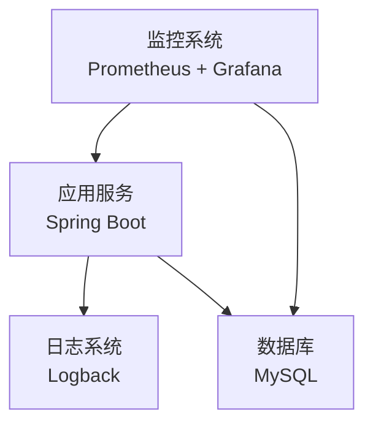
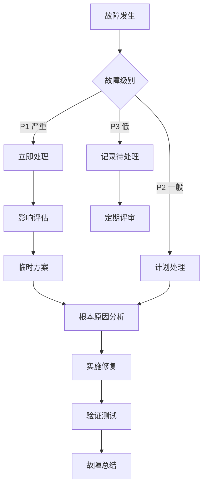

# TodoList 系统运维手册

> **项目**: TodoList 待办事项管理系统
> **版本**: 1.0.0
> **最后更新**: 2026-01-26
> **目标读者**: 运维工程师、系统管理员

---

## 目录

1. [运维概述](#1-运维概述)
2. [系统监控](#2-系统监控)
3. [日志管理](#3-日志管理)
4. [备份恢复](#4-备份恢复)
5. [性能优化](#5-性能优化)
6. [安全加固](#6-安全加固)
7. [故障处理](#7-故障处理)
8. [日常维护](#8-日常维护)
9. [应急处理](#9-应急处理)

---

## 1. 运维概述

### 1.1 系统架构



### 1.2 运维职责

| 职责 | 说明 | 频率 |
|------|------|------|
| 系统监控 | 监控应用和数据库状态 | 7×24 小时 |
| 日志分析 | 分析错误和异常日志 | 每日 |
| 数据备份 | 备份数据库和应用配置 | 每日 |
| 性能优化 | 优化系统性能和资源使用 | 每周 |
| 安全检查 | 检查安全漏洞和配置 | 每月 |
| 故障处理 | 处理系统故障和异常 | 按需 |

### 1.3 运维工具

| 工具 | 用途 | 安装位置 |
|------|------|----------|
| **Prometheus** | 指标收集 | 监控服务器 |
| **Grafana** | 可视化监控 | 监控服务器 |
| **Alertmanager** | 告警通知 | 监控服务器 |
| **Logback** | 日志记录 | 应用服务器 |
| **MySQL Slow Query Log** | 慢查询分析 | 数据库服务器 |

---

## 2. 系统监控

### 2.1 应用监控

#### 健康检查端点

**基础健康检查**:
```bash
curl http://localhost:8080/actuator/health
```

**响应示例**:
```json
{
  "status": "UP",
  "components": {
    "db": {
      "status": "UP",
      "details": {
        "database": "MySQL",
        "validationQuery": "SELECT 1"
      }
    },
    "diskSpace": {
      "status": "UP",
      "details": {
        "total": 500000000000,
        "free": 250000000000,
        "threshold": 10485760
      }
    }
  }
}
```

**配置健康检查** (`application.yml`):
```yaml
management:
  endpoints:
    web:
      exposure:
        include: health,info,metrics,prometheus
  endpoint:
    health:
      show-details: when-authorized
      show-components: always
  health:
    db:
      enabled: true
    diskspace:
      enabled: true
      threshold: 10MB
```

#### 应用指标

**查看 JVM 内存**:
```bash
curl http://localhost:8080/actuator/metrics/jvm.memory.used
```

**查看 HTTP 请求统计**:
```bash
curl http://localhost:8080/actuator/metrics/http.server.requests
```

**查看进程 CPU 使用率**:
```bash
curl http://localhost:8080/actuator/metrics/process.cpu.usage
```

#### 创建监控脚本

创建 `/opt/scripts/check-app-health.sh`:

```bash
#!/bin/bash

APP_URL="http://localhost:8080"
ALERT_EMAIL="ops@example.com"

# 检查健康状态
HEALTH=$(curl -s "$APP_URL/actuator/health" | jq -r '.status')

if [ "$HEALTH" != "UP" ]; then
    echo "[$(date)] Application health check failed: $HEALTH" >> /var/log/todolist/monitor.log

    # 发送告警邮件
    echo "Application is DOWN. Health status: $HEALTH" | mail -s "TodoList App Alert" $ALERT_EMAIL

    # 尝试重启服务
    systemctl restart todolist
fi

# 检查磁盘空间
DISK_USAGE=$(df -h /opt | awk 'NR==2 {print $5}' | sed 's/%//')
if [ $DISK_USAGE -gt 80 ]; then
    echo "[$(date)] Disk usage warning: $DISK_USAGE%" >> /var/log/todolist/monitor.log
    echo "Disk usage is ${DISK_USAGE}%" | mail -s "TodoList Disk Warning" $ALERT_EMAIL
fi
```

**添加到 crontab**:
```bash
# 每 5 分钟检查一次
*/5 * * * * /opt/scripts/check-app-health.sh
```

### 2.2 Prometheus 监控配置

#### 安装 Prometheus

```bash
# 创建配置目录
sudo mkdir -p /etc/prometheus
sudo mkdir -p /var/lib/prometheus

# 下载 Prometheus
wget https://github.com/prometheus/prometheus/releases/download/v2.45.0/prometheus-2.45.0.linux-amd64.tar.gz
tar xvfz prometheus-2.45.0.linux-amd64.tar.gz
cd prometheus-2.45.0.linux-amd64

# 复制文件
sudo cp prometheus /usr/local/bin/
sudo cp promtool /usr/local/bin/
sudo cp prometheus.yml /etc/prometheus/

# 创建服务文件
sudo vim /etc/systemd/system/prometheus.service
```

**Prometheus 服务配置**:
```ini
[Unit]
Description=Prometheus
After=network.target

[Service]
Type=simple
User=prometheus
ExecStart=/usr/local/bin/prometheus \
    --config.file /etc/prometheus/prometheus.yml \
    --storage.tsdb.path /var/lib/prometheus \
    --web.console.templates=/etc/prometheus/consoles \
    --web.console.libraries=/etc/prometheus/console_libraries

Restart=always

[Install]
WantedBy=multi-user.target
```

**Prometheus 配置** (`/etc/prometheus/prometheus.yml`):
```yaml
global:
  scrape_interval: 15s
  evaluation_interval: 15s

scrape_configs:
  - job_name: 'todolist-app'
    metrics_path: '/actuator/prometheus'
    static_configs:
      - targets: ['localhost:8080']
        labels:
          application: 'todolist'
          environment: 'production'

  - job_name: 'mysql'
    static_configs:
      - targets: ['localhost:9104']
        labels:
          application: 'mysql'
          environment: 'production'
```

#### 启动 Prometheus

```bash
# 创建用户
sudo useradd -r -s /bin/false prometheus
sudo chown -R prometheus:prometheus /etc/prometheus /var/lib/prometheus

# 启动服务
sudo systemctl daemon-reload
sudo systemctl start prometheus
sudo systemctl enable prometheus

# 访问 Prometheus
# http://localhost:9090
```

### 2.3 Grafana 可视化

#### 安装 Grafana

```bash
# 添加仓库
sudo wget https://packages.grafana.com/gpg.key | sudo apt-key add -
sudo add-apt-repository "deb https://packages.grafana.com/oss/deb stable main"

# 安装
sudo apt update
sudo apt install grafana

# 启动服务
sudo systemctl start grafana-server
sudo systemctl enable grafana-server

# 访问 Grafana
# http://localhost:3000
# 默认用户名/密码: admin/admin
```

#### 配置数据源

1. 登录 Grafana
2. 添加 Prometheus 数据源
   - URL: `http://localhost:9090`
3. 创建仪表板

#### 推荐仪表板

**JVM 监控仪表板**:
- JVM 内存使用率
- JVM 线程数
- GC 次数和时间
- 类加载数量

**应用监控仪表板**:
- HTTP 请求 QPS
- HTTP 响应时间
- HTTP 错误率
- 活跃连接数

**系统监控仪表板**:
- CPU 使用率
- 内存使用率
- 磁盘 I/O
- 网络流量

### 2.4 告警配置

#### Alertmanager 配置

创建 `/etc/prometheus/alertmanager.yml`:

```yaml
global:
  resolve_timeout: 5m

route:
  group_by: ['alertname']
  group_wait: 10s
  group_interval: 10s
  repeat_interval: 1h
  receiver: 'email'

receivers:
  - name: 'email'
    email_configs:
      - to: 'ops@example.com'
        from: 'alertmanager@example.com'
        smarthost: 'smtp.example.com:587'
        auth_username: 'alertmanager@example.com'
        auth_password: 'password'
```

#### Prometheus 告警规则

创建 `/etc/prometheus/alerts.yml`:

```yaml
groups:
  - name: todolist_alerts
    interval: 30s
    rules:
      # 应用健康检查
      - alert: ApplicationDown
        expr: up{job="todolist-app"} == 0
        for: 1m
        labels:
          severity: critical
        annotations:
          summary: "Application is down"
          description: "TodoList application has been down for more than 1 minute"

      # 高错误率
      - alert: HighErrorRate
        expr: rate(http_server_requests_seconds_count{status=~"5.."}[5m]) > 0.05
        for: 5m
        labels:
          severity: warning
        annotations:
          summary: "High error rate detected"
          description: "Error rate is {{ $value }} errors per second"

      # 高内存使用
      - alert: HighMemoryUsage
        expr: jvm_memory_used_bytes{area="heap"} / jvm_memory_max_bytes{area="heap"} > 0.9
        for: 5m
        labels:
          severity: warning
        annotations:
          summary: "High memory usage"
          description: "Heap memory usage is {{ $value | humanizePercentage }}"

      # 磁盘空间不足
      - alert: DiskSpaceLow
        expr: (node_filesystem_avail_bytes{mountpoint="/"} / node_filesystem_size_bytes{mountpoint="/"}) < 0.1
        for: 5m
        labels:
          severity: warning
        annotations:
          summary: "Disk space low"
          description: "Only {{ $value | humanizePercentage }} disk space available"
```

---

## 3. 日志管理

### 3.1 日志配置

**Logback 配置** (`logback-spring.xml`):

```xml
<?xml version="1.0" encoding="UTF-8"?>
<configuration>
    <!-- 日志输出目录 -->
    <property name="LOG_PATH" value="/var/log/todolist"/>

    <!-- 日志格式 -->
    <property name="LOG_PATTERN"
              value="%d{yyyy-MM-dd HH:mm:ss.SSS} [%thread] %-5level %logger{36} - %msg%n"/>

    <!-- 控制台输出 -->
    <appender name="CONSOLE" class="ch.qos.logback.core.ConsoleAppender">
        <encoder>
            <pattern>${LOG_PATTERN}</pattern>
        </encoder>
    </appender>

    <!-- 文件输出 -->
    <appender name="FILE" class="ch.qos.logback.core.rolling.RollingFileAppender">
        <file>${LOG_PATH}/todolist.log</file>
        <encoder>
            <pattern>${LOG_PATTERN}</pattern>
        </encoder>
        <rollingPolicy class="ch.qos.logback.core.rolling.SizeAndTimeBasedRollingPolicy">
            <fileNamePattern>${LOG_PATH}/todolist-%d{yyyy-MM-dd}.%i.log</fileNamePattern>
            <maxFileSize>100MB</maxFileSize>
            <maxHistory>30</maxHistory>
            <totalSizeCap>10GB</totalSizeCap>
        </rollingPolicy>
    </appender>

    <!-- 错误日志 -->
    <appender name="ERROR_FILE" class="ch.qos.logback.core.rolling.RollingFileAppender">
        <filter class="ch.qos.logback.classic.filter.LevelFilter">
            <level>ERROR</level>
            <onMatch>ACCEPT</onMatch>
            <onMismatch>DENY</onMismatch>
        </filter>
        <file>${LOG_PATH}/todolist-error.log</file>
        <encoder>
            <pattern>${LOG_PATTERN}</pattern>
        </encoder>
        <rollingPolicy class="ch.qos.logback.core.rolling.TimeBasedRollingPolicy">
            <fileNamePattern>${LOG_PATH}/todolist-error-%d{yyyy-MM-dd}.log</fileNamePattern>
            <maxHistory>30</maxHistory>
        </rollingPolicy>
    </appender>

    <!-- Logger 配置 -->
    <logger name="com.todolist" level="INFO"/>
    <logger name="org.springframework" level="WARN"/>
    <logger name="org.hibernate" level="WARN"/>

    <!-- Root Logger -->
    <root level="INFO">
        <appender-ref ref="CONSOLE"/>
        <appender-ref ref="FILE"/>
        <appender-ref ref="ERROR_FILE"/>
    </root>
</configuration>
```

### 3.2 日志查看

**实时查看日志**:
```bash
tail -f /var/log/todolist/todolist.log
```

**查看错误日志**:
```bash
tail -f /var/log/todolist/todolist-error.log
```

**搜索特定错误**:
```bash
grep "ERROR" /var/log/todolist/todolist.log | tail -100
```

**按时间搜索**:
```bash
grep "2026-01-26 10:" /var/log/todolist/todolist.log
```

**统计错误数量**:
```bash
grep -c "ERROR" /var/log/todolist/todolist.log
```

### 3.3 日志分析

**分析 SQL 慢查询**:
```bash
grep "cost" /var/log/todolist/todolist.log | grep -E "Slow query|exec time"
```

**分析异常堆栈**:
```bash
grep -A 20 "Exception" /var/log/todolist/todolist-error.log
```

**统计访问量最高的接口**:
```bash
grep "POST\|GET\|PUT\|DELETE" /var/log/todolist/todolist.log | awk '{print $7}' | sort | uniq -c | sort -rn | head -10
```

### 3.4 日志轮转

**配置 logrotate**

创建 `/etc/logrotate.d/todolist`:

```
/var/log/todolist/*.log {
    daily
    rotate 30
    compress
    delaycompress
    missingok
    notifempty
    create 0640 todolist todolist
    sharedscripts
    postrotate
        systemctl reload todolist > /dev/null 2>&1 || true
    endscript
}
```

**测试 logrotate**:
```bash
sudo logrotate -d /etc/logrotate.d/todolist
```

---

## 4. 备份恢复

### 4.1 数据库备份

#### 自动备份脚本

创建 `/opt/scripts/backup-mysql.sh`:

```bash
#!/bin/bash

# 配置
BACKUP_DIR="/backup/mysql"
MYSQL_USER="root"
MYSQL_PASSWORD="your-mysql-root-password"
DATABASE="todolist"
DATE=$(date +%Y%m%d_%H%M%S)
BACKUP_FILE="$BACKUP_DIR/todolist_$DATE.sql"
RETENTION_DAYS=7

# 创建备份目录
mkdir -p $BACKUP_DIR

# 执行备份
mysqldump -u$MYSQL_USER -p$MYSQL_PASSWORD \
    --single-transaction \
    --routines \
    --triggers \
    --events \
    $DATABASE > $BACKUP_FILE

# 压缩备份
gzip $BACKUP_FILE

# 删除过期备份
find $BACKUP_DIR -name "todolist_*.sql.gz" -mtime +$RETENTION_DAYS -delete

# 记录日志
echo "[$(date)] Backup completed: ${BACKUP_FILE}.gz" >> /var/log/todolist/backup.log

# 发送通知（可选）
echo "Database backup completed: ${BACKUP_FILE}.gz" | mail -s "MySQL Backup Success" ops@example.com
```

**添加到 crontab**:
```bash
# 每天凌晨 2 点执行备份
0 2 * * * /opt/scripts/backup-mysql.sh
```

#### 手动备份

```bash
# 全量备份
mysqldump -u root -p todolist > /backup/todolist_manual_$(date +%Y%m%d).sql

# 只备份表结构
mysqldump -u root -p --no-data todolist > /backup/todolist_schema_$(date +%Y%m%d).sql

# 只备份特定表
mysqldump -u root -p todolist sys_user sys_todo > /backup/todolist_partial_$(date +%Y%m%d).sql
```

### 4.2 数据库恢复

#### 从备份恢复

```bash
# 停止应用
sudo systemctl stop todolist

# 备份当前数据库（以防万一）
mysqldump -u root -p todolist > /backup/todolist_before_restore_$(date +%Y%m%d).sql

# 解压备份文件
gunzip /backup/mysql/todolist_20260126_020000.sql.gz

# 恢复数据库
mysql -u root -p todolist < /backup/mysql/todolist_20260126_020000.sql

# 启动应用
sudo systemctl start todolist
```

#### 恢复到特定时间点（使用 binlog）

```bash
# 查看可用的 binlog 文件
mysql -u root -p -e "SHOW BINARY LOGS;"

# 从 binlog 恢复
mysqlbinlog --start-datetime="2026-01-26 10:00:00" \
            --stop-datetime="2026-01-26 12:00:00" \
            mysql-bin.000001 | mysql -u root -p todolist
```

### 4.3 应用配置备份

**备份脚本** (`/opt/scripts/backup-config.sh`):

```bash
#!/bin/bash

BACKUP_DIR="/backup/config"
DATE=$(date +%Y%m%d_%H%M%S)

# 创建备份目录
mkdir -p $BACKUP_DIR

# 备份配置文件
tar -czf $BACKUP_DIR/config_$DATE.tar.gz \
    /opt/todolist/application-prod.yml \
    /etc/nginx/conf.d/todolist.conf

# 保留最近 30 天的备份
find $BACKUP_DIR -name "config_*.tar.gz" -mtime +30 -delete

echo "[$(date)] Config backup completed" >> /var/log/todolist/backup.log
```

**添加到 crontab**:
```bash
# 每天凌晨 3 点执行备份
0 3 * * * /opt/scripts/backup-config.sh
```

### 4.4 备份验证

**定期验证备份可用性**:

创建 `/opt/scripts/verify-backup.sh`:

```bash
#!/bin/bash

BACKUP_FILE="/backup/mysql/todolist_$(date +%Y%m%d)_020000.sql.gz"

# 测试解压
gunzip -t $BACKUP_FILE

if [ $? -eq 0 ]; then
    echo "[$(date)] Backup verification successful: $BACKUP_FILE" >> /var/log/todolist/backup.log
else
    echo "[$(date)] Backup verification FAILED: $BACKUP_FILE" >> /var/log/todolist/backup.log
    echo "Backup verification FAILED" | mail -s "Backup Alert" ops@example.com
fi
```

---

## 5. 性能优化

### 5.1 应用性能优化

#### JVM 调优

**生产环境 JVM 参数**:
```bash
java -Xms1g \
     -Xmx2g \
     -XX:+UseG1GC \
     -XX:MaxGCPauseMillis=200 \
     -XX:+HeapDumpOnOutOfMemoryError \
     -XX:HeapDumpPath=/var/log/todolist/ \
     -XX:+PrintGCDetails \
     -XX:+PrintGCDateStamps \
     -Xloggc:/var/log/todolist/gc.log \
     -jar todolist-project-1.0.0.jar
```

**参数说明**:
- `-Xms`: 初始堆大小
- `-Xmx`: 最大堆大小
- `-XX:+UseG1GC`: 使用 G1 垃圾收集器
- `-XX:MaxGCPauseMillis`: GC 最大暂停时间
- `-XX:+HeapDumpOnOutOfMemoryError`: 内存溢出时生成堆转储

#### 连接池优化

**HikariCP 配置** (`application.yml`):
```yaml
spring:
  datasource:
    hikari:
      minimum-idle: 10              # 最小空闲连接数
      maximum-pool-size: 50         # 最大连接池大小
      idle-timeout: 600000          # 空闲连接超时（10分钟）
      connection-timeout: 30000     # 连接超时（30秒）
      max-lifetime: 1800000         # 连接最大生命周期（30分钟）
      connection-test-query: SELECT 1
      pool-name: TodoListHikariCP
```

#### 应用缓存优化

**启用 Spring Cache** (可选):

```java
@Configuration
@EnableCaching
public class CacheConfig {

    @Bean
    public CacheManager cacheManager() {
        SimpleCacheManager cacheManager = new SimpleCacheManager();
        cacheManager.setCaches(Arrays.asList(
            new ConcurrentMapCache("categories"),
            new ConcurrentMapCache("userStats")
        ));
        return cacheManager;
    }
}
```

### 5.2 数据库性能优化

#### 索引优化

**检查未使用的索引**:
```sql
-- 查看索引使用情况
SELECT
    table_name,
    index_name,
    cardinality,
    index_type
FROM information_schema.statistics
WHERE table_schema = 'todolist';
```

**添加复合索引**（如需要）:
```sql
-- 用户ID + 状态 + 创建时间复合索引
CREATE INDEX idx_user_status_time ON sys_todo(user_id, status, created_at);

-- 截止日期索引（如需要按日期查询）
CREATE INDEX idx_due_date ON sys_todo(due_date);
```

#### 查询优化

**慢查询分析**:
```bash
# 查看慢查询配置
mysql -e "SHOW VARIABLES LIKE 'slow_query%';"

# 查看慢查询日志
sudo tail -f /var/log/mysql/slow-query.log
```

**优化慢查询**:
```sql
-- 使用 EXPLAIN 分析查询
EXPLAIN SELECT * FROM sys_todo WHERE user_id = 1 AND status = 'PENDING';

-- 查看执行计划
EXPLAIN SELECT
    t.*,
    c.name as category_name
FROM sys_todo t
LEFT JOIN sys_todo_category tc ON t.id = tc.todo_id
LEFT JOIN sys_category c ON tc.category_id = c.id
WHERE t.user_id = 1;
```

#### 数据库参数优化

**MySQL 配置** (`/etc/mysql/my.cnf`):
```ini
[mysqld]
# 连接数
max_connections = 200
connect_timeout = 10

# InnoDB 缓冲池（物理内存的 70-80%）
innodb_buffer_pool_size = 2G

# 日志文件大小
innodb_log_file_size = 512M

# 刷新策略
innodb_flush_log_at_trx_commit = 2

# 慢查询日志
slow_query_log = 1
long_query_time = 2

# 查询缓存（MySQL 8.0 已移除）
# query_cache_size = 128M
```

### 5.3 系统性能优化

#### Linux 内核参数优化

**编辑 `/etc/sysctl.conf`**:
```conf
# 网络优化
net.core.somaxconn = 1024
net.ipv4.tcp_max_syn_backlog = 2048
net.ipv4.tcp_fin_timeout = 30

# 文件描述符
fs.file-max = 65535

# 交换分区使用（减少 swap 使用）
vm.swappiness = 10
```

**应用配置**:
```bash
sudo sysctl -p
```

#### 文件描述符限制

**编辑 `/etc/security/limits.conf`**:
```
* soft nofile 65535
* hard nofile 65535
todolist soft nofile 65535
todolist hard nofile 65535
```

---

## 6. 安全加固

### 6.1 应用安全

#### 配置 HTTPS

**使用 Let's Encrypt 获取免费 SSL 证书**:
```bash
sudo apt install certbot python3-certbot-nginx

# 获取证书
sudo certbot --nginx -d todolist.example.com

# 自动续期
sudo crontab -e
# 添加以下行
0 0 * * * certbot renew --quiet
```

#### 安全头配置

**Nginx 安全头**:
```nginx
# 添加到 server 块
add_header X-Frame-Options "SAMEORIGIN" always;
add_header X-Content-Type-Options "nosniff" always;
add_header X-XSS-Protection "1; mode=block" always;
add_header Referrer-Policy "no-referrer-when-downgrade" always;
add_header Content-Security-Policy "default-src 'self' http: https: data: blob: 'unsafe-inline'" always;
```

#### 关闭不必要的端点

**生产环境配置** (`application-prod.yml`):
```yaml
management:
  endpoints:
    web:
      exposure:
        include: health,info  # 只暴露必要的端点
  endpoint:
    shutdown:
      enabled: false  # 关闭 shutdown 端点
```

### 6.2 数据库安全

#### 创建专用数据库用户

```sql
-- 创建应用专用用户
CREATE USER 'todolist_app'@'localhost' IDENTIFIED BY 'strong_password';

-- 只授予必要权限
GRANT SELECT, INSERT, UPDATE, DELETE ON todolist.* TO 'todolist_app'@'localhost';

-- 不授予 DROP、ALTER 等危险权限
FLUSH PRIVILEGES;
```

#### 配置防火墙

```bash
# 使用 ufw
sudo ufw enable
sudo ufw allow 22/tcp    # SSH
sudo ufw allow 80/tcp    # HTTP
sudo ufw allow 443/tcp   # HTTPS
sudo ufw deny 3306/tcp   # 拒绝外部访问 MySQL

# 查看防火墙状态
sudo ufw status
```

### 6.3 系统安全

#### 及时更新系统

```bash
# Ubuntu/Debian
sudo apt update
sudo apt upgrade -y

# CentOS/RHEL
sudo yum update -y
```

#### 配置自动安全更新

```bash
# Ubuntu/Debian
sudo apt install unattended-upgrades
sudo dpkg-reconfigure -plow unattended-upgrades
```

---

## 7. 故障处理

### 7.1 常见故障及处理

#### 应用无响应

**现象**: API 请求超时或无响应

**排查步骤**:
1. 检查应用进程
   ```bash
   ps aux | grep todolist
   ```

2. 检查端口监听
   ```bash
   netstat -tunlp | grep 8080
   ```

3. 查看应用日志
   ```bash
   tail -f /var/log/todolist/todolist.log
   ```

4. 检查系统资源
   ```bash
   top -p <PID>
   free -h
   df -h
   ```

**解决方案**:
```bash
# 重启应用
sudo systemctl restart todolist

# 如果无法启动，检查详细日志
sudo journalctl -u todolist -n 100
```

#### 数据库连接失败

**现象**: 应用日志显示"Cannot connect to database"

**排查步骤**:
1. 检查 MySQL 服务
   ```bash
   sudo systemctl status mysql
   ```

2. 测试数据库连接
   ```bash
   mysql -h localhost -u todolist_app -p todolist
   ```

3. 检查连接数
   ```sql
   SHOW PROCESSLIST;
   SHOW VARIABLES LIKE 'max_connections';
   ```

**解决方案**:
```bash
# 增加 MySQL 连接数
sudo vim /etc/mysql/my.cnf
# 添加: max_connections = 200

# 重启 MySQL
sudo systemctl restart mysql
```

#### 内存溢出

**现象**: 应用日志显示"OutOfMemoryError"

**排查步骤**:
1. 查看 JVM 堆转储文件
   ```bash
   ls -lh /var/log/todolist/heap_dump.hprof
   ```

2. 分析堆转储
   ```bash
   jhat -J-Xmx2g /var/log/todolist/heap_dump.hprof
   ```

**解决方案**:
```bash
# 增加 JVM 内存
# 修改服务文件
sudo vim /etc/systemd/system/todolist.service
# 修改: ExecStart=/usr/bin/java -Xms1g -Xmx2g ...

# 重启服务
sudo systemctl daemon-reload
sudo systemctl restart todolist
```

### 7.2 故障处理流程



---

## 8. 日常维护

### 8.1 每日检查

**检查清单**:
- [ ] 查看应用健康状态
- [ ] 检查错误日志
- [ ] 检查系统资源使用
- [ ] 检查数据库连接数
- [ ] 验证备份完成

**自动化检查脚本** (`/opt/scripts/daily-check.sh`):

```bash
#!/bin/bash

echo "=== Daily Check Report - $(date) ===" >> /var/log/todolist/daily-check.log

# 1. 应用健康检查
HEALTH=$(curl -s http://localhost:8080/actuator/health | jq -r '.status')
echo "Application Health: $HEALTH" >> /var/log/todolist/daily-check.log

# 2. 错误日志统计
ERROR_COUNT=$(grep -c "ERROR" /var/log/todolist/todolist.log)
echo "Error Count (24h): $ERROR_COUNT" >> /var/log/todolist/daily-check.log

# 3. 磁盘空间
DISK_USAGE=$(df -h /opt | awk 'NR==2 {print $5}')
echo "Disk Usage: $DISK_USAGE" >> /var/log/todolist/daily-check.log

# 4. 内存使用
MEM_USAGE=$(free | grep Mem | awk '{printf "%.2f%%", $3/$2 * 100.0}')
echo "Memory Usage: $MEM_USAGE" >> /var/log/todolist/daily-check.log

# 5. 数据库连接数
DB_CONNECTIONS=$(mysql -u root -p$MYSQL_PASS -e "SHOW PROCESSLIST" | wc -l)
echo "Database Connections: $DB_CONNECTIONS" >> /var/log/todolist/daily-check.log

echo "=== Check Complete ===" >> /var/log/todolist/daily-check.log
```

### 8.2 每周维护

**维护清单**:
- [ ] 审查慢查询日志
- [ ] 检查索引使用情况
- [ ] 分析性能指标
- [ ] 审查安全日志
- [ ] 清理旧日志文件

### 8.3 每月维护

**维护清单**:
- [ ] 安全更新检查
- [ ] 性能基线更新
- [ ] 容量规划评估
- [ ] 备份恢复演练
- [ ] 文档更新

---

## 9. 应急处理

### 9.1 应急预案

#### P1 级故障（严重）

**定义**: 系统完全不可用，所有用户受影响

**响应时间**: 立即（15 分钟内）

**处理流程**:
1. 立即通知相关人员
2. 启用应急响应团队
3. 实施临时解决方案
4. 恢复服务
5. 根本原因分析
6. 制定预防措施

#### P2 级故障（一般）

**定义**: 部分功能不可用，性能严重下降

**响应时间**: 2 小时内

**处理流程**:
1. 评估影响范围
2. 制定解决方案
3. 实施修复
4. 验证和测试
5. 监控观察

#### P3 级故障（低）

**定义**: 轻微影响，不影响主要功能

**响应时间**: 下一个版本或维护窗口

**处理流程**:
1. 记录问题
2. 排期修复
3. 测试验证
4. 发布更新

### 9.2 应急联系人

| 角色 | 姓名 | 电话 | 邮箱 |
|------|------|------|------|
| 运维负责人 | - | - | ops@example.com |
| 开发负责人 | - | - | dev@example.com |
| 数据库管理员 | - | - | dba@example.com |
| 安全负责人 | - | - | security@example.com |

### 9.3 应急命令速查

```bash
# 快速重启应用
sudo systemctl restart todolist

# 快速查看日志
tail -100 /var/log/todolist/todolist-error.log

# 快速检查进程
ps aux | grep todolist

# 快速检查端口
netstat -tunlp | grep 8080

# 快速检查磁盘
df -h

# 快速检查内存
free -h

# 快速备份数据库
mysqldump -u root -p todolist > /backup/emergency_$(date +%Y%m%d_%H%M%S).sql

# 快速回滚版本
cd /opt/todolist && ./stop.sh && cp backup/todolist-project-1.0.0.jar . && ./start.sh
```

---

## 附录

### A. 监控指标参考

| 指标 | 正常值 | 警告值 | 严重值 |
|------|--------|--------|--------|
| 应用健康状态 | UP | - | DOWN |
| HTTP 响应时间 | < 200ms | 200-500ms | > 500ms |
| HTTP 错误率 | < 1% | 1-5% | > 5% |
| JVM 堆内存使用 | < 70% | 70-90% | > 90% |
| GC 时间占比 | < 5% | 5-10% | > 10% |
| 数据库连接数 | < 50% | 50-80% | > 80% |
| 磁盘使用率 | < 70% | 70-85% | > 85% |
| CPU 使用率 | < 60% | 60-85% | > 85% |

### B. 日志级别说明

| 级别 | 说明 | 使用场景 |
|------|------|----------|
| TRACE | 最详细的信息 | 问题诊断 |
| DEBUG | 调试信息 | 开发和测试 |
| INFO | 一般信息 | 重要业务流程 |
| WARN | 警告信息 | 潜在问题 |
| ERROR | 错误信息 | 需要关注的问题 |

### C. 常用命令参考

```bash
# 应用管理
systemctl start|stop|restart|status todolist

# 日志查看
tail -f /var/log/todolist/todolist.log
grep "ERROR" /var/log/todolist/todolist.log

# 数据库管理
mysql -u root -p todolist
mysqldump -u root -p todolist > backup.sql

# 系统监控
top
htop
iotop
nethogs

# 网络调试
curl -v http://localhost:8080/actuator/health
telnet localhost 8080
netstat -tunlp | grep 8080
```

---

**文档版本**: 1.0
**最后更新**: 2026-01-26
**维护人**: 运维团队
**审核周期**: 每季度
