# 用户流程图 (User Flow)

> **项目**: TodoList 待办事项管理系统
> **版本**: 1.0
> **最后更新**: 2026-01-26

---

## 流程概览

本文档描述 TodoList 系统的主要用户流程，包括用户从进入系统到完成目标的完整路径。

---

## 用户角色

| 角色 | 描述 | 主要目标 |
|------|------|----------|
| 新用户 | 首次访问系统的用户 | 注册账户并创建第一个待办事项 |
| 注册用户 | 已登录系统的用户 | 管理待办事项、分类和个人信息 |
| 访客 | 未登录的用户 | 了解系统功能（无法使用核心功能） |

---

## 用户流程图

### 主要流程 1: 用户注册和首次使用

**流程说明**:
1. 用户访问系统首页，检查登录状态
2. 未登录用户进入登录/注册页面
3. 用户选择注册或登录
4. 注册：填写表单 → 验证 → 创建账户 → 自动登录
5. 登录：验证凭证 → 检查账户状态 → 进入系统
6. 首次用户显示引导教程
7. 引导创建第一个待办事项
8. 进入主功能页面

---

### 主要流程 2: 创建和管理待办事项

```mermaid
flowchart TD
    Start([开始]) --> Dashboard[待办列表页面]
    Dashboard --> Action{用户操作}

    Action -->|创建待办| ClickCreate[点击新建按钮]
    Action -->|编辑待办| ClickEdit[点击编辑按钮]
    Action -->|删除待办| ClickDelete[点击删除按钮]
    Action -->|标记完成| ToggleComplete[切换完成状态]
    Action -->|搜索过滤| SearchFilter[使用搜索或过滤]

    ClickCreate --> CreatePage[创建待办页面]
    CreatePage --> FillForm[填写表单]
    FillForm --> ValidateCreate{验证通过?}

    ValidateCreate -->|否| ShowCreateError[显示错误提示]
    ShowCreateError --> FillForm

    ValidateCreate -->|是| SubmitCreate[提交创建]
    SubmitCreate --> CreateSuccess{创建成功?}

    CreateSuccess -->|是| ShowSuccess[显示成功提示]
    CreateSuccess -->|否| ShowCreateError

    ShowSuccess --> Dashboard

    ClickEdit --> EditPage[编辑待办页面]
    EditPage --> LoadData[加载待办数据]
    LoadData --> ModifyForm[修改表单]
    ModifyForm --> ValidateEdit{验证通过?}

    ValidateEdit -->|否| ShowEditError[显示错误提示]
    ShowEditError --> ModifyForm

    ValidateEdit -->|是| SubmitEdit[提交更新]
    SubmitEdit --> EditSuccess{更新成功?}

    EditSuccess -->|是| ShowEditSuccess[显示成功提示]
    EditSuccess -->|否| ShowEditError

    ShowEditSuccess --> Dashboard

    ClickDelete --> ConfirmDialog[显示确认对话框]
    ConfirmDialog --> DeleteChoice{确认删除?}

    DeleteChoice -->|否| Dashboard
    DeleteChoice -->|是| ExecuteDelete[执行删除]

    ExecuteDelete --> DeleteSuccess{删除成功?}
    DeleteSuccess -->|是| ShowDeleteSuccess[显示删除提示]
    DeleteSuccess -->|否| ShowDeleteError[显示错误提示]

    ShowDeleteSuccess --> Dashboard
    ShowDeleteError --> Dashboard

    ToggleComplete --> UpdateStatus[更新状态]
    UpdateStatus --> StatusAnimation[播放动画效果]
    StatusAnimation --> Dashboard

    SearchFilter --> ApplyFilter[应用过滤条件]
    ApplyFilter --> RefreshList[刷新列表]
    RefreshList --> Dashboard

    Dashboard --> End([结束])
```

---

### 主要流程 3: 分类管理

---

### 主要流程 4: 个人信息管理

---

### 子流程: 表单验证

---

## 页面流程详情

### 页面: 登录/注册页面

**URL**: `/login`, `/register`

**入口**:
- 来源: 直接访问、未登录访问受保护页面
- 条件: 用户未登录

**出口**:
- 登录成功 → `/dashboard` (待办列表页面)
- 注册成功 → `/dashboard` (待办列表页面)
- 点击返回 → 前一页面或首页

**关键交互**:
1. 输入用户名和密码
2. 切换登录/注册表单
3. 密码可见性切换
4. 表单验证和错误提示
5. 登录失败次数限制提示

**页面元素**:
- Logo和应用名称
- 表单切换标签
- 用户名输入框
- 密码输入框（带显示/隐藏切换）
- 登录/注册按钮
- 忘记密码链接
- 记住我复选框

---

### 页面: 待办列表页面

**URL**: `/dashboard`

**入口**:
- 来源: 登录成功、注册成功、导航菜单
- 条件: 用户已登录

**出口**:
- 点击新建 → `/create-todo`
- 点击编辑 → `/edit-todo/:id`
- 点击分类管理 → `/categories`
- 点击个人中心 → `/profile`
- 退出登录 → `/login`

**关键交互**:
1. 查看待办事项列表
2. 搜索待办事项
3. 按状态/优先级/日期/分类过滤
4. 切换完成状态
5. 批量操作（删除、标记完成）
6. 分页导航

**页面元素**:
- 顶部导航栏
- 统计卡片（全部、待处理、已完成、已过期）
- 工具栏（新建、批量删除、导出、搜索）
- 过滤器（状态、优先级、日期、分类）
- 待办事项列表
- 分页控件

---

### 页面: 创建/编辑待办页面

**URL**: `/create-todo`, `/edit-todo/:id`

**入口**:
- 来源: 待办列表页面点击新建/编辑
- 条件: 用户已登录

**出口**:
- 保存成功 → 返回待办列表
- 取消 → 返回待办列表
- 保存失败 → 显示错误提示，停留在当前页面

**关键交互**:
1. 填写标题（必填）
2. 填写描述（可选）
3. 选择优先级
4. 设置截止日期
5. 选择分类/标签
6. 实时表单验证
7. 保存或取消

**页面元素**:
- 页面标题（创建/编辑）
- 表单字段
- 字段验证提示
- 字符计数提示
- 保存和取消按钮

---

## 异常流程

### 异常 1: 登录失败次数过多

**触发条件**: 连续 5 次登录失败

**处理流程**:

---

### 异常 2: 网络请求失败

**触发条件**: API 请求超时或服务器错误

**处理流程**:
1. 显示友好的错误提示
2. 提供重试按钮
3. 记录错误日志
4. 如果是服务器错误，显示错误编号

---

### 异常 3: 并发编辑冲突

**触发条件**: 多个客户端同时编辑同一待办事项

**处理流程**:
1. 检测数据版本（使用版本号或时间戳）
2. 如果检测到冲突，提示用户
3. 显示最新数据
4. 让用户选择：覆盖/取消/合并

---

## 用户流程最佳实践

### 设计原则

1. **清晰性**: 流程清晰、直观，用户无需思考即可操作
2. **简洁性**: 减少不必要的步骤，提高效率
3. **一致性**: 相似操作使用相似的流程和交互
4. **反馈性**: 每个操作都有明确的视觉和文字反馈
5. **容错性**: 允许用户撤销操作，提供二次确认

### 流程优化建议

- **减少点击次数**: 常用操作提供快捷方式
- **智能预填充**: 根据上下文预填表单数据
- **批量操作**: 支持批量标记完成、批量删除
- **快捷键支持**: 为高频操作提供键盘快捷键
- **自动保存**: 编辑表单时自动保存草稿
- **错误预防**: 在用户提交前进行实时验证

---

## 流程验证

### 验证清单

- [x] 流程覆盖所有用户场景
- [x] 每个决策点都有明确的分支
- [x] 异常流程都有处理方案
- [x] 流程符合用户心智模型
- [x] 流程支持用户目标高效达成
- [x] 所有页面都有清晰的入口和出口
- [x] 关键操作都有确认提示
- [x] 错误处理友好且有帮助

### 测试用例

| 用例 ID | 场景描述 | 步骤 | 预期结果 |
|---------|----------|------|----------|
| UF-001 | 新用户注册流程 | 1. 访问首页 2. 点击注册 3. 填写表单 4. 提交注册 | 注册成功，自动登录，进入待办列表 |
| UF-002 | 用户登录流程 | 1. 访问登录页 2. 输入正确凭证 3. 点击登录 | 登录成功，跳转到待办列表 |
| UF-003 | 创建待办事项 | 1. 点击新建按钮 2. 填写标题 3. 保存 | 创建成功，返回列表，新待办显示在列表中 |
| UF-004 | 标记待办完成 | 1. 点击完成按钮 2. 确认操作 | 状态更新，待办标记为已完成 |
| UF-005 | 删除待办事项 | 1. 点击删除按钮 2. 确认删除 | 待办被删除，从列表中移除 |
| UF-006 | 搜索待办事项 | 1. 输入关键词 2. 点击搜索 | 显示匹配的待办列表 |
| UF-007 | 过滤待办事项 | 1. 选择过滤条件 2. 应用过滤 | 显示符合条件的待办 |

---

## 相关文档

- 线框图: `docs/design/wireframes/`
- 原型规格: `docs/design/prototype-spec.md`
- 设计系统: `docs/design/design-system.md`
- 需求规格: `docs/requirements/requirements-spec.md`
- 用户故事: `docs/requirements/user-stories.md`
